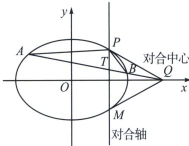

## 三、和型对合 $k_{1} + k_{2}$ 的三种模型

1. 射影中心与一对合不动点横坐标相同

参考例 1，例 2 和例 4，都是射影中心 P 与一对合不动点连线平行于 y 轴类型.

2. 两对合不动点横坐标相同

如图，以 x 轴上一点 Q 作为对合中心，作两条切线 QP 和 QM，则其对合轴 PM 一定平行于 y 轴，过 Q 作直线与椭圆交于 AB 两点，以 P 作为射影中心，设 $k_{PA}=k_{1}$ ， $k_{PB}=k_{2}$ ， $k_{PQ}=k_{3}$ ，由于 P 与一对合不动点 M 的连线平行于 y 轴，故始终有 $k_{1}+k_{2}=2k_{3}$ .

如果按照调和线束斜率公式理解，P位于点Q对应极线(对合轴)上任意一点，都能满足 $k_{1}+k_{2}=2k_{3}$ .

![[高中/总复习/专题/2026版高中《mst老唐说题》圆锥曲线专题（数学）/下册/第12章_调和点列与调和线束定理与对合关系/第四节_斜率对合与斜率翻译/三_和型对合_k__1____k__2__的三种模型/例题/Q00048945.md]]
![[高中/总复习/专题/2026版高中《mst老唐说题》圆锥曲线专题（数学）/下册/第12章_调和点列与调和线束定理与对合关系/第四节_斜率对合与斜率翻译/三_和型对合_k__1____k__2__的三种模型/例题/Q00048846.md]]
