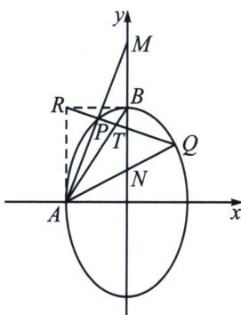

<!-- question-source:start -->
例8 (2023·乙卷)已知椭圆 $C: \frac{y^2}{a^2} + \frac{x^2}{b^2} = 1 (a > b > 0)$ 的离心率为 $\frac{\sqrt{5}}{3}$ , 点 $A(-2, 0)$ 在 $C$ 上.

(1)求 $C$ 的方程;

(2)过点 $(-2,3)$ 的直线交C于点P，Q两点，直线AP，AQ与y轴的交点分别为M，N，证明：线段MN的中点为定点.

(1)椭圆 C 的方程为 $\frac{y^{2}}{9} + \frac{x^{2}}{4} = 1$ ;

如图，由 $R(-2,3)$ 为对合中心作椭圆两条切线，分别切于左顶点 A 和上顶点 B，AB 为对合轴，分别记则 AP、AQ、AB 斜率为 $k_{1}$ 、 $k_{2}$ 、 $k_{3}$ ，由于 $AR \parallel y$ 轴，所以 $k_{1} + k_{2} = 2k_{3} = 3$ ，再分析与 y 轴平行的 $\triangle AMN$ ，且 $k_{AM} + k_{AN} = 2k_{AB}$ ，可知 BM = BN。
<!-- question-source:end -->

![[高中/总复习/专题/2026版高中《mst老唐说题》圆锥曲线专题（数学）/下册/第12章_调和点列与调和线束定理与对合关系/第四节_斜率对合与斜率翻译/三_和型对合_k__1____k__2__的三种模型/例题/answers/Q00048846A1.md]]
