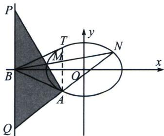
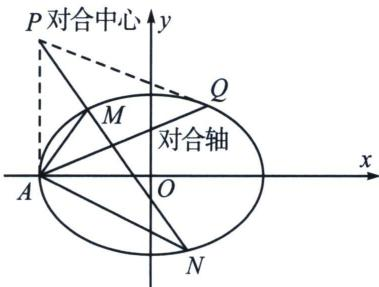

<!-- question-source:start -->
例7 (2020·北京)已知椭圆 $C: \frac{x^2}{a^2} + \frac{y^2}{b^2} = 1$ 过点 $A(-2, -1)$ , 且 $a = 2b$ .

(1)求椭圆 C 的方程;

(2)过点 $B(-4,0)$ 的直线 l 交椭圆 C 于点 M, N, 直线 MA, NA 分别交直线 x = -4 于点 P, Q. 求 $\left|\frac{PB}{BQ}\right|$ 的值.

## 解析
(1) $\frac{x^2}{8} + \frac{y^2}{2} = 1$ (本题详解参考本章第二节例11);

(2)斜率对合背景分析: 以 $B(-4,0)$ 为对合中心, 作椭圆两条切线, 分别为 $BA$ 和 $BT$ , 易知 $AT: x = -2$ , 此为对合轴, $A、T$ 则为两对合不动点, 分别记 $AM、AN、AB$ 斜率为 $k_{1}、k_{2}、k_{3}$ , 所以 $k_{1} + k_{2} = 2k_{3} = -1$ ,

再分析与 y 轴平行的 $\triangle APQ$ ，且 $k_{AP} + k_{AQ} = 2k_{AB}$ ，故 B 为 PQ 中点.

3. 射影中心与对合中心横坐标相同

如图，以椭圆左顶点(右顶点也如法炮制)上方一点 P 作为对合中心，作两条切线 PA 和 PQ，则其对合轴 AQ，过 P 作直线与椭圆交于 MN 两点，以 A 作为射影中心，设 $k_{AM}=k_{1}$ ， $k_{AN}=k_{2}$ ， $k_{AQ}=k_{3}$ ，由于 P 与一对合不动点 A 的连线平行于 y 轴，故始终有 $k_{1}+k_{2}=2k_{3}$ .
<!-- question-source:end -->
