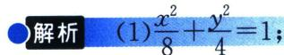

<!-- question-source:start -->
例5 (2023·广州模拟)已知椭圆 $C: \frac{x^2}{a^2} + \frac{y^2}{b^2} = 1 (a > b > 0)$ 的离心率为 $\frac{\sqrt{2}}{2}$ , 以 $C$ 的短轴为直径的圆与直线 $y = ax + 6$ 相切.

(1)求 C 的方程;

(2) 直线 $l: y = k(x - 1) (k \geqslant 0)$ 与 $C$ 相交于 $A, B$ 两点, 过 $C$ 上的点 $P$ 作 $x$ 轴的平行线交线段 $AB$ 于点 $Q$ , 直线 $OP$ 的斜率为 $k'$ ( $O$ 为坐标原点), $\triangle APQ$ 的面积为 $S_1$ . $\triangle BPQ$ 的面积为 $S_2$ , 若 $|AP| \cdot S_2 = |BP| \cdot S_1$ , 判断 $k \cdot k'$ 是否为定值? 并说明理由.

(2)详解过程参考上一节例 2

对合中心
<!-- question-source:end -->

![[高中/总复习/专题/2026版高中《mst老唐说题》圆锥曲线专题（数学）/下册/第12章_调和点列与调和线束定理与对合关系/第四节_斜率对合与斜率翻译/二_对合中心在无穷远点的特殊值/例题/answers/Q00048839A1.md]]
