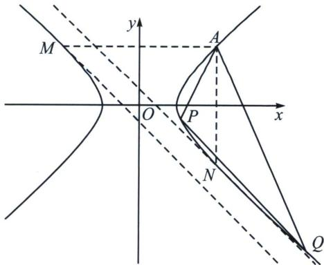

<!-- question-source:start -->
例6 (2022·新高考Ⅰ卷)已知 A(2,1) 在双曲线 C: $\frac{x^{2}}{a^{2}} - \frac{y^{2}}{a^{2} - 1} = 1 (a > 1)$ 上，直线 l 交 C 于 P、Q 两点，直线 AP，AQ 斜率之和为 0. 求 l 的斜率；

<!-- question-source:end -->

![[高中/总复习/专题/2026版高中《mst老唐说题》圆锥曲线专题（数学）/下册/第12章_调和点列与调和线束定理与对合关系/第四节_斜率对合与斜率翻译/二_对合中心在无穷远点的特殊值/例题/answers/Q00048944A1.md]]
