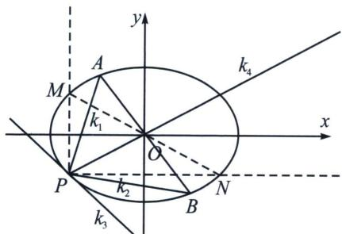
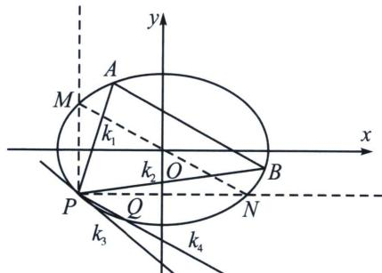

<!-- question-source:start -->
例6 (2022·新高考Ⅰ卷)已知 A(2,1) 在双曲线 C: $\frac{x^{2}}{a^{2}} - \frac{y^{2}}{a^{2} - 1} = 1 (a > 1)$ 上，直线 l 交 C 于 P、Q 两点，直线 AP，AQ 斜率之和为 0. 求 l 的斜率；

2. 当 $k_{1}k_{2} = \pm \frac{b^{2}}{a^{2}}$ 时，第三条边斜率为定值

以椭圆为例，若 $k_{1}k_{2} = -\frac{b^{2}}{a^{2}}$ 时，如左图，则 $k_{3} = -\frac{x_{0}b^{2}}{y_{0}a^{2}}$ （切线斜率）， $k_{4} = \frac{y_{0}}{x_{0}}$ ，此时对合中心为原点，这也是椭圆的第三定义逆定理.

若 $k_{1}k_{2} = \frac{b^{2}}{a^{2}}$ 时，如右图，则 $k_{3} = -\frac{x_{0}b^{2}}{y_{0}a^{2}}$ （切线斜率）， $k_{4} = k_{PQ} = -\frac{y_{0}}{x_{0}}$ ，此时 $MN / / PQ / / AB$ ，对合中心为无穷远点.

注意 $k_{1}k_{2} = \frac{b^{2}}{a^{2}}$ 在考试中用其齐次化证明是最简单的.

证明：将椭圆 C 按向量 $\overrightarrow{PO}(-x_{0}, -y_{0})$ 平移得椭圆 $C' : \frac{(x+x_{0})^{2}}{a^{2}} + \frac{(y+y_{0})^{2}}{b^{2}} = 1$ ,

又点 $P(x_0, y_0)$ 在椭圆 $\frac{x^2}{a^2} + \frac{y^2}{b^2} = 1$ 上，所以 $\frac{x_0^2}{a^2} + \frac{y_0^2}{b^2} = 1$ ，代入上式得 $\frac{x^2}{a^2} + \frac{y^2}{b^2} + \frac{2x_0}{a^2}x + \frac{2y_0}{b^2}y = 0$ ①。椭圆 $C$ 上的定点 $P(x_0, y_0)$ 和动点 $A$ ， $B$ 分别对应椭圆 $C'$ 上的定点 $O$ 和动点 $A'$ ， $B'$ ，设直线 $A'B'$ 的方程为 $mx + ny = 1$ ，代入 ① 得： $\frac{x^2}{a^2} + \frac{y^2}{b^2} + \left(\frac{2x_0}{a^2}x + \frac{2y_0}{b^2}y\right)(mx + ny) = 0$ ，当 $x \neq 0$ 时，两边除以 $x^2$ 得： $\frac{1 + 2y_0n}{b^2}\frac{y^2}{x^2} + \left(\frac{2x_0n}{a^2} + \frac{2y_0m}{b^2}\right)\frac{y}{x} + \frac{1 + 2x_0m}{a^2} = 0$ ，因为点 $A'$ ， $B'$ 的坐标满足这个方程，所以 $k_{OA'}$ ， $k_{OB'}$ 是这个关于 $\frac{y}{x}$ 的方程的两个根。即 $\frac{1 + 2x_0m}{a^2} \cdot \frac{b^2}{1 + 2y_0n} = \frac{b^2}{a^2}$ ，所以 $1 + 2x_0m = 1 + 2y_0n$ ，所以 $k = -\frac{m}{n} = -\frac{y_0}{x_0}$ 。
<!-- question-source:end -->

![[高中/总复习/专题/2026版高中《mst老唐说题》圆锥曲线专题（数学）/下册/第12章_调和点列与调和线束定理与对合关系/第四节_斜率对合与斜率翻译/二_对合中心在无穷远点的特殊值/例题/answers/Q00048944A1.md]]
