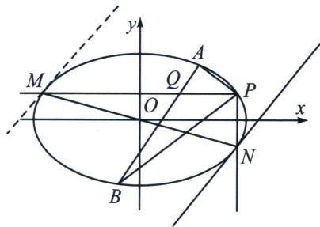

> [!faq]- 《圆锥曲线专题(下册)》例题解析
>
> > [!success]- **【答案】** 详见解析
>
> > [!note]- **【分析】**
> > 由于 $k_{PA} + k_{PB} = 0$ ，故作 $PM \parallel x$ 轴交椭圆于一个不动点 $M(-x_0, y_0)$ ，再作 $PN \parallel y$ 轴交椭圆于另一个不动点 $N(x_0, -y_0)$ ，由于 $MN$ 过原点，根据极点极线配极定理可知，对合轴 $MN$ 的对合中心 S 在无穷远点(过 M 和 N 处作的两条切线平行)，由于 A 与 B 对合，故 AB 的斜率可以根据 M 处或者 N 处切线斜率得到，即 $MM \parallel AB \parallel NN$ ， $k = \frac{x_{0}}{2y_{0}}$ ，所以 $kk' = \frac{1}{2}$ .
>
> > [!note]- **【解析】**
> > 
> > 22 年新高考一卷的背景也是如此，详解过程参考上一节例 1.
