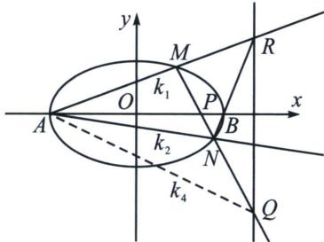
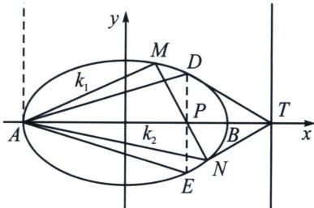

## 五、顶点角+同轴轴点弦的对合方程

1. 两类对合中心在坐标轴上的对合模型

第一类：左右顶点 $+x$ 轴轴点弦型

如图，椭圆 $\frac{x^2}{a^2} +\frac{y^2}{b^2} = 1(a > b > 0)$ 中， $A$ 、 $B$ 分别为其左右顶点，过 $P(m,0)$ 的直线MN交椭圆于M、N两点， $P$ 其对应极线 $RQ:x = \frac{a^2}{m}$ ，AM延长线交 $RQ$ 于 $R$ ，MN与 $RQ$ 交于点 $Q$ ，设 $k_{AM} = k_1$ ， $k_{AN} = k_2$ ， $k_{AB}$ $= k_{3} = 0$ ， $k_{AQ} = k_4$ ， $k_{MN} = k.$

则：① $k_{1}k_{2}=$ 定值；② $\frac{1}{k_{1}}+\frac{1}{k_{2}}=\frac{2}{k_{4}}$ ；③ $\frac{1}{k_{1}}+\frac{1}{k_{2}}=\frac{\lambda}{k}$ ;

证明：① $k_{2}k_{BN}=-\frac{b^{2}}{a^{2}},\quad\frac{k_{1}}{k_{BN}}=\frac{\frac{a^{2}}{m}-a}{\frac{a^{2}}{m}+a}=\frac{a-m}{a+m}$ ，所以 $k_{1}k_{2}=-\frac{b^{2}(a-m)}{a^{2}(a+m)}=$ 定值；

由于对合中心 P 在 x 轴上，A 为射影中心，所以过 A 作垂直于两坐标轴直线，显然一条长轴恒过对合中心，一条左顶点切线（显然只有点 A 这个二重点），所以无论 P 在 x 轴任何位置，一定有 $k_{1}k_{2}=$ 定值，如果 P 在椭圆内，无对合不动点，就是椭圆型对合，如果 P 在椭圆外，就是双曲型对合。如下图，当这种对合是椭圆型对合时，利用二阶曲线的共轭与对偶性质，找到 P 点在 x 轴上的调和共轭点 T，过 T 作两条切线 TD 与 TE，则一定有 $k_{1}k_{2}=k_{AD}\cdot k_{AE}$

②由于 $A(MN, PQ) = -1$ ， $k_3 = 0$ ，所以 $2(k_1 k_2 + k_3 k_4) = (k_1 + k_2)(k_3 + k_4) \Rightarrow 2k_1 k_2 = (k_1 + k_2) k_4$

即 $\frac{2}{k_{4}}=\frac{1}{k_{1}}+\frac{1}{k_{2}};$

③由于 $\frac{k}{k_{4}}=\frac{\frac{a^{2}}{m}+a}{\frac{a^{2}}{m}-m}=\frac{a}{a-m},\quad\frac{1}{k_{1}}+\frac{1}{k_{2}}=\frac{2}{k_{4}}=\frac{2a}{k(a-m)};$

![[高中/总复习/专题/2026版高中《mst老唐说题》圆锥曲线专题（数学）/下册/第12章_调和点列与调和线束定理与对合关系/第四节_斜率对合与斜率翻译/五_顶点角_同轴轴点弦的对合方程/例题/Q00048853.md]]
![[高中/总复习/专题/2026版高中《mst老唐说题》圆锥曲线专题（数学）/下册/第12章_调和点列与调和线束定理与对合关系/第四节_斜率对合与斜率翻译/五_顶点角_同轴轴点弦的对合方程/例题/Q00048854.md]]
![[高中/总复习/专题/2026版高中《mst老唐说题》圆锥曲线专题（数学）/下册/第12章_调和点列与调和线束定理与对合关系/第四节_斜率对合与斜率翻译/五_顶点角_同轴轴点弦的对合方程/例题/Q00048855.md]]
![[高中/总复习/专题/2026版高中《mst老唐说题》圆锥曲线专题（数学）/下册/第12章_调和点列与调和线束定理与对合关系/第四节_斜率对合与斜率翻译/五_顶点角_同轴轴点弦的对合方程/例题/Q00048856.md]]
![[高中/总复习/专题/2026版高中《mst老唐说题》圆锥曲线专题（数学）/下册/第12章_调和点列与调和线束定理与对合关系/第四节_斜率对合与斜率翻译/五_顶点角_同轴轴点弦的对合方程/例题/Q00048857.md]]
![[高中/总复习/专题/2026版高中《mst老唐说题》圆锥曲线专题（数学）/下册/第12章_调和点列与调和线束定理与对合关系/第四节_斜率对合与斜率翻译/五_顶点角_同轴轴点弦的对合方程/例题/Q00048858.md]]
![[高中/总复习/专题/2026版高中《mst老唐说题》圆锥曲线专题（数学）/下册/第12章_调和点列与调和线束定理与对合关系/第四节_斜率对合与斜率翻译/五_顶点角_同轴轴点弦的对合方程/例题/Q00048859.md]]
![[高中/总复习/专题/2026版高中《mst老唐说题》圆锥曲线专题（数学）/下册/第12章_调和点列与调和线束定理与对合关系/第四节_斜率对合与斜率翻译/五_顶点角_同轴轴点弦的对合方程/例题/Q00048860.md]]
![[高中/总复习/专题/2026版高中《mst老唐说题》圆锥曲线专题（数学）/下册/第12章_调和点列与调和线束定理与对合关系/第四节_斜率对合与斜率翻译/五_顶点角_同轴轴点弦的对合方程/例题/Q00048861.md]]
