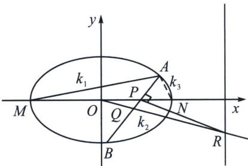
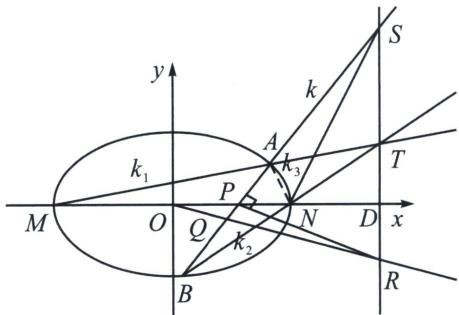

<!-- question-source:start -->
例15（2024·青羊区模拟）已知椭圆 $M: \frac{x^{2}}{a^{2}} + \frac{y^{2}}{b^{2}} = 1 (a > b > 0)$ 的离心率为 $\frac{1}{2}$ ，短轴长为 $2\sqrt{3}$ ，过点 $P(1, 0)$ 斜率存在且不为 0 的直线 $l$ 与椭圆有两个不同的交点 $A, B$ .

(1)求椭圆的标准方程;

(2)椭圆左右顶点为 M, N, 设 AB 中点为 Q, 直线 OQ 交直线 x=4 于点 R, $k_{BN}(k_{AM}-k_{PR})$ 是否为定值? 若是请求出定值, 若不是请说明理由.

(1)由题意: $\left\{ \begin{array}{l} \frac{c}{a} = \frac{1}{2} \\ 2b = 2\sqrt{3} \\ a^2 = b^2 + c^2 \end{array} \right.$ , 解得: $\left\{ \begin{array}{l} a = 2 \\ b = \sqrt{3} \\ c = 1 \end{array} \right.$ , 故所求椭圆的标准方程为: $\frac{x^2}{4} + \frac{y^2}{3} = 1$ .

(2)极点极线背景分析: 易知 $AM$ 与 $BN$ 延长线交于 $T$ , $\frac{k_{TB}}{k_{TA}} = \frac{k_2}{k_1} = \frac{x_T - x_M}{x_T - x_N} = 3$ , 根据第三定义 $k_1 k_3 = -\frac{3}{4}$ , 所以 $k_2 k_3 = -\frac{9}{4}$ , 由于 $N(BA, PS) = -1$ , 所以 $\frac{1}{k_2} + \frac{1}{k_3} = \frac{2}{k_{SN}} = \frac{4}{3k} = \frac{k_2 + k_3}{k_2 k_3} = -\frac{4}{9}(k_2 + k_3)$ (利用 $\frac{k_{SN}}{k} = \frac{|PD|}{|ND|} = \frac{3}{2}$ ), 所以 $k_2 + k_3 = -\frac{3}{k}$ , 由中点点差法得 $k \cdot k_{OQ} = -\frac{3}{4}$ , $\frac{k_{PR}}{k_{OQ}} = \frac{|OD|}{|DP|} = \frac{4}{3}$ , 所以 $k_{PR} =$ $\frac{4}{3} k_{\mathrm{OQ}} = -\frac{1}{k}$ ， $k_{BN}(k_{AM} - k_{PR}) = k_2\left(k_1 + \frac{1}{k}\right) = 3k_1^2 +\frac{3k_1}{k} = 3k_1^2 -k_1(k_2 + k_3) = -k_1k_3 = \frac{3}{4}$ ，显然复杂的一些斜率关系，齐次化最好表达.
<!-- question-source:end -->

![[高中/总复习/专题/2026版高中《mst老唐说题》圆锥曲线专题（数学）/下册/第12章_调和点列与调和线束定理与对合关系/第四节_斜率对合与斜率翻译/五_顶点角_同轴轴点弦的对合方程/例题/answers/Q00048855A1.md]]
