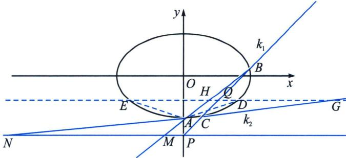

<!-- question-source:start -->
例16 (2021·北京)已知椭圆 $E: \frac{x^2}{a^2} + \frac{y^2}{b^2} = 1 (a > b > 0)$ 的一个顶点 $A(0, -2)$ , 以椭圆 $E$ 的四个顶点围成的四边形面积为 $4\sqrt{5}$ .

(1)求椭圆 E 的方程;

(2) 过点 $P(0, -3)$ 作斜率为 k 的直线与椭圆 E 交于不同的两点 B, C, 直线 AB、AC 分别与直线 y = -3 交于点 M、N, 当 $|PM| + |PN| \leqslant 15$ 时, 求 k 的取值范围.

(2)极点极线背景: 这是一个简单的下顶点 + y 轴轴点弦模型, 隐藏了 $k_{AC} k_{AB} = \lambda$ 这个定值, 解答此题最佳方案就是齐次化, 我们仅仅分析其斜率积为定值的对合问题。如图, 由于 $P(0, -3)$ 对应极线方程为 $DE$ : $y = -\frac{4}{3}$ , $D\left(\frac{3}{5}, -\frac{4}{3}\right)$ , $E\left(-\frac{3}{5}, -\frac{4}{3}\right)$ 为两个对合不动点, 此时属于双曲型对合, 故一定有 $A(PQ, CB) = A(GH, DE) = -1$ , 所以利用调和线束斜率关系可知 $k_{1} k_{2} + k_{AD} k_{AE} = 0$ , 即 $k_{AC} \cdot k_{AB} = \frac{\frac{25}{9}}{\left(-\frac{4}{3} + 2\right)^{2}} = \frac{25}{4}$ , 由于 $y = k_{1} x - 2$ , $y = k_{2} x - 2$ , 当 $y = -3$ , $x_{M} = \frac{-1}{k_{1}}$ , $x_{N} = \frac{-1}{k_{2}}$ , $|x_{M}| + |x_{N}| = \left|\frac{1}{k_{1}} + \frac{1}{k_{2}}\right| = \frac{k_{1} + k_{2}}{k_{1} k_{2}} = \frac{4}{25} |k_{1} + k_{2}| \leqslant 15$ , $|k_{1} + k_{2}| \leqslant \frac{25 \times 15}{4} \Leftrightarrow |k_{BC}| \leqslant 3$ , $B = C$ 时, $|k_{BC}| = 1$ , 所以 $k_{BC} \in [-3, -1) \cup (1, 3]$

<!-- question-source:end -->

![[高中/总复习/专题/2026版高中《mst老唐说题》圆锥曲线专题（数学）/下册/第12章_调和点列与调和线束定理与对合关系/第四节_斜率对合与斜率翻译/五_顶点角_同轴轴点弦的对合方程/例题/answers/Q00048856A1.md]]
