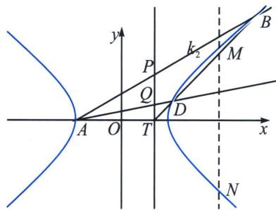

<!-- question-source:start -->
例21（2024·重庆模拟）已知双曲线 $C: \frac{x^2}{a^2} - \frac{y^2}{b^2} = 1 (a, b > 0)$ 的左、右焦点分别为 $F_1, F_2$ ，左顶点为 $A(-2, 0)$ ，点 $M$ 为双曲线上一动点，且 $\left|MF_1\right|^2 + \left|MF_2\right|^2$ 的最小值为 18， $O$ 为坐标原点.

(1)求双曲线 C 的标准方程;

(2)如图, 已知直线 $l: x = m$ 与 $x$ 轴的正半轴交于点 $T$ , 过点 $T$ 的直线交双曲线 $C$ 右支于点 $B, D$ , 直线 ▶ 老唐说题

AB, AD 分别交直线 l 于点 P, Q, 若 O, A, P, Q 四点共圆，求实数 m 的值.

## 解析
(1) $\frac{x^{2}}{4}-y^{2}=1.$

(2)极点极线背景分析: 四点共圆得出 $|OT| \cdot |AT| = |TP| \cdot |TQ|$ , 设 $T(m, 0)$ , 则 $m(m+2) = y_{P}y_{Q} = (m+2)^{2}k_{AP}k_{AQ}$ , 故仅需 $k_{AP}k_{AQ} = \frac{m}{m+2}$ , 作 $T$ 的极线 $MN: x = \frac{4}{m}$ 交双曲线于 $M\left(\frac{4}{m}, \frac{\sqrt{4-m^{2}}}{m}\right)$ , $N\left(\frac{4}{m}, \frac{\sqrt{4-m^{2}}}{m}\right)$ , 利用调和线束斜率公式可得: $k_{AP}k_{AQ} = k_{AM}^{2} = \frac{2-m}{4(m+2)} = \frac{m}{m+2}$ , 所以 $m = \frac{2}{5}$ . 本题齐次化和定比点差都很好处理.
<!-- question-source:end -->

![[高中/总复习/专题/2026版高中《mst老唐说题》圆锥曲线专题（数学）/下册/第12章_调和点列与调和线束定理与对合关系/第四节_斜率对合与斜率翻译/五_顶点角_同轴轴点弦的对合方程/例题/answers/Q00048861A1.md]]
