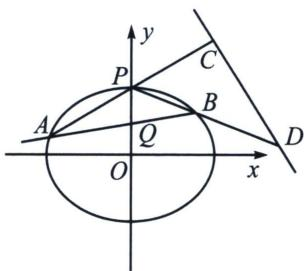

<!-- question-source:start -->
例17（2022·浙江卷）如图，已知椭圆 $E: \frac{x^2}{12} + y^2 = 1$ 。设 $A, B$ 是椭圆上异于 $P(0, 1)$ 的两点，且点 $Q(0, \frac{1}{2})$ 在线段 $AB$ 上，直线 $PA, PB$ 分别交直线 $y = -\frac{1}{2}x + 3$ 于 $C, D$ 两点。

(1)求点 P 到椭圆上点的距离的最大值;

(2)求 $|CD|$ 的最小值.

$$
\text { 解析 } \quad (1) d = \sqrt {x ^ {2} + (y - 1) ^ {2}} \Rightarrow d = \sqrt {1 2 - 1 2 y ^ {2} + y ^ {2} - 2 y + 1} \Rightarrow d = \sqrt {- 1 1 y ^ {2} - 2 y + 1 3} \Rightarrow d \leqslant \frac {1 2 \sqrt {1 1}}{1 1}
$$
<!-- question-source:end -->

![[高中/总复习/专题/2026版高中《mst老唐说题》圆锥曲线专题（数学）/下册/第12章_调和点列与调和线束定理与对合关系/第四节_斜率对合与斜率翻译/五_顶点角_同轴轴点弦的对合方程/例题/answers/Q00053196A1.md]]
