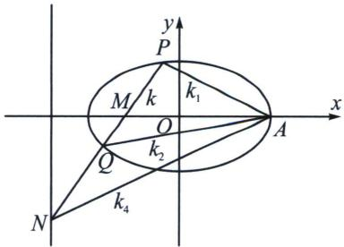
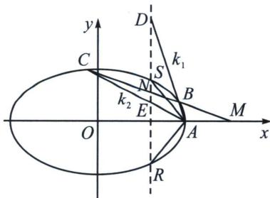

> [!faq]- 《圆锥曲线专题(下册)》例题解析
>
> > [!success]- **【答案】** 详见解析
>
> > [!note]- **【解析】**
> > 
> > 如图，设 $PQ$ 交 $x$ 轴于 $M(m,0)$ ， $PQ$ 交直线 $x = \frac{4}{m}$ 于 $N$ ， $A(PQ, MN) = -1$ ，由于 $k_{AM} = k_3 = 0$ ，故 $\frac{1}{k_1} + \frac{1}{k_2} = \frac{2}{k_4}$ ，由于 $\frac{1}{k_1} + \frac{1}{k_2} = \frac{4}{k}$ ，故 $k = 2k_4$ ，即 $m - \frac{4}{m} = 1 - \frac{2}{m}$ ，故 $m = 2$ （舍）或 $m = -1$ ，此时 $k_1k_2 = -\frac{b^2}{a^2}\frac{2 + m}{2 - m} = -\frac{1}{4}$ （或者按照特殊值 $PQ \perp x$ 轴， $P\left(-1, \frac{3}{2}\right), Q\left(-1, -\frac{3}{2}\right), k_1k_2 = -\frac{1}{4}$ ）
> > 
> > 如图, $M(m, 0)$ 是椭圆外的一点, 以 $M$ 为对合中心, 其对合对合轴 $x = \frac{a^2}{m}$ , 这是一个典型的双曲型对合, $RS$ 为两对合不动点, 故 $A(MN, BC) = -1$ , 由于 $B$ 和 $C$ 是一组对合对应点, 故延长 $AB$ 交 $RS$ 于 $D$ , $AC$ 交 $RS$ 于 $E$ , 故 $DE$ 也是一组对合对应点, 所以 $A(DE, SR) = -1$ . 根据调和线束的斜率公式,
> > 可得 $2(k_{1}k_{2}+k_{AS}k_{AR})=(k_{1}+k_{2})(k_{AS}+k_{AR})$ ，所以 $k_{1}k_{2}=k_{AS}^{2}$
