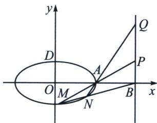

> [!faq]- 《圆锥曲线专题(下册)》例题解析
>
> > [!success]- **【答案】** 详见解析
>
> > [!note]- **【解析】**
> > 解析 (1)根据题意可得 $\frac{c}{a} = \frac{\sqrt{3}}{2} \Rightarrow \frac{c^2}{a^2} = \frac{3}{4}$ , $|AD| = \sqrt{a^2 + b^2} = \sqrt{5} \Rightarrow 2a^2 - c^2 = 5$ ,
> >
> > 所以 $b^{2}=1,\ c^{2}=3,\ a^{2}=4$ ，所以 E: $\frac{x^{2}}{4}+y^{2}=1$ ;
> >
> > 
> >
> > (2)①证明：令 $M(2\cos \theta_{1},\sin \theta_{1})$ ， $N(2\cos \theta_{2},\sin \theta_{2})$ ，令 $t_1 = \tan \frac{\theta_1}{2}$ ， $t_2 = \tan \frac{\theta_2}{2}$
> >
> > 由于 $\cos \theta_{1}\cos \frac{\theta_{1} + \theta_{2}}{2} +\sin \theta_{1}\sin \frac{\theta_{1} + \theta_{2}}{2} = \cos \frac{\theta_1 - \theta_2}{2},$
> >
> > $$
> > \cos \theta_ {2} \cos \frac {\theta_ {1} + \theta_ {2}}{2} + \sin \theta_ {2} \sin \frac {\theta_ {1} + \theta_ {2}}{2} = \cos \frac {\theta_ {1} - \theta_ {2}}{2},
> > $$
> >
> > 故 $M(2\cos \theta_{1},\sin \theta_{1})$ ， $N(2\cos \theta_{2},\sin \theta_{2})$ ，均在同构方程 $\frac{x}{2}\cos \frac{\theta_1 + \theta_2}{2} +y\sin \frac{\theta_1 + \theta_2}{2} = \cos \frac{\theta_1 - \theta_2}{2}$ 上，
> >
> > 即 $MN$ 的对合方程是 $\frac{x}{2}\cos \frac{\theta_1 + \theta_2}{2} + y\sin \frac{\theta_1 + \theta_2}{2} = \cos \frac{\theta_1 - \theta_2}{2}$ ，同除以 $\cos \frac{\theta_1}{2}\cos \frac{\theta_2}{2} (\theta_1 \neq \pi, \theta_2 \neq \pi)$ ，即 $MN: \frac{x}{2}(1 - t_1t_2) + y(t_1 + t_2) = 1 + t_1t_2$ ，由于过点 $B(4,0)$ ，所以 $t_1t_2 = \frac{1}{3}$ ；
> >
> > 根据题意： $k_{AM}=\frac{\sin\theta_{1}}{2\cos\theta_{1}-2}=-\frac{1}{2t_{1}}$ ， $k_{AN}=\frac{\sin\theta_{2}}{2\cos\theta_{2}-2}=-\frac{1}{2t_{2}}$ ， $k_{AM}k_{AN}=\frac{1}{4t_{1}t_{2}}=\frac{3}{4}$
> > - **②**：根据①可得： $y=-\frac{1}{2t_{1}}(x-2)$ ，当 x=4 时， $y_{P}=-\frac{1}{t_{1}}$ ，同理 $y_{Q}=-\frac{1}{t_{2}}$ ， $|BP|+|BQ|=10\Leftrightarrow$ $\left|-\frac{1}{t_{1}}-\frac{1}{t_{2}}\right|=10,\quad k_{MN}=-\frac{1-t_{1}t_{2}}{2(t_{1}+t_{2})}=\frac{\frac{1}{t_{1}t_{2}}-1}{2\left(-\frac{1}{t_{1}}-\frac{1}{t_{2}}\right)}=\pm\frac{1}{10}.$
