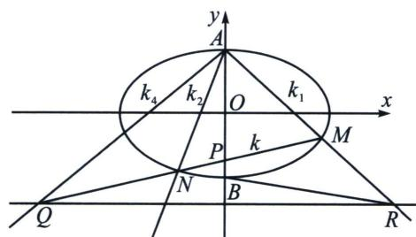

> [!faq]- 《圆锥曲线专题(下册)》例题解析
>
> > [!success]- **【答案】** 详见解析
>
> > [!note]- **【分析】**
> > 易知 $AM$ 与 $BN$ 延长线交于 $T$ , $\frac{k_{TB}}{k_{TA}} = \frac{k_2}{k_1} = \frac{x_T - x_M}{x_T - x_N} = 3$ , 根据第三定义 $k_1 k_3 = -\frac{3}{4}$ , 所以 $k_2 k_3 = -\frac{9}{4}$ , 由于 $N(BA, PS) = -1$ , 所以 $\frac{1}{k_2} + \frac{1}{k_3} = \frac{2}{k_{SN}} = \frac{4}{3k} = \frac{k_2 + k_3}{k_2 k_3} = -\frac{4}{9}(k_2 + k_3)$ (利用 $\frac{k_{SN}}{k} = \frac{|PD|}{|ND|} = \frac{3}{2}$ ), 所以 $k_2 + k_3 = -\frac{3}{k}$ , 由中点点差法得 $k \cdot k_{OQ} = -\frac{3}{4}$ , $\frac{k_{PR}}{k_{OQ}} = \frac{|OD|}{|DP|} = \frac{4}{3}$ , 所以 $k_{PR} =$ $\frac{4}{3} k_{\mathrm{OQ}} = -\frac{1}{k}$ ， $k_{BN}(k_{AM} - k_{PR}) = k_2\left(k_1 + \frac{1}{k}\right) = 3k_1^2 +\frac{3k_1}{k} = 3k_1^2 -k_1(k_2 + k_3) = -k_1k_3 = \frac{3}{4}$ ，显然复杂的一些斜率关系，齐次化最好表达.
>
> > [!note]- **【解析】**
> > 解法一(齐次化+中点点差法): 将椭圆按照向量 $\overrightarrow{NO} = (-2, 0)$ 平移, 得 $\frac{(x + 2)^2}{4} + \frac{y^2}{3} = 1$ , 即 $\frac{x^2}{4} + \frac{y^2}{3} + x = 0$ , $A \to A'$ , $B \to B'$ , $A'B'$ : $-x + ny = 1$ , 联立得: $\frac{x^2}{4} + \frac{y^2}{3} + x (-x + ny) = 0$ , 同除以 $x^2$ 得: $\frac{1}{3}\left(\frac{y}{x}\right)^2 + n \frac{y}{x} - \frac{3}{4} = 0$ , $k_{NA} k_{NB} = k_2 k_3 = -\frac{9}{4}$ , $k_2 + k_3 = -3n$ , 由椭圆第三定义(考试需自证)得 $k_{MA} k_{NA} = k_1 k_3 = -\frac{3}{4}$ , 所以 $k_2 = 3k_1$ , 令 $k_{AB} = k = k_{A'B'} = \frac{1}{n}$ , 所以 $k_2 + k_3 = \frac{-3}{k}$ , 由中点点差法(需证明)得 $k \cdot k_{OQ} = -\frac{3}{4}$ , $\frac{k_{PR}}{k_{OQ}} = \frac{x_R}{x_R - x_P} = \frac{4}{3}$ , 所以 $k_{PR} = \frac{4}{3} k_{OQ} = -\frac{1}{k}$ , $k_{BN}(k_{AM} - k_{PR}) = k_2(k_1 + \frac{1}{k}) = 3k_1^2 + \frac{3k_1}{k} = 3k_1^2 - k_1(k_2 + k_3) = -k_1k_3 = \frac{3}{4}$ .
> > 解法二(两点对合式): 令 $A(2\cos \theta_{1}, \sqrt{3}\sin \theta_{1})$ ， $B(2\cos \theta_{2}, \sqrt{3}\sin \theta_{2})$ ，令 $t_{1} = \tan \frac{\theta_{1}}{2}$ ， $t_{2} = \tan \frac{\theta_{2}}{2}$ ，
> > 由于 $\cos\theta_{1}\cos\frac{\theta_{1}+\theta_{2}}{2}+\sin\theta_{1}\sin\frac{\theta_{1}+\theta_{2}}{2}=\cos\frac{\theta_{1}-\theta_{2}}{2}$ ,
> > $$
> > \cos \theta_ {2} \cos \frac {\theta_ {1} + \theta_ {2}}{2} + \sin \theta_ {2} \sin \frac {\theta_ {1} + \theta_ {2}}{2} = \cos \frac {\theta_ {1} - \theta_ {2}}{2},
> > $$
> > 故 $A(2\cos \theta_{1},\sqrt{3}\sin \theta_{1})$ ， $B(2\cos \theta_{2},\sqrt{3}\sin \theta_{2})$ ，均在同构方程 $\frac{x}{2}\cos \frac{\theta_1 + \theta_2}{2} +\frac{y}{\sqrt{3}}\sin \frac{\theta_1 + \theta_2}{2} = \cos \frac{\theta_1 - \theta_2}{2}$ 上，
> > 即 $AB$ 的对合方程是 $\frac{x}{2}\cos \frac{\theta_1 + \theta_2}{2} +\frac{y}{\sqrt{3}}\sin \frac{\theta_1 + \theta_2}{2} = \cos \frac{\theta_1 - \theta_2}{2}$ ，同除以 $\cos \frac{\theta_1}{2}\cos \frac{\theta_2}{2} (\theta_1\neq \pi ,\theta_2\neq \pi)$ ，即 $AB:\frac{x}{2} (1 - t_1t_2) + \frac{y}{\sqrt{3}} (t_1 + t_2) = 1 + t_1t_2$ ，由于过点 $P(1,0)$ ，所以 $t_1t_2 = -\frac{1}{3},k_{AB} = -\frac{\sqrt{3}}{2}\frac{1 - t_1t_2}{t_1 + t_2} =$ $-\frac{2}{\sqrt{3}(t_1 + t_2)}$ ，根据题意： $k_{AM} = \frac{\sqrt{3}\sin\theta_1}{2\cos\theta_1 + 2} = \frac{\sqrt{3}t_1}{2},k_{AN} = \frac{\sqrt{3}\sin\theta_1}{2\cos\theta_1 - 2} = -\frac{\sqrt{3}}{2t_1}$ ，同理 $k_{BN} = -\frac{\sqrt{3}}{2t_2}$ ，由第三定义可得： $k_{OQ}k_{AB} = -\frac{3}{4}$ ，所以 $k_{OQ} = \frac{3\sqrt{3}}{8} (t_1 + t_2)$ ，则 $R\left(4,\frac{3\sqrt{3}}{2} (t_1 + t_2)\right),k_{PR} = \frac{\sqrt{3}}{2} (t_1 + t_2),$
> > $$
> > k _ {B N} (k _ {A M} - k _ {P R}) = - \frac {\sqrt {3}}{2 t _ {2}} \left[ \frac {\sqrt {3} t _ {1}}{2} - \frac {\sqrt {3}}{2} (t _ {1} + t _ {2}) \right] = \frac {3}{4}.
> > $$
> > ## 第二类：上下顶点+y轴轴点弦型
> > 如图，椭圆 $\frac{x^2}{a^2} +\frac{y^2}{b^2} = 1(a > b > 0)$ 中， $A$ 、 $B$ 分别为其上下顶点，过 $P(0,m)$ 的直线MN交椭圆于M、N两点， $P$ 其对应极线 $RQ:y = \frac{a^2}{m}$ ，AM延长线交 $RQ$ 于 $R$ ，MN与 $RQ$ 交于点 $Q$ ，设 $k_{AM} = k_1$ ， $k_{AN} = k_2$ ， $k_{AB}$ $= k_{3} = 0$ ， $k_{AQ} = k_{4}$ ， $k_{MN} = k.$
> > 
> > 则：① $k_{1}k_{2}=$ 定值；
> > - **②**：$k_{1}+k_{2}=2k_{4}$ ；
> > - **③**：$k_{1}+k_{2}=\lambda k$ ；
> > 证明：① $k_{2}k_{BN}=-\frac{b^{2}}{a^{2}}$ ， $\frac{k_{1}}{k_{BN}}=\frac{b-\frac{b^{2}}{m}}{-b-\frac{b^{2}}{m}}=\frac{b-m}{b+m}$ ，所以 $k_{1}k_{2}=-\frac{b^{2}(b-m)}{a^{2}(b+m)}=$ 定值；
> > - **②**：由于 $A(MN, PQ) = -1$ , $k_{3} = \infty$ ，所以 $2(k_{1}k_{2} + k_{3}k_{4}) = (k_{1} + k_{2})(k_{3} + k_{4}) \Rightarrow 2k_{4} = (k_{1} + k_{2})$ ，即 $k_{1} + k_{2} = 2k_{4}$ ;
> > - **③**：由于 $\frac{k}{k_{4}}=\frac{m-\frac{b^{2}}{m}}{b-\frac{b^{2}}{m}}=\frac{m+b}{b}$ ， $k_{1}+k_{2}=2k_{4}=\frac{2kb}{m+b}$ .
> > 注意 本模型是椭圆型对合，以 P 作为对合中心，没有不动点，所以 $k_{1}k_{2}$ 可以采用特殊值，即过 P 作 x 轴平行线交椭圆于 MN 两特殊点，算出 $k_{1}k_{2}$ ，此模型的双曲型对合，可以参考前面 x 轴的轴点弦模型，不再赘述.
