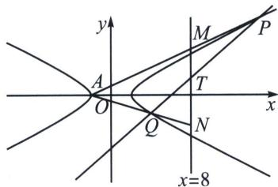

> [!faq]- 《圆锥曲线专题(下册)》例题解析
>
> > [!success]- **【答案】** 详见解析
>
> > [!note]- **【解析】**
> > 解析 (1)因为双曲线的实轴长是虚轴长的2倍，其左焦点坐标为 $(-\sqrt{5}, 0)$ ，所以 $\left\{ \begin{array}{l} a = 2b \\ c = \sqrt{5} \\ a^2 + b^2 = c^2 \end{array} \right.$ ，解得 $a$
> >
> > =2, b=1，则双曲线 $\Gamma$ 的方程为 $\frac{x^{2}}{4}-y^{2}=1$ ;
> >
> > 
> >
> > (2)(i)证明：令 $P\left(\frac{2}{\cos\theta_1}, \frac{\sin\theta_1}{\cos\theta_1}\right), Q\left(\frac{2}{\cos\theta_2}, \frac{\sin\theta_2}{\cos\theta_2}\right)$ ，
> >
> > 由于 $\cos \theta_{1}\cos \frac{\theta_{1} + \theta_{2}}{2} +\sin \theta_{1}\sin \frac{\theta_{1} + \theta_{2}}{2} = \cos \frac{\theta_1 - \theta_2}{2},$
> >
> > $\cos \theta_{2}\cos \frac{\theta_{1} + \theta_{2}}{2} +\sin \theta_{2}\sin \frac{\theta_{1} + \theta_{2}}{2} = \cos \frac{\theta_{1} - \theta_{2}}{2},$
> >
> > 故 $P\left(\frac{2}{\cos\theta_1}, \frac{\sin\theta_1}{\cos\theta_1}\right), Q\left(\frac{2}{\cos\theta_2}, \frac{\sin\theta_2}{\cos\theta_2}\right)$ ，均在同构方程 $\frac{x}{2} \cos \frac{\theta_1 - \theta_2}{2} - y \sin \frac{\theta_1 + \theta_2}{2} = \cos \frac{\theta_1 + \theta_2}{2}$ 上，
> >
> > 即弦 $PQ$ 的对合方程是: $\frac{x}{2} \cos \frac{\theta_1 - \theta_2}{2} - y \sin \frac{\theta_1 + \theta_2}{2} = \cos \frac{\theta_1 + \theta_2}{2}$ , 令 $t_1 = \tan \frac{\theta_1}{2}, t_2 = \tan \frac{\theta_2}{2}$ , 同除以 $\cos \frac{\theta_1}{2} \cos \frac{\theta_2}{2} (\theta_1 \neq \pi, \theta_2 \neq \pi)$ , 则 $\frac{x}{2} (1 + t_1 t_2) - y (t_1 + t_2) = 1 - t_1 t_2, k_{PQ} = \frac{1 + t_1 t_2}{2 (t_1 + t_2)}$ ,
> >
> > $k_{AP}=\frac{\frac{\sin\theta_{1}}{\cos\theta_{1}}}{\frac{2}{\cos\theta_{1}}+2}=\frac{t_{1}}{2},\quad k_{AQ}=\frac{t_{2}}{2},\quad k_{AP}\cdot k_{AQ}=-\frac{1}{8}\Leftrightarrow t_{1}t_{2}=-\frac{1}{2},$ 所以 $\left\{\begin{aligned}x=6\\ y=0\end{aligned}\right.$ 符合题意，直线 PQ 过定点 (6, 0);
> >
> > (ii) $y = \frac{t_1}{2} (x + 2)$ ，当 $x = 8$ 时， $y_M = 5t_1$ ，同理 $y_N = 5t_2$ ，代入 $PQ: \frac{x}{2}(1 + t_1t_2) - y(t_1 + t_2) = 1 - t_1t_2$ ， $y_T = \frac{3 + 5t_1t_2}{t_1 + t_2} = \frac{1}{2(t_1 + t_2)}$ ， $S_{\triangle PMT} = S_{\triangle QNT}$ ，则 $S_{\triangle APQ} = S_{\triangle AMN} = \frac{10|5t_1 - 5t_2|}{2} = 25|t_1 - t_2|$ ，
> >
> > $$
> > S _ {\triangle A P Q} = \frac {1}{2} \times 8 \times | y _ {P} - y _ {Q} | = 4 | \tan \theta_ {1} - \tan \theta_ {2} | = 4 \left| \frac {2 t _ {1}}{1 - t _ {1} ^ {2}} - \frac {2 t _ {2}}{1 - t _ {2} ^ {2}} \right| = \frac {8 | t _ {1} - t _ {2} | \cdot (1 + t _ {1} t _ {2})}{| 1 - t _ {1} ^ {2} - t _ {2} ^ {2} + t _ {1} ^ {2} t _ {2} ^ {2} |} = \frac {4 | t _ {1} - t _ {2} |}{\left| \frac {5}{4} - t _ {1} ^ {2} - t _ {2} ^ {2} \right|},
> > $$
> >
> > 所以 $t_1^2 + t_2^2 = \frac{109}{100}$ ，所以 $(t_1 + t_2)^2 = \frac{9}{100}$ ， $t_1 + t_2 = \pm \frac{3}{10}$ ， $k_{\mathrm{PQ}} = \frac{1 + t_1t_2}{2(t_1 + t_2)}$ ，解得 $k = \pm \frac{5}{6}$ .
> >
> > 则 PQ 的直线方程为 $y=\pm\frac{5}{6}(x-6)$ .
