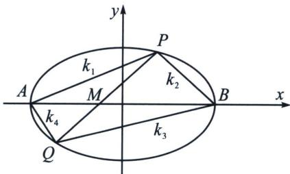

> [!faq]- 《圆锥曲线专题(下册)》例题解析
>
> > [!success]- **【答案】** 详见解析
>
> > [!note]- **【解析】**
> > 解析 (1)因为长轴长是短轴长的 $\sqrt{2}$ 倍, 所以 $2a = 2b \cdot \sqrt{2}$ , 即 $a = \sqrt{2} b$ , 又 $a^2 = b^2 + c^2$ ,
> >
> > 所以 $b^{2}=c^{2}$ ，所以在 $\triangle AFD$ 中，可得 $\angle AFD=135^{\circ}$ ，由正弦定理可得 $\frac{|AD|}{\sin\angle AFD}=\frac{\sqrt{a^{2}+b^{2}}}{\sin135^{\circ}}\frac{\sqrt{3}b}{\frac{\sqrt{2}}{2}}=2\times\sqrt{3}$ ，
> > 解得 $b=\sqrt{2}$ ，所以 a=2，所以椭圆的方程为 $\frac{x^{2}}{4}+\frac{y^{2}}{2}=1$ .
> >
> > 
> >
> > (2)(i)由条件可知, 直线 $l$ 的斜率不为 0 , 令 $P(2\cos \theta_1, \sqrt{2}\sin \theta_1)$ , $Q(2\cos \theta_2, \sqrt{2}\sin \theta_2)$ , $t_1 = \tan \frac{\theta_1}{2}$ , $t_2 = \tan \frac{\theta_2}{2}$ , 易得: $k_1 = \frac{t_1}{\sqrt{2}}$ , $k_2 = -\frac{1}{\sqrt{2} t_1}$ , $k_3 = -\frac{1}{\sqrt{2} t_2}$ , $k_4 = \frac{t_2}{\sqrt{2}}$ (过程略), 由于 $3(k_1 + k_4) = 5(k_2 + k_3)$ , 故 $3(t_1 + t_2) = -5\left(\frac{1}{t_1} + \frac{1}{t_2}\right)$ , 所以 $t_1 t_2 = -\frac{5}{3}$ , 对比 $PQ: \frac{x}{2}(1 - t_1 t_2) + \frac{y}{\sqrt{2}}(t_1 + t_2) = 1 + t_1 t_2$ , 故 $x = -\frac{1}{2}$ , $y = 0$ , 所以直线 $l$ 恒过定点 $N\left(-\frac{1}{2}, 0\right)$ .
> >
> > （ii）当 $m = -\frac{1}{2}$ 时，所以 $S_{\triangle BPQ} = \frac{1}{2}|BN| \cdot |y_1 - y_2| = \frac{1}{2} \times \frac{5}{2} \times |\sqrt{2}\sin \theta_1 - \sqrt{2}\sin \theta_2| = \frac{5\sqrt{2}}{2}$ $\left|\frac{t_1}{1 + t_1^2} - \frac{t_2}{1 + t_2^2}\right| = \frac{5}{\sqrt{2}} \cdot \left|\frac{(t_1 - t_2)(1 - t_1t_2)}{(1 + t_1^2)(1 + t_2^2)}\right| = \frac{20\sqrt{2}}{3} \cdot \left|\frac{(t_1 - t_2)}{\frac{34}{9} + t_1^2 + t_2^2}\right| = \frac{20\sqrt{2}}{3} \cdot \left|\frac{t_1 - t_2}{\frac{4}{9} + (t_1 - t_2)^2}\right| = \frac{20\sqrt{2}}{3}$ $\cdot \left|\frac{1}{\frac{4}{9(t_1 - t_2)} + (t_1 - t_2)}\right|$ ，
> >
> > 由于 $\left|t_{1}-t_{2}\right|=\left|t_{1}+\frac{5}{3t_{1}}\right|\geqslant\frac{2\sqrt{15}}{3}$ ，所以 $\frac{4}{9\left(t_{1}+\frac{5}{3t_{1}}\right)}+t_{1}+\frac{5}{3t_{1}}\geqslant\frac{32\sqrt{15}}{45}$ ，由于 $t_{1}\neq-t_{2}$ （否则斜率不存在），所以取等不成立，所以 $\triangle BPQ$ 面积的取值范围为 $\left(0,\frac{5}{8}\sqrt{30}\right)$ .
> >
> > 注意 在求面积等量关系时，两点对合式有优势，但是求面积范围，不如常规联立或者面积叉乘公式。
> >
> > ## 3. 对合中心在坐标轴上的斜率与共圆转化
