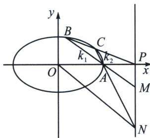
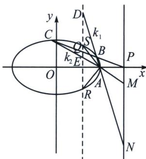

> [!faq]- 《圆锥曲线专题(下册)》例题解析
>
> > [!success]- **【答案】** 详见解析
>
> > [!note]- **【解析】**
> > 解析 (1)由题意可得 $\left\{ \begin{array}{l} \frac{c}{a} = \frac{1}{2} \\ \frac{1}{2} ab = \sqrt{3} \\ a^2 = b^2 + c^2 \end{array} \right.$ ，解得 $a = 2, b = \sqrt{3}, c = 1$ ，所以椭圆 $E$ 的标准方程为 $\frac{x^2}{4} + \frac{y^2}{3} = 1$ ；
> >
> > 
> >
> > (2)由题意可得 $P(t,0)$ ， $A(2,0)$ ，t>2，设点 $B(x_{1},y_{1})$ ， $C(x_{2},y_{2})$ ， $M(t,y_{M})$ ， $N(t,y_{N})$ ，
> >
> > 因为 O, A, M, N 四点共圆，所以由切割线定理得： $|PO| \cdot |PA| = |PM| \cdot |PN|$ ，即 $t(t-2) = |y_{M} \cdot y_{N}|$ ,
> >
> > 解法一(常规联立): 设直线 $PB$ 的方程为 $x = ky + t$ , 代入椭圆方程 $\frac{x^2}{4} + \frac{y^2}{3} = 1$ ,
> >
> > 可得 $(3k^{2} + 4)y^{2} + 6kty + 3t^{2} - 12 = 0$ ，所以 $y_{1} + y_{2} = \frac{-6kt}{3k^{2} + 4}, y_{1}y_{2} = \frac{3t^{2} - 12}{3k^{2} + 4},$
> >
> > 直线 $BA$ 的方程为 $y = \frac{y_1}{x_1 - 2} (x - 2)$ ，当 $x = t$ 时， $y_M = \frac{y_1}{x_1 - 2} (t - 2) = \frac{y_1}{ky_1 + t - 2} (t - 2)$ ，
> >
> > 直线 $CA$ 的方程为 $y = \frac{y_2}{x_2 - 2} (x - 2)$ ，当 $x = t$ 时， $y_N = \frac{y_2}{x_2 - 2} (t - 2) = \frac{y_2}{ky_2 + t - 2} (t - 2)$ ，
> >
> > 所以 $y_{M} \cdot y_{N} = (t - 2)^{2} \cdot \frac{y_{1}y_{2}}{(ky_{1} + t - 2)(ky_{2} + t - 2)} = (t - 2)^{2} \cdot \frac{y_{1}y_{2}}{k^{2}y_{2}y_{1} + k(t - 2)(y_{1} + y_{2}) + (t - 2)^{2}}$ $= (t - 2)^{2} \cdot \frac{3(t + 2)}{4(t - 2)} = \frac{3}{4}(t^{2} - 4)$ ，所以 $t(t - 2) = \frac{3}{4}(t^{2} - 4)$ ，解得 $t = 6$ .
> >
> > 解法二(齐次化): 将椭圆按照向量 $\overrightarrow{AO} = (-2, 0)$ 平移, 得: $\frac{(x + 2)^2}{4} + \frac{y^2}{3} = 1$ , 即 $\frac{x^2}{4} + \frac{y^2}{3} + x = 0$ , 此时 $B \to B'$ , $C \to C'$ , $B'C'$ 过定点 $(t - 2, 0)$ , 不妨设 $B'C'$ : $\frac{x}{t - 2} + ny = 1$ , 联立得: $\frac{x^2}{4} + \frac{y^2}{3} + x\left(\frac{x}{t - 2} + ny\right) = 0$ ,
> >
> > 同除以 $x^{2}$ 得： $\frac{1}{3}\left(\frac{y}{x}\right)^{2} + n\frac{y}{x} +\frac{1}{4} +\frac{1}{t - 2} = 0$ ，此时 $k_{AB}k_{AC} = k_1k_2 = \frac{3}{4} +\frac{3}{t - 2} = \frac{|PM|}{|PA|}\frac{|PN|}{|PA|} = \frac{y_My_N}{(t - 2)^2} =$ $\frac{t}{t - 2}$ ，所以 $t = 6$
> >
> > 极点极线背景：如图，由于 $P(t,0)$ 对应极线方程为 SR: $x=\frac{4}{t}$ ， $S\left(\frac{4}{t},\frac{\sqrt{3(t^{2}-4)}}{t}\right)$ ， $R\left(\frac{4}{t},-\frac{\sqrt{3(t^{2}-4)}}{t}\right)$ 为两个对合不动点，此时属于双曲型对合，故一定有 $A(PQ,BC)=A(DE,SR)=-1$ ，所以利用调和线束斜率关系可知 $k_{1}k_{2}+k_{AS}k_{AR}=0$ ，即 $k_{1}k_{2}=\frac{y_{M}y_{N}}{(t-2)^{2}}=\frac{y_{S}^{2}}{\left(\frac{4}{t}-2\right)^{2}}\Rightarrow y_{M}y_{N}=\frac{t^{2}}{4}y_{S}^{2}=\frac{3(t^{2}-4)}{4}$ ，
> >
> > 由于 $|PO|\cdot|PA|=|PM|\cdot|PN|$ ，即 $t(t-2)=y_{M}\cdot y_{N}$ ，所以t=6.
> >
> > 
