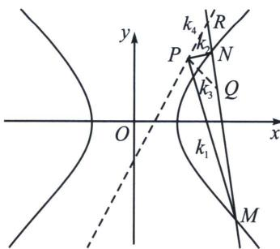

<!-- question-source:start -->
例23 (2023·湖北四月调考)过点(4, 2)的动直线 l 与双曲线 $E: \frac{x^{2}}{a^{2}} - \frac{y^{2}}{b^{2}} = 1 (a > 0, b > 0)$ 交于 M, N 两点，当 l 与 x 轴平行时， $|MN| = 4\sqrt{2}$ ，当 l 与 y 轴平行时， $|MN| = 4\sqrt{3}$

(1)求双曲线 E 的标准方程;

(2) 点 P 是直线 $y = x + 1$ 上一定点，设直线 PM，PN 的斜率分别为 $k_{1}$ ， $k_{2}$ ，若 $k_{1}k_{2}$ 为定值，求点 P 的坐标.

(1) 双曲线 $E$ 的标准方程为 $x^{2} - y^{2} = 4$ ;

极点极线背景分析：P 是极点 Q(4, 2) 对应的极线 2x - y = 2 与直线 $y = x + 1$ 的交点，即 P(3, 4). 如图，极点 Q(4, 2) 对应的极线方程为 2x - y = 2，以 P 为射影中心， $P(M, N; Q, R) = -1$ ，

根据调和线束的斜率公式 $2(k_{1}k_{2} + k_{3}k_{4}) = (k_{1} + k_{2})(k_{3} + k_{4})$ ，欲使得 $k_{1}k_{2}$ 为定值，只须 $k_{3} + k_{4} = 0$ 即可，不妨先构造锁定一个 $k_{4} = k_{PR}$ ，即 $P$ 位于点 $Q$ 所在的极线上，所以调和线束中 $k_{3}$ 即为直线 $PQ$ 的斜率，其方程为 $y - 2 = -2(x - 4)$ ，联立 $\left\{ \begin{array}{l} y = -2x + 10 \\ y = 2x - 2 \end{array} \right.$ ，解得 $P(3,4)$ ，题目给出的 $y = x + 1$ 是用来验证 $P$ 是否在这条直线上，本题以 $P(3,4)$ 为背景，可以设定很多条件，比如在曲线 $x^{2} + y^{2} = 25$ 上是否存在点 $P$ 满足 $k_{1}k_{2}$ 为定值.

(2) 设 $T(4, 2)$ , $P(m, m+1)$ 且 $\overrightarrow{MT} = \lambda \overrightarrow{TN}$ , 则 $\left\{ \begin{array}{l} x_1 + \lambda x_2 = 4(1 + \lambda) \\ y_1 + \lambda y_2 = 2(1 + \lambda) \end{array} \right.$ ,

故在直线 $MN$ 上一定存在点 $Q$ ，使得 $\overrightarrow{MQ} = -\lambda \overrightarrow{QN}$ （定比调和），此时 $\left\{ \begin{array}{l} \frac{x_1 - \lambda x_2}{1 - \lambda} = x_Q \\ \frac{y_1 - \lambda y_2}{1 - \lambda} = y_Q \end{array} \right.$

此时根据定比点差得： $\left\{\begin{aligned}\frac{x_{1}^{2}}{4}-\frac{y_{1}^{2}}{4}&=1①\\ \frac{\lambda^{2}x_{2}^{2}}{4}-\frac{\lambda^{2}y_{2}^{2}}{4}&=\lambda^{2}②\end{aligned}\right.$ ①-②得 $\frac{(x_{1}+\lambda x_{2})(x_{1}-\lambda x_{2})}{4}-\frac{(y_{1}+\lambda y_{2})(y_{1}-\lambda y_{2})}{4}=1-\lambda^{2}$

则 $\frac{x_{1}-\lambda x_{2}}{4(1-\lambda)}-\frac{y_{1}-\lambda y_{2}}{4(1-\lambda)}=1$ ，所以 $\frac{x_{T}x_{Q}}{4}-\frac{y_{T}y_{Q}}{4}=1$ ，代入 $x_{Q}$ 和 $y_{Q}$ ， $\frac{4x_{1}}{4}-\frac{2y_{1}}{4}-1=\frac{\lambda+1}{2}\left(\frac{16}{4}-\frac{4}{4}-1\right)$ （默写步骤）

所以 $\left\{ \begin{array}{l} x_{2} = \frac{3x_{1} - 2y_{1} - 4}{x_{1} - \frac{y_{1}}{2} - 2}\\ \lambda = x_{1} - \frac{y_{1}}{2} -2\end{array} \right.$ ，由于 $k_{PM}k_{PN} = \frac{(y_2 - m - 1)(y_1 - m - 1)}{(x_2 - m)(x_1 - m)} = \frac{\left[(1 - m)x_1 + \frac{m - 3}{2}y_1 + 2m\right](y_1 - m - 1)}{\left[(3 - m)x_1 + \frac{m - 4}{2}y_1 + 2m - 4\right](x_1 - m)} =$ $y_{2} = \frac{2x_{1} - 2y_{1} - 2}{x_{1} - \frac{y_{1}}{2} - 2}$

常数，故分子和分母不对称的项(分子有分母没有和分母有分子没有的)必须系数为0，即分子的 $y_{1}^{2}$ 与分母的 $x_{1}^{2}$ 系数必须为0，所以m=3，此时 $k_{PM}k_{PN}=\frac{(-2x_{1}+4)(y_{1}-4)}{\left(-\frac{1}{2}y_{1}+2\right)(x_{1}-2)}=4$ ，故存在点 $P(3,4)$ 符合题意.
<!-- question-source:end -->

![[高中/总复习/专题/2026版高中《mst老唐说题》圆锥曲线专题（数学）/下册/第12章_调和点列与调和线束定理与对合关系/第四节_斜率对合与斜率翻译/六_积型_k__1_k__2__对合的多解问题/例题/answers/Q00048863A1.md]]
