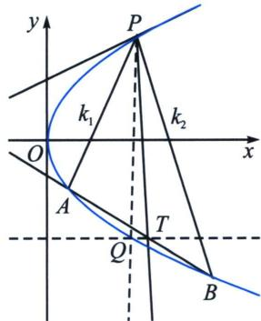

<!-- question-source:start -->
例22 (2023·平罗县期末)已知抛物线 $E: y^{2} = 2px (p > 0)$ , $P(4, y_{0})$ 为 $E$ 上位于第一象限的一点, 点 $P$ 到 $E$ 的准线的距离为 5.

(1) 求 E 的标准方程;

(2)设 O 为坐标原点，F 为 E 的焦点，A，B 为 E 上异于 P 的两点，且直线 PA 与 PB 斜率乘积为 -4，求证：直线 AB 过定点.

##
<!-- question-source:end -->

![[高中/总复习/专题/2026版高中《mst老唐说题》圆锥曲线专题（数学）/下册/第12章_调和点列与调和线束定理与对合关系/第四节_斜率对合与斜率翻译/六_积型_k__1_k__2__对合的多解问题/例题/answers/Q00053201A1.md]]
