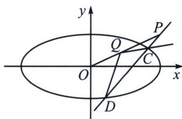

> [!faq]- 《圆锥曲线专题(下册)》例题解析
>
> > [!success]- **【答案】** 详见解析
>
> > [!note]- **【解析】**
> > 解析 (1)椭圆 E 的焦点在 x 轴上，故可设椭圆 E 的标准方程为 $\frac{x^{2}}{a^{2}} + \frac{y^{2}}{b^{2}} = 1 (a > b > 0)$ ,
> >
> > 因为椭圆 E 经过点 $A\left(\sqrt{2}, -\frac{\sqrt{2}}{2}\right)$ ， $B(0, 1)$ ，所以 $\left\{\begin{aligned}\frac{2}{a^{2}}+\frac{\frac{1}{2}}{b^{2}}=1\\ b=1\end{aligned}\right.$ ，解得 $\left\{\begin{aligned}a=2\\ b=1\end{aligned}\right.$ ，所以椭圆 E 的标准方程为 $\frac{x^{2}}{4}+y^{2}=1$ .
> >
> > (2)(i)设 $G(x, y)$ ，根据“共轭点对” [A, G] 定义可知点 G 的坐标满足 $\left\{\begin{aligned}\frac{x^{2}}{4}+y^{2}&=1\\ \frac{\sqrt{2}}{4}x-\frac{\sqrt{2}}{2}y&=0\end{aligned}\right.$
> >
> > 解得 $\left\{\begin{aligned}x&=-\sqrt{2}\\ y&=-\frac{\sqrt{2}}{2}\end{aligned}\right.$ 或 $\left\{\begin{aligned}x&=\sqrt{2}\\ y&=\frac{\sqrt{2}}{2}\end{aligned}\right.$ ，所以有两个点满足“共轭点对” $[A,G]$ ，且点G的坐标为 $\left(-\sqrt{2},-\frac{\sqrt{2}}{2}\right)$ ， $\left(\sqrt{2},\frac{\sqrt{2}}{2}\right).$
> >
> > (ii)由(i)得，直线 $G_{1}G_{2}$ 的方程为 $y=\frac{1}{2}x$ .
> >
> > 
> >
> > 设 $Q\left(m, \frac{1}{2} m\right)$ , 且 $\overrightarrow{CP} = \lambda \overrightarrow{PD}$ , 则 $\left\{ \begin{array}{l} x_1 + \lambda x_2 = 2(1 + \lambda) \\ y_1 + \lambda y_2 = 1 + \lambda \end{array} \right.$ , 故在直线 $CD$ 上一定存在点 $R$ , 使得 $\overrightarrow{CR} = -\lambda \overrightarrow{RD}$ , 此时 $\left\{ \begin{array}{l} \frac{x_1 - \lambda x_2}{1 - \lambda} = x_R \\ \frac{y_1 - \lambda y_2}{1 - \lambda} = y_R \end{array} \right.$ , 此时根据定比点差得: $\left\{ \begin{array}{l} \frac{x_1^2}{4} + y_1^2 = 1① \\ \frac{\lambda^2 x_2^2}{4} + \lambda^2 y_2^2 = \lambda^2 ② \end{array} \right.$
> > - **①**：-②得 $\frac{(x_1 + \lambda x_2)(x_1 - \lambda x_2)}{4} +(y_1 + \lambda y_2)(y_1 - \lambda y_2) = 1 - \lambda^2$ ，则 $\frac{x_1 - \lambda x_2}{2(1 - \lambda)} +\frac{y_1 - \lambda y_2}{(1 - \lambda)} = 1$ ，所以 $\frac{x_R}{2} +y_R =$
> >
> > 1，代入 $x_{R}$ 和 $y_{R}$ ， $\frac{x_1}{2} + y_1 - 1 = \frac{\lambda + 1}{2}\left(\frac{4}{4} + 1 - 1\right)$ （默写步骤）所以 $\left\{ \begin{array}{l} \lambda = x_1 + 2y_1 - 3 \\ y_2 = \frac{x_1 + y_1 - 2}{x_1 + 2y_1 - 3} \end{array} \right.$ （非轴点弦三炮齐鸣结论式）
> >
> > $$
> > \left\{ \begin{array}{l} x _ {2} = \frac {x _ {1} + 4 y _ {1} - 4}{x _ {1} + 2 y _ {1} - 3} \\ \lambda = x _ {1} + 2 y _ {1} - 3 \\ y _ {2} = \frac {x _ {1} + y _ {1} - 2}{x _ {1} + 2 y _ {1} - 3} \end{array} \right.
> > $$
> >
> > 由于 $k_{QC}k_{QD} = \frac{\left(y_2 - \frac{m}{2}\right)\left(y_1 - \frac{m}{2}\right)}{(x_2 - m)(x_1 - m)} = \frac{\left[(1 - \frac{m}{2})x_1 + (1 - m)y_1 + \frac{3m}{2} - 2\right]\left(y_1 - \frac{m}{2}\right)}{\left[(1 - m)x_1 + (4 - 2m)y_1 + 3m - 4\right](x_1 - m)} =$ 常数，
> >
> > 故分子和分母不对称的项(分子有分母没有和分母有分子没有的)必须系数为0，即分子的 $y_{1}^{2}$ 与分母的 $x_{1}^{2}$ 系数必须为0，所以m=1，此时 $k_{QA}k_{QB}=\frac{\left(\frac{1}{2}x_{1}-\frac{1}{2}\right)\left(y_{1}-\frac{1}{2}\right)}{(2y_{1}-1)(x_{1}-1)}=\frac{1}{4}$ ，存在定点 $Q\left(1,\frac{1}{2}\right)$ ，使得直线QC与QD的斜率之积为定值 $\frac{1}{4}$ .
> >
> > ## 3. 射影中心未知的斜率乘积为定值的多解问题
> >
> > 如果射影中心在曲线外，那根据调和线束斜率公式，利用 $k_{3} + k_{4} = 0$ 构造 $k_{1}k_{2} + k_{3}k_{4} = 0$ ，当射影中心在曲线上时，则会产生两解，这两个点关于原点中心对称.
> >
> > 斜率积的对合原理，关键在于构造射影中心作与两坐标轴垂直的直线，那么对合中心一定在这两条垂直直线的斜边上，根据这一点，再利用第三定义，我们不妨来看看多解情况，以例题来建模.
> >
> > ## 4. 费雷格(Fregier)定理
> >
> > (1)设 $P(x_0, y_0)$ 为椭圆 $\frac{x^2}{a^2} + \frac{y^2}{b^2} = 1$ 上一点， $M, N$ 为椭圆上的两点，且直线 $PM, PN$ 的斜率之积 $k_1 k_2 = \lambda (\lambda$ 为定值， $\lambda \neq \frac{b^2}{a^2})$ 的充要条件是直线 $MN$ 过定点 $(\mu x_0, -\mu y_0)$ ，其中 $\mu = \frac{\lambda a^2 + b^2}{\lambda a^2 - b^2}$
> >
> > (2)设 $P(x_{0}, y_{0})$ 为椭圆 $\frac{x^{2}}{a^{2}} + \frac{y^{2}}{b^{2}} = 1$ 上一点，M，N 为椭圆上的两点，且直线 PM，PN 的斜率之积 $k_{1}k_{2} = \frac{m+1}{m-1} \cdot \frac{b^{2}}{a^{2}} (m \neq 1)$ 的充要条件是直线过定点 $(mx_{0}, -my_{0})$ .
> >
> > 注意 当射影中心已知时，齐次化最好拿捏，射影中心未知时，用两点对合方程解决。
