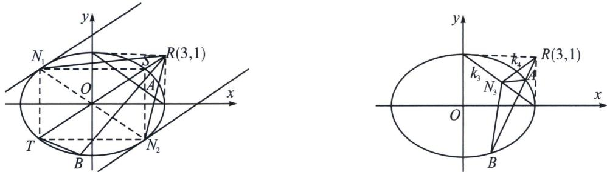

> [!faq]- 《圆锥曲线专题(下册)》例题解析
>
> > [!success]- **【答案】** 详见解析
>
> > [!note]- **【解析】**
> > 解析 (1)设点 $P(x', y')$ ， $M(x, y)$ ，因为 $|OP| = |PQ|$ ，所以 $Q(2x', 0)$ ， $(x' \neq 0)$ ，由 $M$ 为 $PQ$ 的中点得 $\left\{ \begin{array}{l} x = \frac{x' + 2x'}{2} \\ y = \frac{y'}{2} \end{array} \right.$ ，所以 $\left\{ \begin{array}{l} x' = \frac{2x}{3} \\ y' = 2y \end{array} \right.$ ，代入 $x'^2 + y'^2 = 4$ ，得 $\frac{x^2}{9} + y^2 = 1$ ，所以 $\Gamma$ 的方程为 $\frac{x^2}{9} + y^2 = 1 (x \neq 0)$ .
> >
> > 
> >
> > (2)若 N 在椭圆上，则一定有关于原点对称的 $N_{1}$ 和 $N_{2}$ ，如左图，由于对合中心 $R(3,1)$ ，连接 OR，截
> >
> > 椭圆于 S、T 两点，作椭圆内接矩形 $N_{1}SN_{2}T$ ，则 $N_{1}\left(-\frac{3\sqrt{2}}{2},\frac{\sqrt{2}}{2}\right)$ 或 $N_{2}\left(\frac{3\sqrt{2}}{2},-\frac{\sqrt{2}}{2}\right)$ 满足题意；
> >
> > 其本质原因就是 R 一定位于过原点的直线 OR 上，以 ST 为对角线作的矩形，恰好完美符合这一特性，且 $k_{NN} \cdot k_{NR} = k_{1} k_{2} (k_{NN}$ 表示点 N 处切线的斜率）；
> >
> > 若 $N$ 不在椭圆上，如右图，则根据调和线束斜率公式，当 $k_{3} = -\frac{1}{3}(R$ 的极线），则 $k_{4} = \frac{1}{3}$ ，所以 $\left\{ \begin{array}{l} y = -\frac{1}{3} x + 1 \\ y = \frac{1}{3} x \end{array} \Rightarrow N_{3}\left(\frac{3}{2}, \frac{1}{2}\right) \right.$
> >
> > 解法一：存在 N 满足题意，证明如下：依题意直线 l 的斜率存在且不为 0，设 l 的方程： $y=k(x-3)+1$ ，设 $A(x,y)$ ， $B(x_{2},y_{2})$ ， $N(x_{0},y_{0})$ ，联立 $\left\{\begin{aligned}y&=k(x-3)+1\\ \frac{x^{2}}{9}&+y^{2}=1\end{aligned}\right.$ ，消去 y 得 $(1+9k^{2})x^{2}+18k(1-3k)x+81k^{2}-54k=0$ ，则 $x_{1}+x_{2}=-\frac{18k(1-3k)}{1+9k^{2}}$ ， $x_{1}x_{2}=\frac{81k^{2}-54k}{1+9k^{2}}$ ①，直线 l 方程化为 $x=3+\frac{y-1}{k}$ ，
> >
> > 联立 $\left\{\begin{aligned}x&=3+\frac{y-1}{k}\\ \frac{x^{2}}{9}+y^{2}&=1\end{aligned}\right.$ ，消去x得 $(1+9k^{2})y^{2}+(6k-2)y-6k+1=0$ ，则 $y_{1}+y_{2}=-\frac{6k-2}{1+9k^{2}}$ ， $y_{1}y_{2}=$ $\frac{1-6k}{1+9k^{2}}$ ，②
> >
> > $$
> > k _ {1} k _ {2} = \frac {y _ {0} - y _ {1}}{x _ {0} - x _ {1}} \cdot \frac {y _ {0} - y _ {2}}{x _ {0} - x _ {2}} = \frac {y _ {0} ^ {2} + \frac {6 k - 2}{1 + 9 k ^ {2}} y _ {0} + \frac {1 - 6 k}{1 + 9 k ^ {2}}}{x _ {0} ^ {2} + \frac {1 8 k (1 - 3 k)}{1 + 9 k ^ {2}} x _ {0} + \frac {8 1 k ^ {2} - 5 4 k}{1 + 9 k ^ {2}}} = \frac {(1 + 9 k ^ {2}) y _ {0} ^ {2} + (6 k - 2) y _ {0} + 1 - 6 k}{(1 + 9 k ^ {2}) x _ {0} ^ {2} + 1 8 k (1 - 3 k) x _ {0} + 8 1 k ^ {2} - 5 4 k}
> > $$
> >
> > $$
> > = \frac {9 y _ {0} ^ {2} k ^ {2} + 6 (y _ {0} - 1) k + (y _ {0} - 1) ^ {2}}{9 (x _ {0} - 3) ^ {2} k ^ {2} + 1 8 (x _ {0} - 3) k + x _ {0} ^ {2}},
> > $$
> >
> > $$
> > k _ {1} k _ {2}
> > $$
> >
> > $$
> > \frac {y _ {0} ^ {2}}{(x _ {0} - 3) ^ {2}} = \frac {y _ {0} - 1}{3 (x _ {0} - 3)} = \frac {(y _ {0} - 1) ^ {2}}{x _ {0} ^ {2}}
> > $$
> >
> > $$
> > \frac {y _ {0} ^ {2}}{(x _ {0} - 3) ^ {2}} = \frac {y _ {0} - 1}{3 (x _ {0} - 3)} \Rightarrow 3 y _ {0} ^ {2} = (x _ {0} - 3) (y _ {0} - 1) \textcircled {3}, \frac {y _ {0} - 1}{3 (x _ {0} - 3)} = \frac {(y _ {0} - 1) ^ {2}}{x _ {0} ^ {2}} \Rightarrow x _ {0} ^ {2} = 3 (x _ {0} - 3) (y _ {0} - 1)
> > $$
> >
> > $$
> > x _ {0} = 3 y _ {0}
> > $$
> >
> > $$
> > x _ {0} = - 3 y _ {0}
> > $$
> >
> > $$
> > \left\{ \begin{array}{l} x _ {0} = \frac {3}{2} \\ y _ {0} = \frac {1}{2} \end{array} \right.
> > $$
> >
> > $$
> > \left\{ \begin{array}{l} x _ {0} = \frac {3 \sqrt {2}}{2} \\ y _ {0} = - \frac {\sqrt {2}}{2} \end{array} \right.
> > $$
> >
> > $$
> > \left\{ \begin{array}{l} x _ {0} = - \frac {3 \sqrt {2}}{2} \\ y _ {0} = \frac {\sqrt {2}}{2} \end{array} \right.
> > $$
> >
> > 所以存在 $N\left(\frac{3}{2}, \frac{1}{2}\right)$ 或 $N\left(\frac{3\sqrt{2}}{2}, -\frac{\sqrt{2}}{2}\right)$ 或 $N\left(-\frac{3\sqrt{2}}{2}, \frac{\sqrt{2}}{2}\right)$ 满足题意.
> >
> > 解法二： $\frac{x}{3}\cos\frac{\theta_{1}+\theta_{2}}{2}+y\sin\frac{\theta_{1}+\theta_{2}}{2}=\cos\frac{\theta_{1}-\theta_{2}}{2}$ ，代入(3,1)得： $\cos\frac{\theta_{1}+\theta_{2}}{2}+\sin\frac{\theta_{1}+\theta_{2}}{2}=\cos\frac{\theta_{1}-\theta_{2}}{2}$ ;
> > 当 $N(3\cos\theta_{0}, \sin\theta_{0})$ 在椭圆上时， $\left\{\begin{aligned}&NA:\frac{x}{3}\cos\frac{\theta_{1}+\theta_{0}}{2}+y\sin\frac{\theta_{1}+\theta_{0}}{2}=\cos\frac{\theta_{1}-\theta_{0}}{2}\\ &NB:\frac{x}{3}\cos\frac{\theta_{2}+\theta_{0}}{2}+y\sin\frac{\theta_{2}+\theta_{0}}{2}=\cos\frac{\theta_{2}-\theta_{0}}{2}\end{aligned}\right.$ 所以 $k_{1}k_{2}=\frac{1}{9}$
> >
> > $$
> > \frac {\cos \frac {\theta_ {1} + \theta_ {0}}{2} \cdot \cos \frac {\theta_ {2} + \theta_ {0}}{2}}{\sin \frac {\theta_ {1} + \theta_ {0}}{2} \cdot \sin \frac {\theta_ {2} + \theta_ {0}}{2}} = \frac {1}{9} \cdot \frac {\cos \left(\theta_ {0} + \frac {\theta_ {1} + \theta_ {2}}{2}\right) + \cos \frac {\theta_ {1} - \theta_ {2}}{2}}{\cos \frac {\theta_ {1} - \theta_ {2}}{2} - \cos \left(\theta_ {0} + \frac {\theta_ {1} + \theta_ {2}}{2}\right)} = \frac {1}{9} \cdot \frac {\sin \frac {\theta_ {1} + \theta_ {2}}{2} (1 - \sin \theta_ {0}) + \cos \frac {\theta_ {1} + \theta_ {2}}{2} (\cos \theta_ {0} + 1)}{\sin \frac {\theta_ {1} + \theta_ {2}}{2} (1 + \sin \theta_ {0}) + \cos \frac {\theta_ {1} + \theta_ {2}}{2} (- \cos \theta_ {0} + 1)}
> > $$
> >
> > 以 $\frac{1+\cos\theta_{0}}{1-\cos\theta_{0}}=\frac{1-\sin\theta_{0}}{1+\sin\theta_{0}}$ ，所以 $\tan\theta_{0}=-1$ ，故 $N\left(\frac{3\sqrt{2}}{2},-\frac{\sqrt{2}}{2}\right)$ 或 $N\left(-\frac{3\sqrt{2}}{2},\frac{\sqrt{2}}{2}\right)$ 符合题意；
> >
> > 当 $N$ 不在椭圆上时， $k_{1}k_{2} = \frac{y_{0} - y_{1}}{x_{0} - x_{1}} \cdot \frac{y_{0} - y_{2}}{x_{0} - x_{2}} = \frac{y_{0}^{2} - (\sin\theta_{1} + \sin\theta_{2})y_{0} + \sin\theta_{1}\sin\theta_{2}}{x_{0}^{2} - 3(\cos\theta_{1} + \cos\theta_{2})x_{0} + 9\cos\theta_{1}\cos\theta_{2}}$
> >
> > $$
> > \begin{array}{l} = \frac {y _ {0} ^ {2} - 2 y _ {0} \sin \frac {\theta_ {1} + \theta_ {2}}{2} \cos \frac {\theta_ {1} - \theta_ {2}}{2} + \frac {1}{2} [ \cos (\theta_ {1} - \theta_ {2}) - \cos (\theta_ {1} + \theta_ {2}) ]}{x _ {0} ^ {2} - 6 x _ {0} \cos \frac {\theta_ {1} + \theta_ {2}}{2} \cos \frac {\theta_ {1} - \theta_ {2}}{2} + \frac {9}{2} [ \cos (\theta_ {1} - \theta_ {2}) + \cos (\theta_ {1} + \theta_ {2}) ]} \\ = \frac {y _ {0} ^ {2} - 2 y _ {0} \sin \frac {\theta_ {1} + \theta_ {2}}{2} (\cos \frac {\theta_ {1} + \theta_ {2}}{2} + \sin \frac {\theta_ {1} + \theta_ {2}}{2}) + \sin^ {2} \frac {\theta_ {1} + \theta_ {2}}{2} + 2 \sin \frac {\theta_ {1} + \theta_ {2}}{2} \cos \frac {\theta_ {1} + \theta_ {2}}{2}}{x _ {0} ^ {2} - 6 x _ {0} \cos \frac {\theta_ {1} + \theta_ {2}}{2} (\cos \frac {\theta_ {1} + \theta_ {2}}{2} + \sin \frac {\theta_ {1} + \theta_ {2}}{2}) + 9 (\cos^ {2} \frac {\theta_ {1} + \theta_ {2}}{2} + 2 \sin \frac {\theta_ {1} + \theta_ {2}}{2} \cos \frac {\theta_ {1} + \theta_ {2}}{2})} \\ = \frac {y _ {0} ^ {2} + (2 - 2 y _ {0}) \sin \frac {\theta_ {1} + \theta_ {2}}{2} \cos \frac {\theta_ {1} + \theta_ {2}}{2} + \sin^ {2} \frac {\theta_ {1} + \theta_ {2}}{2} (1 - 2 y _ {0})}{x _ {0} ^ {2} - 6 x _ {0} + 9 + (1 8 - 6 x _ {0}) \sin \frac {\theta_ {1} + \theta_ {2}}{2} \cos \frac {\theta_ {1} + \theta_ {2}}{2} + \sin^ {2} \frac {\theta_ {1} + \theta_ {2}}{2} (6 x _ {0} - 9)} \end{array}
> > $$
> >
> > 所以 $\frac{y_0^2}{(x_0 - 3)^2} = \frac{2 - 2y_0}{18 - 6x_0} = \frac{1 - 2y_0}{6x_0 - 9}$ ，同样得到 $N\left(\frac{3}{2}, \frac{1}{2}\right)$ 或 $N\left(\frac{3\sqrt{2}}{2}, -\frac{\sqrt{2}}{2}\right)$ 或 $N\left(-\frac{3\sqrt{2}}{2}, \frac{\sqrt{2}}{2}\right)$ 满足题意.
