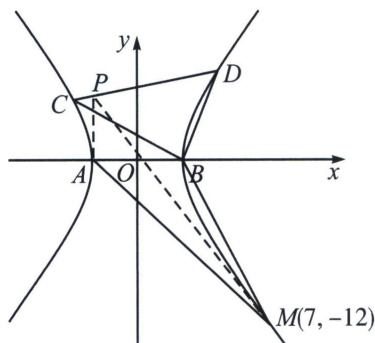
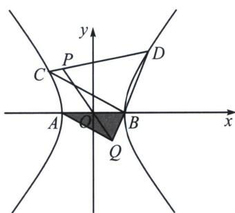
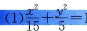

<!-- question-source:start -->
例9 (2025·海安市开学考第18题)在平面直角坐标系 $xOy$ 中, 已知双曲线 $\Gamma: \frac{x^2}{a^2} - \frac{y^2}{b^2} = 1 (a > 0, b > 0)$ 的离心率为 2 , 左、右顶点分别为 $A, B$ , 且 $|AB| = 2$ .

(1)求 $\Gamma$ 的方程;

(2) 直线 l 与 $\Gamma$ 的左、右两支分别交于点 C, D, 记直线 BC, BD 的斜率分别为 $k_{1}$ , $k_{2}$ , 且 $\frac{1}{k_{1}} + \frac{1}{k_{2}} = -1$ .

(i) 求证：直线 l 过定点；

(ii) $P(-1, 2)$ , 直线 $OP$ 与 $BD$ 交于点 $Q$ , 判断并证明直线 $AQ$ 与 $BC$ 的位置关系.

(1)解: 设双曲线 $\Gamma$ 的焦距为 $2c$ , 因为双曲线的离心率为 2, 左、右顶点分别为 $A, B$ , 且 $|AB|=2$ , 所以 $\begin{cases}\frac{c}{a}=2\\2a=2\\a^{2}+b^{2}=c^{2}\end{cases}$ , 解得 $a=1, b=\sqrt{3}, c=2$ , 则 $\Gamma$ 的方程为 $x^{2}-\frac{y^{2}}{3}=1$ ;

对合轴与对合中心: 如图, 由于 $B$ 为射影中心, 故当 $\frac{1}{k_1} + \frac{1}{k_2} = -1$ 恒成立时, 一定有一对合不动点为左顶点 $A$ , 另一对合不动点为 $M$ , 且 $\frac{1}{k_1} + \frac{1}{k_2} = \frac{2}{k_{BM}} = -1$ , 所以 $k_{BM} = -2$ , 联立 $\left\{ \begin{array}{l} y = -2(x - 1) \\ x^2 - \frac{y^2}{3} = 1 \end{array} \right.$ , 所以 $M(7, -12)$ , 过 $A$ 和 $M$ 的切线 $\left\{ \begin{array}{l} x = -1 \\ 7x + 4y = 1 \end{array} \right.$ 交点 $P(-1, 2)$ 即为对合中心, $AM$ 为对合轴.

(i) 证明：将双曲线按照向量 $\overrightarrow{BO} = (-1, 0)$ 平移，则 $(x + 1)^2 - \frac{y^2}{3} = 1$ ，即 $x^2 - \frac{y^2}{3} + 2x = 0$

设直线 $C^{\prime}D^{\prime}$ 的方程为 $mx + ny = 1$ ，联立得： $x^{2} - \frac{y^{2}}{3} + 2x (mx + ny) = 0$ ，由于斜率存在，故同除以 $x^{2}$ 得， $\left(-\frac{1}{3}\right)\left(\frac{y}{x}\right)^{2} + 2n \frac{y}{x} + 1 + 2m = 0$ ，可得 $\frac{1}{k_{1}} + \frac{1}{k_{2}} = -\frac{2n}{1 + 2m} = -1$ ，所以 $-2m + 2n = 1$ ，所以直线 $C^{\prime}D^{\prime}$ 过 $(-2, 2)$ ，即直线 $l$ 恒过定点 $P(-1, 2)$ .

(ii) 因为 $P(-1, 2)$ ，所以直线 $k_{OP} = -2$ ，由于 AB 为 x 轴上关于 O 对称的两点，所以 $\frac{1}{k_{QA}} + \frac{1}{k_{QB}} = \frac{2}{k_{QO}} =$

## 高中数学 新思路 圆锥专题

$\frac{2}{k_{OP}} = -1$ ，因为 $k_{QB} = k_2$ ，且 $\frac{1}{k_1} +\frac{1}{k_2} = -1$ ，所以 $k_{BC} = k_{QA}$ ，所以 $AQ / / BC.$

## 2. 两对合不动点纵坐标相同
<!-- question-source:end -->

![[高中/总复习/专题/2026版高中《mst老唐说题》圆锥曲线专题（数学）/下册/第12章_调和点列与调和线束定理与对合关系/第四节_斜率对合与斜率翻译/四_倒数和型_frac_1__k_1___frac_1__k_2__对合的三种模/例题/answers/Q00048848A1.md]]
