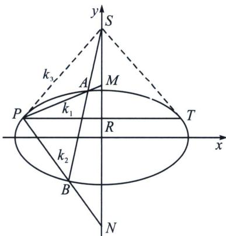

<!-- question-source:start -->
例10 (2025·永州二模第19题)在直角坐标系 $xOy$ 中, 椭圆 $C: \frac{x^2}{a^2} + \frac{y^2}{b^2} = 1 (a > b > 0)$ 经过点 $P(-2\sqrt{3}, 1)$ , 短半轴长为 $\sqrt{5}$ . 过点 $S(0, 5)$ 作直线 $l$ 交 $C$ 于 $A, B$ 两点, 直线 $PA$ 交 $y$ 轴于点 $M$ , 直线 $PB$ 交 $y$ 轴于点 $N$ , 记直线 $PA, PB$ 的斜率分别为 $k_1$ 和 $k_2$ .

(1)求 C 的标准方程;

(2)证明 $\frac{1}{k_{1}}+\frac{1}{k_{2}}$ 是定值，并求出该定值；

(1) $\frac{x^2}{15} + \frac{y^2}{5} = 1$ (详解参考本章第三讲例8);

(2)对合分析: 以 $S$ 作为对合中心, 作两条切线分别切椭圆于 $P(-2 \sqrt{3}, 1)$ , $T(2 \sqrt{3}, 1)$ , 其对合轴为 $P T$ : $y = 1$ , 所以 $P T$ 与 $x$ 轴平行, 所以 $\frac {1}{k _ {1}} + \frac {1}{k _ {2}} = \frac {2}{k _ {3}} = \sqrt {3}$ ;

## 3. 射影中心与对合中心纵坐标相同
<!-- question-source:end -->

![[高中/总复习/专题/2026版高中《mst老唐说题》圆锥曲线专题（数学）/下册/第12章_调和点列与调和线束定理与对合关系/第四节_斜率对合与斜率翻译/四_倒数和型_frac_1__k_1___frac_1__k_2__对合的三种模/例题/answers/Q00048849A1.md]]
