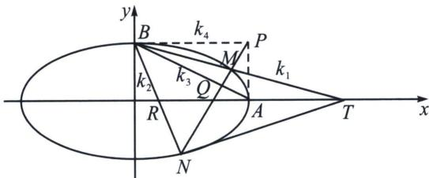

<!-- question-source:start -->
例12 (2024·南通模拟)在平面直角坐标系 $xOy$ 中, 点 $A$ , $B$ 分别是椭圆 $C: \frac{x^2}{a^2} + \frac{y^2}{b^2} = 1 (a > b > 0)$ 的右顶点, 上顶点, 若 $C$ 的离心率为 $\frac{\sqrt{3}}{2}$ , 且 $O$ 到直线 $AB$ 的距离为 $\frac{2}{5}\sqrt{5}$ .

(1)求椭圆 C 的标准方程;

(2) 过点 $P(2, 1)$ 的直线 $l$ 与椭圆 $C$ 交于 $M, N$ 两点，其中点 $M$ 在第一象限，点 $N$ 在 $x$ 轴下方且不在 $y$ 轴上，设直线 $BM, BN$ 的斜率分别为 $k_{1}, k_{2}$ .

①求证： $\frac{1}{k_1} +\frac{1}{k_2}$ 为定值，并求出该定值；

②设直线 BM 与 x 轴交于点 T，求 $\triangle BNT$ 的面积 S 的最大值.

(1)设椭圆 $C$ 的焦距为 $2c(c > 0)$ , 因为椭圆 $C$ 的离心率为 $\frac{\sqrt{3}}{2}$ , 所以 $\frac{c}{a} = \frac{\sqrt{3}}{2}$ , 由 $a^2 - b^2 = c^2$ , 得 $a^2 - b^2 = \frac{3}{4} a^2$ , 即 $a = 2b$ , 所以直线 $AB$ 的方程为 $\frac{x}{2b} + \frac{y}{b} = 1$ , 即 $x + 2y - 2b = 0$ , 因为原点 $O$ 到直线 $BA$ 的距离为 $\frac{2\sqrt{5}}{5}$ , 所以 $\frac{|-2b|}{\sqrt{1^2 + 2^2}} = \frac{2\sqrt{5}}{5}$ , 解得 $b = 1, a = 2$ , 椭圆 $C$ 的标准方程为 $\frac{x^2}{4} + y^2 = 1$ .

极点极线背景分析: 本题给到极点 $P(2,1)$ , 我们求出它的极线方程 $\frac{2x}{4} + y = 1$ , 如图, 即是过椭圆右顶点 $A$ 和上顶点 $B$ 的连线, 设 $AB$ 与 $MN$ 交于点 $Q$ , 则 $P, Q, M, N$ 是调和点列, 因为 $AP \parallel x$ 轴,

由调和点列的平行中点定理知 $B(P, Q; M, N)=B(\infty, A; T, R)=-1$ ，所以 AT=AR，

BM、BN、BA、BP 为调和线束，分别记它们斜率为 $k_{1}$ 、 $k_{2}$ 、 $k_{3}$ 、 $k_{4}$ ，由于 $k_{4} = 0$ ，所以 $\frac{1}{k_1} + \frac{1}{k_2} = \frac{2}{k_3} = -4$ ，

对合分析: 以 $P(2,1)$ 为对合中心, 我们求出它的对合轴方程 $\frac{2x}{4} + y = 1$ , 椭圆右顶点 $A$ 和上顶点 $B$ 的连线, $A$ 和 $B$ 是两个对合不动点, 因为 $BP \parallel x$ 轴, 以 $B$ 为射影中心, 所以一定有 $\frac{1}{k_1} + \frac{1}{k_2} = \frac{2}{k_3} = -4$

由于 B 和 T 都是定点，曲线上只有单动点 N，故以三角换元来处理.

本题最优解答就是齐次化+三角换元，计算量小.

(2)解答: ①将椭圆 $C: \frac{x^{2}}{4} + y^{2} = 1$ 按照向量 $(0, -1)$ 平移, 则得到方程 $\frac{x^{2}}{4} + (y + 1)^{2} = 1 \Rightarrow \frac{x^{2}}{4} + y^{2} + 2y = 0$ , 平移后设 $M^{\prime}N^{\prime}$ 方程为 $\frac{1}{2} x + ny = 1$ , 联立 $\frac{x^{2}}{4} + y^{2} + 2y = \frac{x^{2}}{4} + y^{2} + 2y \left( \frac{1}{2}x + ny \right) = 0$ (构造齐次式), 同除以$x^{2}$ 得， $(1+2n)\frac{y^{2}}{x^{2}}+\frac{y}{x}+\frac{1}{4}=0$ ，所以 $k_{1}, k_{2}$ 是这个关于 $\frac{y}{x}$ 的方程的两个根。 $\frac{1}{k_{1}}+\frac{1}{k_{2}}=-4$ ，为定值，得证。

②由于 $\frac{1}{k_{1}}+\frac{1}{k_{2}}=-4=\frac{2}{k_{AB}}$ ，根据中点斜率定理可知 $|AR|=|AT|$ ，故 $S_{BNT}=2S_{ABN}=|AB|\cdot d, AB:\frac{x}{2}+y=1, |AB|=\sqrt{5}$ ，设 $N(2\cos\theta, \sin\theta)$ （其中 $\theta\in(\pi, 2\pi)$ ）， $d=\frac{2|\cos\theta+\sin\theta-1|}{\sqrt{5}}=\frac{2\left|\sqrt{2}\sin\left(\theta+\frac{\pi}{4}\right)-1\right|}{\sqrt{5}}\in\left[0, \frac{2(\sqrt{2}+1)}{\sqrt{5}}\right]$ ，当且仅当 $\theta=\frac{5\pi}{4}$ 时取得最大值， $S_{BNT\max}=|AB|\cdot d_{\max}=2(\sqrt{2}+1)$ ，所以 $\triangle BNT$ 面积 S 的最大值为 $2\sqrt{2}+2$ 。
<!-- question-source:end -->

![[高中/总复习/专题/2026版高中《mst老唐说题》圆锥曲线专题（数学）/下册/第12章_调和点列与调和线束定理与对合关系/第四节_斜率对合与斜率翻译/四_倒数和型_frac_1__k_1___frac_1__k_2__对合的三种模/例题/answers/Q00048851A1.md]]
