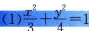

<!-- question-source:start -->
例11（2022·全国乙卷）已知椭圆 E 的中心为坐标原点，对称轴为 x 轴、y 轴，且过 A(0, -2)，B(3/2, -1)两点.

(1) 求 E 的方程;

(2)设过点 $P(1, -2)$ 的直线交 E 于 M, N 两点，过 M 且平行于 x 轴的直线与线段 AB 交于点 T，点 H 满足 $\overrightarrow{MT} = \overrightarrow{TH}$ . 证明：直线 HN 过定点.

(2)对合背景
<!-- question-source:end -->

![[高中/总复习/专题/2026版高中《mst老唐说题》圆锥曲线专题（数学）/下册/第12章_调和点列与调和线束定理与对合关系/第四节_斜率对合与斜率翻译/四_倒数和型斜率对合模型/例题/answers/Q00048850A1.md]]
