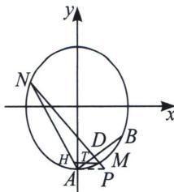

> [!faq]- 《圆锥曲线专题(下册)》例题解析
>
> > [!success]- **【答案】** 详见解析
>
> > [!note]- **【解析】**
> > 如下图，以 $P(1, -2)$ 为对合中心，其对合轴为 $\frac{1 \cdot x}{3} + \frac{-2 \cdot y}{4} = 1$ ，即 $y = \frac{2}{3} x - 2$ ，恰好是 $AB$ ，连接 $AP$ ， $PB$ ，则 $A$ 和 $B$ 是两个对合不动点，由于 $AP // x$ 轴，故 $\frac{1}{k_{AM}} + \frac{1}{k_{AN}} = \frac{2}{k_{AB}} = 3$ ，再分析与 $x$ 轴平行的 $\triangle AMH$ ， $\frac{1}{k_{AM}} + \frac{1}{k_{AH}} = \frac{2}{k_{AT}} = 3$ ，则一定有 $k_{AN} = k_{AH}$ ，故 $A$ 、 $H$ 、 $N$ 三点共线，直线 $HN$ 必过定点 $A(0, -2)$ .
> > 
