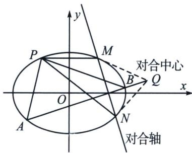

四、倒数和型 $\frac{1}{k_1} +\frac{1}{k_2}$ 对合的三种模型

1. 射影中心与一对合不动点纵坐标相同

过 $P$ (射影中心) 作 $PM \parallel x$ 轴交椭圆于 $M$ , 设 $P$ 与另一个对合不动点 $N$ 的连线斜率为 $k_{3}$ , 则在这一组对合变换中, 始终满足 $\frac{1}{k_{1}} + \frac{1}{k_{2}} = \frac{2}{k_{3}}$ , 联立椭圆与 $PN$ 直线求出点 $N$ , 故 $MN$ 为对合轴, 过 $M$ 和 $N$ 的切线交点 $Q$ 即为对合中心, 也是直线 $AB$ 所过的定点.

![[高中/总复习/专题/2026版高中《mst老唐说题》圆锥曲线专题（数学）/下册/第12章_调和点列与调和线束定理与对合关系/第四节_斜率对合与斜率翻译/四_倒数和型斜率对合模型/例题/Q00053190.md]]
![[高中/总复习/专题/2026版高中《mst老唐说题》圆锥曲线专题（数学）/下册/第12章_调和点列与调和线束定理与对合关系/第四节_斜率对合与斜率翻译/四_倒数和型斜率对合模型/例题/Q00053191.md]]
![[高中/总复习/专题/2026版高中《mst老唐说题》圆锥曲线专题（数学）/下册/第12章_调和点列与调和线束定理与对合关系/第四节_斜率对合与斜率翻译/四_倒数和型斜率对合模型/例题/Q00048850.md]]
![[高中/总复习/专题/2026版高中《mst老唐说题》圆锥曲线专题（数学）/下册/第12章_调和点列与调和线束定理与对合关系/第四节_斜率对合与斜率翻译/四_倒数和型斜率对合模型/例题/Q00053192.md]]
