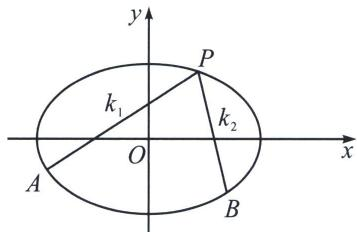

## 一、曲线上双定点单动点斜率调整原理

如图， $P(x_{0},y_{0})$ ， $A(x_{1},y_{1})$ ， $B(x_{2},y_{2})$ 为椭圆 $\frac{x^{2}}{a^{2}}+\frac{y^{2}}{b^{2}}=1(a>b>0)$ 上三点，令 $k_{1}=k_{PA}$ ， $k_{2}=k_{PB}$ ，

利用点差法可知： $k_{1} = \frac{y_{1} - y_{0}}{x_{1} - x_{0}} = -\frac{b^{2}}{a^{2}} \cdot \frac{x_{1} + x_{0}}{y_{1} + y_{0}}$ ，再利用等比定理， $k_{1} = \frac{\lambda(y_{1} - y_{0}) - \mu b^{2}(x_{1} + x_{0})}{\lambda(x_{1} - x_{0}) + \mu a^{2}(y_{1} + y_{0})}$ ，分子分母中利用 $B$ 点替换 $(x_0, y_0)$ ，即可得到 $\lambda, \mu$ 。

例如： $P(x_0,y_0)$ 为椭圆 $\frac{x^2 + y^2}{6} +\frac{y^2}{3} = 1$ 上动点， $A(2,1)$ ， $B(-2,1)$ 均为椭圆上的点， $k_{1} = k_{PA}$ ， $k_{2} = k_{PB}$ 求 $k_{1}$ 与 $k_{2}$ 的关系。

易知： $k_{1}=\frac{y_{0}-1}{x_{0}-2}=-\frac{1}{2}\frac{x_{0}+2}{y_{0}+1}=\frac{\lambda(y_{0}-1)-\mu(x_{0}+2)}{\lambda(x_{0}-2)+2\mu(y_{0}+1)}$

分子： $\lambda (y_0 - 1) - \mu (x_0 + 2) = 0$ ，分母： $\lambda (x_0 - 2) + 2\mu (y_0 + 1) = 0$ ，代入 $B(-2,1)$ ，即 $-4\lambda +4\mu = 0$ 所以 $\lambda = \mu$ ，所以 $k_{1} = \frac{\lambda(y_{0} - 1) - \lambda(x_{0} + 2)}{\lambda(x_{0} - 2) + 2\lambda(y_{0} + 1)} = \frac{(y_{0} - 1) - (x_{0} + 2)}{(x_{0} + 2) + 2(y_{0} - 1)} = \frac{k_{2} - 1}{1 + 2k_{2}}$ ，即 $2k_{1}k_{2} + k_{1} - k_{2} + 1 = 0$

与之前的斜率对合情况 $ak_{1}k_{2} + b(k_{1} + k_{2}) + c = 0$ 不同的是，对合强调射影变换，需要对合轴与对合中心的对应，而斜率调整更为广泛。

![[高中/总复习/专题/2026版高中《mst老唐说题》圆锥曲线专题（数学）/下册/第13章_新定义下的斜率调整与仿射/第一节_斜率调整法/一_曲线上双定点单动点斜率调整原理/例题/Q00048969.md]]
![[高中/总复习/专题/2026版高中《mst老唐说题》圆锥曲线专题（数学）/下册/第13章_新定义下的斜率调整与仿射/第一节_斜率调整法/一_曲线上双定点单动点斜率调整原理/例题/Q00048877.md]]
