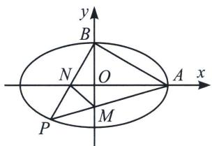
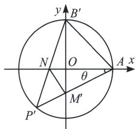

<!-- question-source:start -->
例①（2016·北京）已知椭圆 $C: \frac{x^2}{a^2} + \frac{y^2}{b^2} = 1$ 过点 $A(2,0), B(0,1)$ 两点.

(1)求椭圆 C 的方程及离心率;

(2)设 $P$ 为第三象限内一点且在椭圆 $C$ 上, 直线 $PA$ 与 $y$ 轴交于点 $M$ , 直线 $PB$ 与 $x$ 轴交于点 $N$ , 求证: 四边形ABNM的面积为定值.

(1)因为椭圆 $C: \frac{x^2}{a^2} + \frac{y^2}{b^2} = 1$ 过点 $A(2,0), B(0,1)$ 两点，所以 $a = 2, b = 1$ ，则 $c = \sqrt{a^2 - b^2} = \sqrt{4 - 1} = \sqrt{3}$ ，所以椭圆 $C$ 的方程为 $\frac{x^2}{4} + y^2 = 1$ ，离心率为 $e = \frac{\sqrt{3}}{2}$ ；

(2)解法一(仿射变换): 如图, 作 $\left\{ \begin{array}{l} x' = x \\ y' = 2y \end{array} \right. \Rightarrow \left\{ \begin{array}{l} x = x' \\ y = \frac{1}{2} y' \end{array} \right. \Rightarrow x'^2 + y'^2 = 4$ , 则 $\angle P' = 45^\circ$ , $\angle P'B'O + \angle P'AO = 45^\circ$ , 令 $\angle P'AO = \theta$ , $S_{ABNM} = \frac{1}{2} S_{AB'NM'} = \frac{1}{4} |AN| \cdot |B'M'| = \frac{1}{4}(2 + 2\tan (45^\circ - \theta))(2 + 2\tan \theta) = 2$ .
<!-- question-source:end -->

![[高中/总复习/专题/2026版高中《mst老唐说题》圆锥曲线专题（数学）/下册/第13章_新定义下的斜率调整与仿射/第一节_斜率调整法/一_曲线上双定点单动点斜率调整原理/例题/answers/Q00048969A1.md]]
