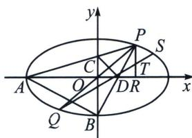

> [!faq]- 《圆锥曲线专题(下册)》例题解析
>
> > [!success]- **【答案】** 详见解析
>
> > [!note]- **【解析】**
> > 解析 (1)因为椭圆 $\frac{x^2}{a^2} +\frac{y^2}{b^2} = 1$ ， $(a > b > 0)$ 的短轴长为2，且过点 $\left(1,\frac{\sqrt{3}}{2}\right)$ ，所以 $b = 1$ ， $\frac{1}{a^2} +\frac{3}{4} = 1$ ，所以 $a = 2$ ，因此椭圆方程为： $\frac{x^2}{4} +y^2 = 1.$
> >
> > 
> >
> > (2)
> > 解法一：如图，设 $P(x_0, y_0)$ ，那么 $PA: y = \frac{y_0}{x_0 + 2} (x + 2)$ ， $PB: y = \frac{y_0 + 1}{x_0} x - 1$
> >
> > 对 $y = \frac{y_0 + 1}{x_0} x - 1$ ，令 $y = 0 \Rightarrow x_D = \frac{x_0}{y_0 + 1}$ ， $\frac{S_{\triangle PAB}}{S_{\triangle PCD}} = \frac{\frac{1}{2}|PA| \times |PB| \sin \angle APB}{\frac{1}{2}|PC| \times |PD| \sin \angle APB} = \frac{|PA| \times |PB|}{|PC| \times |PD|}$ ，
> >
> > 因此根据相似三角形性质可得： $\frac{S_{\triangle PCD}}{S_{\triangle PAB}} = \frac{x_0}{x_0 + 2}\frac{x_0 - \frac{x_0}{y_0 + 1}}{x_0} = \frac{1}{6}$ ，因此 $x_0 = 2\frac{y_0 + 1}{5y_0 - 1}$
> >
> > 又由于 $\frac{x_0^2}{4} + y_0^2 = 1$ ，因此 $\left(\frac{y_0 + 1}{5y_0 - 1}\right)^2 + y_0^2 = 1, y_0 > 0$ ，解得 $y_0 = \frac{4}{5}$ 或 $y_0 = \frac{3}{5}$ ，因此对应的 $x_0$ 分别为 $x_0 = \frac{6}{5}$ 或 $x_0 = \frac{8}{5}$ ，因此 $P\left(\frac{8}{5}, \frac{3}{5}\right)$ 或 $\left(\frac{6}{5}, \frac{4}{5}\right)$ .
> >
> > 解法二(斜率调整): $k_{PA} = k_{1} = \frac{y}{x + 2} = -\frac{1}{4}\frac{x - 2}{y} = \frac{\lambda y - \mu(x - 2)}{\lambda(x + 2) + 4\mu y}$ , 当 $\left\{ \begin{array}{l} \lambda y - \mu(x - 2) = 0 \\ \lambda (x + 2) + 4\mu y = 0 \end{array} \right.$ , 代入 $B(0, -$
> >
> > 1) 得： $\lambda=2\mu$ ，所以 $k_{1}=\frac{2y-(x-2)}{2(x+2)+4y}=\frac{2(y+1)-x}{4(y+1)+2x}=\frac{2k_{2}-1}{4k_{2}+2}$ ，即 $4k_{1}k_{2}+2k_{1}-2k_{2}+1=0$ ，
> >
> > 又由于 $k_{1} = \frac{y_{C}}{2}$ ， $k_{2} = \frac{1}{x_{D}}$ ，所以 $(y_{C} + 1)(x_{D} + 2) = 4$ ，即 $S_{\text{四边形}ABDC} = \frac{1}{2}|AD||BC| = \frac{1}{2}(x_D + 2)(y_C + 1)$ $= 2.$
> >
> > 所以 $S_{PAB} = 2 \div \frac{5}{6} = \frac{12}{5} = \frac{1}{2} |AB| d = \frac{\sqrt{5}}{2} d$ ，所以 $d = \frac{24}{5\sqrt{5}}$ ，作直线 $y = -\frac{1}{2} x + m$ ， $AB: y = -\frac{1}{2} x - 1$ ，所以 $d = \frac{|m + 1|}{\sqrt{1 + \frac{1}{4}}} = \frac{2|m + 1|}{\sqrt{5}} = \frac{24}{5\sqrt{5}} \Rightarrow m = \frac{7}{5}$ 或 $m = -\frac{17}{5}$ （舍）， $\left\{ \begin{array}{l} \frac{x^2}{4} + y^2 = 1 \\ y = -\frac{1}{2} x + \frac{7}{5} \end{array} \right. \Rightarrow P\left(\frac{8}{5}, \frac{3}{5}\right)$ 或 $P\left(\frac{6}{5}, \frac{4}{5}\right)$ ;
> >
> > (3)设 $S(m, n)$ ，那么 $k_{PS} = \frac{n - y_0}{m - x_0}$ ， $k_{QS} = \frac{n + y_0}{m + x_0}$ ，那么 $k_{PS} \cdot k_{QS} = \frac{n^2 - y_0^2}{m^2 - x_0^2} = \frac{n^2 - \left(1 - \frac{x_0^2}{4}\right)}{4 - 4n^2 - x_0^2} = -\frac{1}{4}$ （第三定义）。又由于 $k_{QS} = \frac{\frac{y_0}{2} + y_0}{x_0 - (-x_0)} = \frac{3}{4}\frac{y_0}{x_0} = \frac{3}{4} k_{PQ}$ ，因此 $k_{PQ} \cdot k_{PS} = -\frac{1}{3}$ ，那么 $k_{PS} = -\frac{1}{3k_{PQ}}$ ，设 $k = \frac{y_0}{x_0} > 0$ ，直线 $PQ$ 倾斜角为 $\beta$ ，直线 $PS$ 倾斜角为 $\alpha$ ，因此 $\angle QPS = \alpha - \beta$ ，那么 $\tan \angle QPS = \frac{\tan \alpha - \tan \beta}{1 + \tan \alpha \tan \beta} = -\frac{3}{2}\left(k + \frac{1}{3k}\right) \leqslant -\frac{3}{2} \times \frac{2}{\sqrt{3}} = -\sqrt{3}$ ，由于 $\angle QPS = \alpha - \beta \in \left(\frac{\pi}{2}, \pi\right)$ ，因此 $\angle QPS \leqslant \frac{2\pi}{3}$ ，此时 $k = \frac{\sqrt{3}}{3}$ ，因此 $QP: y = \frac{\sqrt{3}}{3}x$ 。
