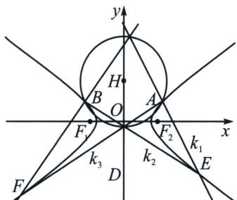

<!-- question-source:start -->
例4 (2024 江苏南京师大附中(25 陪跑课学员林浩然提问))已知点 $A(2,1)$ , $B(-2,1)$ 在双曲线 $C$ : $\frac{x^{2}}{2}-y^{2}=1$ 上, 过点 $D(0,-3)$ 作直线 $l$ 交双曲线于点 $E$ , $F$ (不与点 $A$ , $B$ 重合). 证明:

(1)记点 $P(0, 2 + \sqrt{5})$ ，当直线 l 平行于 x 轴，且与双曲线的右支交点为 E 时，P, A, E 三点共线；

(2) 直线 $AE$ 与直线 $BF$ 的交点在定圆上，并求出该圆的方程.

(1)由题意, 当直线 $l$ 平行于 $x$ 轴时, $l$ 方程为 $y = -3$ , 且与双曲线的右支交点为 $E$ , 则 $\frac{x^2}{2} - (-3)^2 = 1 \Rightarrow E(2\sqrt{5}, -3)$ , $AE$ 的斜率 $k_{AE} = \frac{4}{2 - 2\sqrt{5}} = -\frac{1 + \sqrt{5}}{2}$ , $AP$ 的斜率 $k_{AP} = \frac{1 + \sqrt{5}}{-2} = -\frac{1 + \sqrt{5}}{2} = k_{AE}$ , 所以 $P, A, E$ 三点共线.

(2)本题在上册第八章已经介绍了两种解法，其中一种就是利用四点构造曲线系，关于斜率关系，斜率调整就是一种万能的解法，区别就是计算量的大小问题.

设 $k_{1} = k_{AE} = \frac{y - 1}{x - 2} = \frac{1}{2}\frac{x + 2}{y + 1} = \frac{(y - 1) + \lambda(x + 2)}{(x - 2) + 2\lambda(y + 1)}$ ，代入 $\left\{ \begin{array}{l} y_B - 1 + \lambda (x_B + 2) = 0 \\ x_B - 2 + 2\lambda (y_B + 1) = 0 \end{array} \right.$ ，所以 $\lambda = 1$ ，于是不妨令 $k_{2} = k_{BF} = \frac{y - 1}{x + 2}$ 时， $k_{1} = \frac{(y - 1) + (x + 2)}{(x - 2) + 2(y + 1)} = \frac{(y - 1) + (x + 2)}{(x + 2) + 2(y - 1)} = \frac{k_2 + 1}{1 + 2k_2}$ ，所以 $2k_{1}k_{2} + k_{1} - k_{2} - 1 = 0$ ；

由于 EF 过 D(0, -3)，不在曲线上，不能用斜率调整，故 D 可以作为一个对合中心，设 $k_{AF} = k_{3}$ ，一定有对合关系 $pk_{1}k_{3} + q(k_{1} + k_{3}) + r = 0$ ，可以采用齐次化求出，将双曲线按照 $\overrightarrow{AO}:(-2, -1)$ 平移， $\frac{(x+2)^{2}}{2} - (y+1)^{2} = 1$ ，即 $\frac{x^{2}}{2} - y^{2} + 2x - 2y = 0$ ，平移后第三条边 $E'F'$ 过 $D'(-2, -4)$ ，令 $E'F': mx + ny = 1$ ，所以 $m = -\frac{1}{2} - 2n$ ，联立得： $\frac{x^{2}}{2} - y^{2} + (2x - 2y)\left[ \left( -\frac{1}{2} - 2n \right)x + ny \right] = 0$ ，同除以 $x^{2}, (1 + 2n)\left(\frac{y}{x}\right)^{2} - (6n + 1)\frac{y}{x} + 4n + \frac{1}{2} = 0$ ， $k_{1} + k_{3} = 3 - \frac{2}{1 + 2n}$ ， $k_{1}k_{3} = 2 - \frac{\frac{3}{2}}{1 + 2n}$ ， $4k_{1}k_{3} - 3(k_{1} + k_{3}) + 1 = 0$ ;

所以 $k_{1} = \frac{k_{2} + 1}{1 + 2k_{2}} = \frac{3k_{3} - 1}{4k_{3} - 3}$ ，而 $k_{2} = \frac{y - 1}{x + 2}, k_{3} = \frac{y - 1}{x - 2}$ ，利用对称性可知，EF可互换（对合），图中AF和BE交点与AE和BF交点的轨迹是等价的，所以 $\frac{\frac{y - 1}{x + 2} + 1}{1 + 2\frac{y - 1}{x + 2}} = \frac{3\frac{y - 1}{x - 2} - 1}{4\frac{y - 1}{x - 2} - 3}$ ，即 $x^{2} + y^{2} - 4y - 1 = 0.$

>注意 三种方法中，曲线系最无脑算，斜率调整需要一些斜率对合背景，方法优劣由大家选择取舍.
<!-- question-source:end -->

![[高中/总复习/专题/2026版高中《mst老唐说题》圆锥曲线专题（数学）/下册/第13章_新定义下的斜率调整与仿射/第一节_斜率调整法/三_斜率调整与对合的综合/例题/answers/Q00048879A1.md]]
