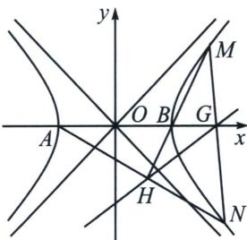

> [!faq]- 《圆锥曲线专题(下册)》例题解析
>
> > [!success]- **【答案】** 详见解析
>
> > [!note]- **【解析】**
> > 解析 (1)因为 $M(5,4)$ 在 $\pmb{E}$ 上，所以 $\frac{25}{a^2} -\frac{16}{b^2} = 1.$ ①
> >
> > 因为 $A(-a, 0)$ , $B(a, 0)$ , 所以 $\overrightarrow{MA} = (-a - 5, -4)$ , $\overrightarrow{MB} = (a - 5, -4)$ , 所以 $\overrightarrow{MA} \cdot \overrightarrow{MB} = 41 - a^2 = 32$ , ②
> >
> > 由①②解得 a=3, b=3，故 E 的方程为 $\frac{x^{2}}{9}-\frac{y^{2}}{9}=1$ .
> >
> > (2)
> > 解法一: 设直线 $NA$ 的方程为 $x = my - 3$ , 直线 $MB$ 的方程为 $y = 2x - 6$ .
> >
> > 联立 $\left\{\begin{aligned}x=my-3,\\ y=2x-6,\end{aligned}\right.$ 得 $H\left(\frac{6m+3}{2m-1},\frac{12}{2m-1}\right).$ 联立 $\left\{\begin{aligned}x=my-3,\\ x^{2}-y^{2}=9,\end{aligned}\right.$ 消去x，整理得 $(m^{2}-1)y^{2}-6my=0,$
> >
> > 所以 $y_{N}=\frac{6m}{m^{2}-1}$ ， $x_{N}=\frac{3m^{2}+3}{m^{2}-1}$ ，即 $N\left(\frac{3m^{2}+3}{m^{2}-1},\frac{6m}{m^{2}-1}\right)$ 。所以直线 MN 的斜率为 $\frac{\frac{6m}{m^{2}-1}-4}{\frac{3m^{2}+3}{m^{2}-1}-5}=\frac{2m+1}{m+2}$ ，
> > 所以直线 MN 的方程为 $y=\frac{2m+1}{m+2}(x-5)+4$ 。令 y=0，得 $x=\frac{6m-3}{2m+1}$ ，即 $G\left(\frac{6m-3}{2m+1},0\right)$ 。
> >
> > 所以直线 $GH$ 的斜率为 $\frac{\frac{12}{2m - 1}}{\frac{6m + 3}{2m - 1} - \frac{6m - 3}{2m + 1}} = \frac{2m + 1}{2m}$ ，所以直线 $GH$ 的方程为 $y = \frac{2m + 1}{2m}\left(x - \frac{6m - 3}{2m + 1}\right)$ ，即 $2m(x - y - 3) + x + 3 = 0$ 。由 $\left\{ \begin{array}{l} x - y - 3 = 0, \\ x + 3 = 0, \end{array} \right.$ 解得 $x = -3, y = -6$ ，故直线 $GH$ 过定点 $(-3, -6)$ 。
> >
> > 
> >
> > 解法二(对合): $M: \left(\frac{3}{\cos \theta_1}, 3 \tan \theta_1\right)$ , 所以 $k_{BM} = \frac{\tan \theta_1}{\frac{3}{\cos \theta_1} - 3} = \frac{1}{\tan \frac{\theta_1}{2}} = \frac{1}{t_1} = \frac{4}{5 - 3} = 2, BM: y = 2(x - 3), N = \left(\frac{3}{\cos \theta_2}, 3 \tan \theta_2\right)$ , 所以 $k_{AN} = \frac{3 \tan \theta_2}{\frac{3}{3 \cos \theta_2} + 3} = \tan \frac{\theta_2}{2} = t_2, AN: y = t_2 (x + 3)$ , 联立得: $H: \left(\frac{3(2 + t_2)}{2 - t_2}, \frac{12t_2}{2 - t_2}\right)$ ; $MN: \frac{x}{3}(t_1 t_2 + 1) - \frac{y}{3}(t_1 + t_2) = 1 - t_1 t_2$ (过程自证), 当 $y = 0, x_G = \frac{3(1 - t_1 t_2)}{1 + t_1 t_2} = \frac{3(2 - t_2)}{2 + t_2}$ ;
> >
> > 利用直线两点式 $\frac{y - y_G}{x - x_G} = \frac{y - y_H}{x - x_H} \Rightarrow x_Gy_H - x_Hy_G = x(y_H - y_G) - y(x_H - x_G)$ ， $\frac{12t_2}{2 + t_2} = x\frac{4t_2}{2 - t_2} - y\left(\frac{2 + t_2}{2 - t_2} - \frac{2 - t_2}{2 + t_2}\right) \Rightarrow \frac{(12 + y)t_2 - 2y}{2 + t_2} = \frac{(4x - y)t_2 - 2y}{2 - t_2}$ ，交叉相乘必须是平方差形式，所以 $\left\{ \begin{array}{l} 12 + y = -y \\ 4x - y = y \end{array} \right. \Rightarrow$ $\left\{ \begin{array}{l} x = -3 \\ y = -6 \end{array} \right.$ ，或者求出 $k_{GH} = \frac{\frac{12t_2}{2 - t_2}}{\frac{3(2 + t_2)}{2 - t_2} - \frac{3(2 - t_2)}{2 + t_2}} = \frac{2 + t_2}{2}$ ，同时 $y = \frac{2 + t_2}{2}\left(x - \frac{6 - 3t_2}{2 + t_2}\right) = \frac{t_2}{2}(x + 3) + x - 3$ ，所以 $\left\{ \begin{array}{l} x = -3 \\ y = -6 \end{array} \right.$ ；
> >
> > 解法三(斜率调整): $k_{MN} = \frac{y - 4}{x - 5} = \frac{x + 5}{y + 4} = \frac{y - 4 + 2(x + 5)}{(x - 5) + 2(y + 4)} = \frac{y + 2(x + 3)}{2y + (x + 3)} = \frac{2 + k_{AN}}{1 + 2k_{AN}}$ , 设 $AN: x = my - 3$ , 则 $k_{AN} = \frac{1}{m}$ , $k_{MN} = \frac{2m + 1}{m + 2}$ , 则 $MN: y - 4 = \frac{2m + 1}{m + 2}(x - 5)$ , 当 $y = 0$ , 则 $G\left(\frac{6m - 3}{2m + 1}, 0\right)$ ; $\left\{ \begin{array}{l} AN: x = my - 3 \\ BM: y = 2x - 6 \end{array} \Rightarrow H\left(\frac{6m + 3}{2m - 1}, \frac{12}{2m - 1}\right)\right.$ , 所以 $GH: y = \frac{2m + 1}{2m}(x + 3) - 6$
> >
> > 综上所述，直线 GH 过定点 $(-3, -6)$ .
