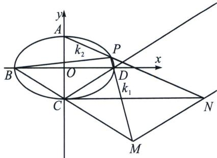

<!-- question-source:start -->
例3 (2023·北京)已知椭圆 $E: \frac{x^{2}}{a^{2}} + \frac{y^{2}}{b^{2}} = 1 (a > b > 0)$ 的离心率为 $\frac{\sqrt{5}}{3}$ , $A$ 、 $C$ 分别为 $E$ 的上、下顶点, $B$ 、 $D$ 分别为 $E$ 的左、右顶点, $|AC| = 4$ .

(1)求 E 的方程;

(2) 点 P 为第一象限内 E 上的一个动点，直线 PD 与直线 BC 交于点 M，直线 PA 与直线 y = -2 交于点 N．求证： $MN \parallel CD$ .

(1)由题意可得: $2b = 4, e = \frac{\sqrt{5}}{3} = \frac{c}{a}, a^2 = b^2 + c^2$ , 解得 $b = 2, a^2 = 9$ , 所以椭圆 $E$ 的方程为 $\frac{x^2}{9} +$

$$
\frac {y ^ {2}}{4} = 1.
$$

(2)本题我们在上一章节已经介绍过了三角单动点换元来表示斜率, 但凡斜率和圆锥曲线上的两个定点,都可以利用斜率调整的方法.

令 $PD: y = k_{1}(x - 3)$ ，联立 $\left\{ \begin{array}{l} y = k_{1}(x - 3) \\ y = -\frac{2}{3} x - 2 \end{array} \right.$ 得： $M\left(\frac{9k_{1} - 6}{3k_{1} + 2}, \frac{-12k_{1}}{3k_{1} + 2}\right)$ ；同理 $PA: y = k_{2}x + 2$ ，则 $N\left(-\frac{4}{k_{2}}, -2\right)$ ，所以 $k_{1} = \frac{y}{x - 3} = -\frac{4}{9}\frac{x + 3}{y} = \frac{y - 4\lambda(x + 3)}{(x - 3) + 9\lambda y}$ （可以单参数）， $\left\{ \begin{array}{l} y - 4\lambda(x + 3) = 0 \\ (x - 3) + 9\lambda y = 0 \end{array} \right.$ ，代入 $A(0,2)$ ， $\lambda = \frac{1}{6}$ ；所以 $k_{1} = \frac{y - \frac{2}{3}(x + 3)}{(x - 3) + \frac{3}{2}y} = \frac{y - 2 - \frac{2}{3}x}{x + \frac{3}{2}(y - 2)} = \frac{k_{2} - \frac{2}{3}}{1 + \frac{3}{2}k_{2}} \Rightarrow k_{1}k_{2} = \frac{2}{3}(k_{2} - k_{1}) - \frac{4}{9}$ ， $k_{MN} = \frac{-2 + \frac{12k_{1}}{3k_{1} + 2}}{\frac{-4}{k_{2}} - \frac{9k_{1} - 6}{3k_{1} + 2}} = \frac{k_{2}(6k_{1} - 4)}{-12k_{1} - 8 - 9k_{1}k_{2} + 6k_{2}} = \frac{4(k_{2} - k_{1}) - \frac{8}{3} - 4k_{2}}{-12k_{1} - 8 - 6(k_{2} - k_{1}) + 4 + 6k_{2}} = \frac{2}{3}$ .
<!-- question-source:end -->

![[高中/总复习/专题/2026版高中《mst老唐说题》圆锥曲线专题（数学）/下册/第13章_新定义下的斜率调整与仿射/第一节_斜率调整法/二_斜率调整与斜率表示/例题/answers/Q00048878A1.md]]
