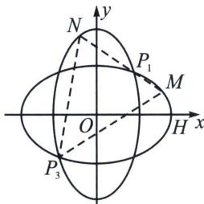
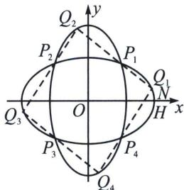

<!-- question-source:start -->
例6 (2025 武汉四调 T19) 如图, 椭圆 $\Gamma_{1}: \frac{x^{2}}{m} + \frac{y^{2}}{n} = 1 (m > n > 0)$ , $\Gamma_{2}: \frac{x^{2}}{n} + \frac{y^{2}}{m} = 1$ , 已知 $\Gamma_{1}$ 右顶点为 $H(2,0)$ , 且它们的交点分别为 $P_{1}(1,1)$ , $P_{2}(-1,1)$ , $P_{3}(-1,-1)$ , $P_{4}(1,-1)$

(1)求 $\Gamma_{1}$ 与 $\Gamma_{2}$ 的标准方程；

(2) 过点 $P_{1}$ 作直线 $MN$ ，交 $\Gamma_{1}$ 于点 $M$ ，交 $\Gamma_{2}$ 于点 $N$ ，设直线 $P_{3}M$ 的斜率为 $k_{1}$ ，直线 $P_{3}N$ 的斜率为 $k_{2}$ ，求 $\frac{k_{2}}{k_{1}}$ ；（上述各点均不重合）

(3)点 $Q_{1}$ 是 $\Gamma_{1}$ 上的动点, 直线 $Q_{1}P_{1}$ 交 $\Gamma_{2}$ 于点 $Q_{2}$ , 直线 $Q_{2}P_{2}$ 交 $\Gamma_{1}$ 于点 $Q_{3}$ , 直线 $Q_{3}P_{3}$ 交 $\Gamma_{2}$ 于点 $Q_{4}$ , 直线 $Q_{4}P_{4}$ 与直线 $Q_{1}P_{1}$ 交于点 $N$ , 求点 $G$ 坐标, 使直线 $NG$ 与直线 $NH$ 的斜率之积为定值. (上述各点均不重合)

<!-- question-source:end -->

![[高中/总复习/专题/2026版高中《mst老唐说题》圆锥曲线专题（数学）/下册/第13章_新定义下的斜率调整与仿射/第一节_斜率调整法/四_斜率调整背景__斯坦纳定理/例题/answers/Q00053222A1.md]]
