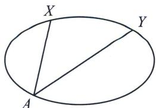
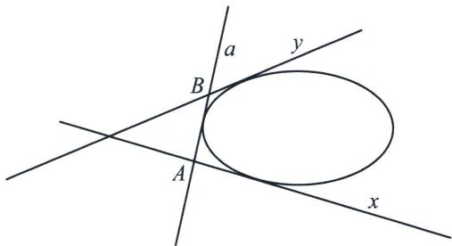
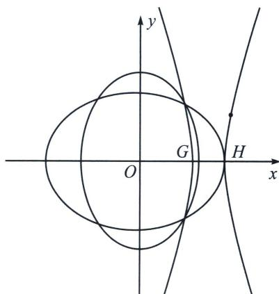
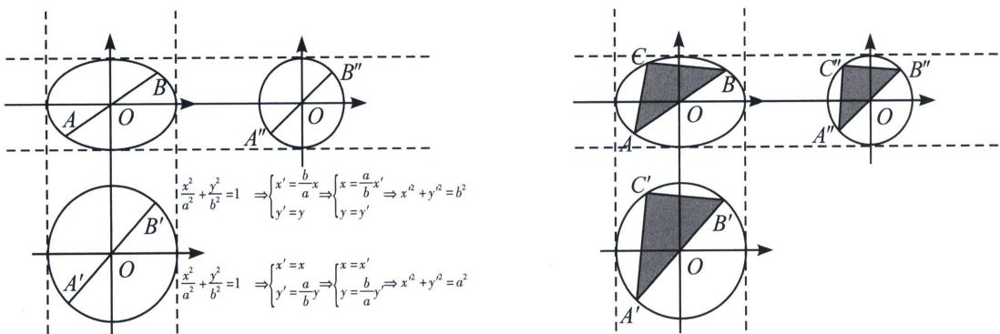

> [!faq]- 《圆锥曲线专题(下册)》例题解析
>
> > [!success]- **【答案】** 详见解析
>
> > [!note]- **【解析】**
> > 解析 (1)由题意得, $m = 4$ , 又因为 $P_{1}(1, 1)$ 在 $\Gamma_{1}$ 上, 代入 $\Gamma_{1}$ 得 $\frac{1}{4} + \frac{1}{n} = 1$ , 所以 $n = \frac{4}{3}$ , 则 $\Gamma_{1}: \frac{x^{2}}{4} + \frac{y^{2}}{\frac{4}{3}} = 1$ , $\Gamma_{2}: \frac{x^{2}}{\frac{4}{3}} + \frac{y^{2}}{4} = 1$ .
> >
> > (2)设 $M(x_{1},y_{1})$ ， $N(x_{2},y_{2})$ ，则 $k_{P_1M}\cdot k_{P_3M} = \frac{(y_1 - 1)}{(x_1 - 1)}\frac{(y_1 + 1)}{(x_1 + 1)} = \frac{y_1^2 - 1}{x_1^2 - 1}$ 又因为 $\frac{x_1^2}{4} +\frac{y_1^2}{\left(\frac{4}{3}\right)} = 1$ ，所以 $y_{1}^{2} = \frac{4}{3}\left(1 - \frac{x_{1}^{2}}{4}\right) = \frac{4 - x_{1}^{2}}{3}$ 则 $k_{P_1M}\cdot k_{P_3M} = \frac{\frac{4 - x_1^2}{3} - 1}{x_1^2 - 1} = -\frac{1}{3}$ ，同理可得 $k_{P_1N}\cdot k_{P_3N} = -3$ ，所以 $\frac{k_2}{k_1} = 9.$
> >
> > (3)设直线 $Q_{1}Q_{2}$ ， $Q_{2}Q_{3}$ ， $Q_{3}Q_{4}$ ， $Q_{4}N$ 分别为 $l_{1}$ ， $l_{2}$ ， $l_{3}$ ， $l_{4}$ ，其斜率依次为 $k_{1}$ ， $k_{2}$ ， $k_{3}$ ， $k_{4}$ ，
> >
> > 解法一：设直线 $l_{1}$ ： $y-1=k_{1}(x-1)$ ，联立 $\frac{3x^{2}}{4}+\frac{y^{2}}{4}=1$ 得 $(k_{1}^{2}+3)x^{2}+2k_{1}(1-k_{1})x+(1-k_{1})^{2}-4=0$ ，
> > 即有 $x_{Q_{2}}\cdot x_{P_{1}}=\frac{k_{1}^{2}-2k_{1}-3}{k_{1}^{2}+3}$ ，所以 $x_{Q_{2}}=\frac{k_{1}^{2}-2k_{1}-3}{k_{1}^{2}+3}$ ，代入直线方程得 $y_{Q_{2}}=\frac{-k_{1}^{2}-6k_{1}+3}{k_{1}^{2}+3}$ ，
> >
> > 则 $k_{2} = \frac{y_{Q_{2}} - 1}{x_{Q_{2}} + 1} = \frac{-2k_{1}^{2} - 6k_{1}}{2k_{1}^{2} - 2k_{1}} = -\frac{k_{1} + 3}{k_{1} - 1}$ 设 $f(x) = -\frac{x + 3}{x - 1}$ ，则经过 $P_{1}, P_{2}$ 的两直线 $l_{1}, l_{2}$ 之间斜率满足关系： $k_{2} = f(k_{1})$ ，将直线 $l_{2}, l_{3}$ 绕原点顺时针旋转 $\frac{\pi}{2}$ 后也会经过 $P_{1}, P_{2}$ ，所以两者斜率满足 $-\frac{1}{k_3} = f(-\frac{1}{k_2})$ ，所以 $k_{3} = -\frac{1}{f\left(-\frac{1}{k_2}\right)} = \frac{-1 - k_2}{-1 + 3k_2} = \frac{-1}{k_1 + 2}$ ，同理将直线 $l_{3}, l_{4}$ 绕原点顺时针旋转 $\pi$ 后也会经过 $P_{1}, P_{2}$ ，
> >
> > 所以两直线斜率满足 $k_{4} = f(k_{3})$ ， $k_{4} = -\frac{k_{3} + 3}{k_{3} - 1} = -\frac{\left(\frac{-1}{k_{1} + 2}\right) + 3}{\left(\frac{-1}{k_{1} + 2}\right) - 1} = \frac{3k_1 + 5}{k_1 + 3}$ ，设 $N(x,y)$ ，则有 $\frac{y - 1}{x - 1} = k_1$ $\frac{y - 1}{x + 1} = k_4$ ，代入上式得： $\frac{y + 1}{x - 1} = \frac{3 \cdot \frac{y - 1}{x - 1} + 5}{\frac{y - 1}{x - 1} + 3}$ ，得到 $y^{2} = 5x^{2} - 16x + 12 = (5x - 6)(x - 2)$ ，所以 $\frac{y}{x - \frac{6}{5}} \cdot \frac{y}{x - 2} = 5$ ，因此存在定点 $G\left(\frac{6}{5},0\right)$ ，使直线 $GN$ 和直线 $HN$ 的斜率之积为定值5.
> >
> > 解法二(斜率调整): $Q_{1}(x_{1}, y_{1}), Q_{2}(x_{2}, y_{2}), Q_{3}(x_{3}, y_{3}), Q_{4}(x_{3}, y_{3}), N(x, y)$ ,
> >
> > $k_{1}=\frac{y_{2}-1}{x_{2}-1}=-\frac{3(x_{2}+1)}{y_{2}+1}=\frac{y_{2}-1-3(x_{2}+1)}{x_{2}-1+y_{2}+1}=\frac{y_{2}-1-3(x_{2}+1)}{x_{2}+1+y_{2}-1}=\frac{k_{2}-3}{1+k_{2}}$ ，所以 $k_{2}=\frac{3+k_{1}}{1-k_{1}}$ ，同理， $k_{3}=$ $\frac{y_{4}+1}{x_{4}+1}=-\frac{3(x_{4}-1)}{y_{4}-1}=\frac{y_{4}+1-3(x_{4}-1)}{x_{4}+1+y_{4}-1}=\frac{y_{4}+1-3(x_{4}-1)}{x_{4}-1+y_{4}+1}=\frac{k_{4}-3}{1+k_{4}}$
> >
> > $$
> > k _ {2} = \frac {y _ {3} - 1}{x _ {3} + 1} = - \frac {x _ {3} - 1}{3 (y _ {3} + 1)} = \frac {y _ {3} - 1 - (x _ {3} - 1)}{x _ {3} + 1 + 3 (y _ {3} + 1)} = \frac {y _ {3} + 1 - (x _ {3} + 1)}{x _ {3} + 1 + 3 (y _ {3} + 1)} = \frac {k _ {3} - 1}{1 + 3 k _ {3}},
> > $$
> >
> > 所以 $k_{2} = \frac{3 + k_{1}}{1 - k_{1}} = \frac{k_{3} - 1}{1 + 3k_{3}} = \frac{\frac{k_{4} - 3}{1 + k_{4}} - 1}{1 + 3\cdot\frac{k_{4} - 3}{1 + k_{4}}} = \frac{1}{2 - k_{4}}\Rightarrow k_{1} = \frac{-3k_{4} + 5}{k_{4} - 3}$ ，由于 $k_{1} = \frac{y - 1}{x - 1}, k_{4} = \frac{y + 1}{x - 1},$
> >
> > 所以 $y^{2} = 5x^{2} - 16x + 12 = (5x - 6)(x - 2)$ ，所以 $\frac{y}{x - \frac{6}{5}} \cdot \frac{y}{x - 2} = 5$ ，因此存在定点 $G\left(\frac{6}{5}, 0\right)$ ，使直线 $GN$ 和直线 $HN$ 的斜率之积为定值 5.
> >
> > 背景:
> >
> > 斯坦纳定理：
> >
> > ## 1. 点的斯坦纳定理
> >
> > 二次曲线任取两个点 $X$ 、 $Y$ 作为定点，则有 $A$ 是曲线上任意一点，线 $AX$ 与线 $AY$ 是射影对应的；此射影对应具有传递性，且逆定理成立.
> >
> > 
> >
> > ## 2. 线的斯坦纳定理
> >
> > 二次曲线任取两切线 $x, y$ 。对于任意动切线 $a, a$ 与 $x$ 的交点为 $A, a$ 与 $y$ 的交点为 $B$ , 则 $A, B$ 互为射影对应, 此射影对应也具有传递性, 且逆定理成立.
> >
> > 
> >
> > 由斯坦纳定理可知：
> >
> > $P_{1}Q_{2}$ 与 $P_{2}Q_{2}$ 射影对应， $P_{2}Q_{3}$ 与 $P_{3}Q_{3}$ 射影对应， $P_{3}Q_{4}$ 与 $P_{4}Q_{4}$ 射影对应，所以可得， $P_{1}Q_{2}$ 与 $P_{4}Q_{4}$ 射影对应，即 $P_{1}Q_{1}$ 与 $P_{4}Q_{1}$ 射影对应。所以由斯坦纳定理可知， $Q_{1}$ 的轨迹是二次曲线，且 $P_{1}$ 和 $P_{4}$ 在此轨迹上。当 $Q_{2}$ 为上顶点的时候， $Q_{1}$ 与 $H$ 重合，即 $H$ 点也在轨迹上，且由对称性可知 $H$ 为顶点。所以 $G$ 的轨迹即为另一个顶点，这样满足曲线的第三定义.
> >
> > 
> >
> > 
