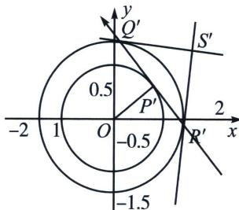

<!-- question-source:start -->
例1 (2025·长沙岳麓区期中考试 T18) 对于椭圆 $\frac{x^{2}}{a^{2}} + \frac{y^{2}}{b^{2}} = 1 (a, b > 0)$ ，令 $x' = \frac{x}{a}$ ， $y' = \frac{y}{b}$ ，那么在坐标系 $x'Oy'$ 中，椭圆经伸缩变换得到了单位圆 $x'^{2} + y'^{2} = 1$ ，在这样的伸缩变换中，有些几何关系保持不变，例如点、直线、曲线的位置关系以及点分线段的比等等；而有些几何量则等比例变化，例如任何封闭图形在变换后的面积变为原先的 $\frac{1}{ab}$ ，由此我们可以借助圆的几何性质处理一些椭圆的问题.

(1)在原坐标系中斜率为 k 的直线 l，经过 $x'=\frac{x}{a}$ ， $y'=\frac{y}{b}$ 的伸缩变换后斜率变为 $k'$ ，求 k 与 $k'$ 满足的关系；

(2)设动点 $P$ 在椭圆 $\Gamma_{1}$ : $\frac{x^{2}}{a^{2}} + y^{2} = 1 (a > 0)$ 上, 过点 $P$ 作椭圆 $\Gamma_{1}$ 的切线, 与椭圆 $\Gamma_{2}$ : $\frac{x^{2}}{a^{2}} + y^{2} = 2 (a > 0)$ 交于点 $Q$ , $R$ , 再过点 $Q$ , $R$ 分别作椭圆 $\Gamma_{2}$ 的切线交于点 $S$ , 求点 $S$ 的轨迹方程;

(3) 点 $A\left(1, \frac{\sqrt{2}}{2}\right)$ 在椭圆 $\frac{x^2}{2} + y^2 = 1$ 上，求椭圆上点 $B, C$ 的坐标，使得 $\triangle ABC$ 的面积取最大值，并求出该最大值.

(1)根据在原坐标系中斜率为 $k$ 的直线 $l$ , 经过 $x' = \frac{x}{a}$ , $y' = \frac{y}{b}$ 的伸缩变换后斜率变为 $k'$ ,

设 l 上两点的坐标为 $(x_{1}, y_{1})$ ， $(x_{2}, y_{2})$ ，经伸缩变换后变为 $(x_{1}^{\prime}, y_{1}^{\prime})$ ， $(x_{2}^{\prime}, y_{2}^{\prime})$ ，

则 $\frac{y_1 - y_2}{y_1' - y_2'} = \frac{y_1 - y_2}{\frac{y_1}{b} - \frac{y_2}{b}} = b, \frac{x_1 - x_2}{x_1' - x_2'} = \frac{x_1 - x_2}{\frac{x_1}{a} - \frac{x_2}{a}} = a, k = \frac{y_1 - y_2}{x_1 - x_2}, k' = \frac{y_1' - y_2'}{x_1' - x_2'}$ ，则 $\frac{k}{k'} = \frac{\frac{y_1 - y_2}{x_1 - x_2}}{\frac{y_1' - y_2'}{x_1' - x_2'}} = \frac{\frac{y_1 - y_2}{y_1' - y_2'}}{\frac{x_1 - x_2}{x_1' - x_2'}} = \frac{b}{a}$ ，所以 $k$ 与 $k'$ 满足的关系是 $\frac{k}{k'} = \frac{b}{a}$ .

(2)因为对于椭圆 $\frac{x^2}{a^2} +\frac{y^2}{b^2} = 1(a,b > 0)$ ，令 $x^{\prime} = \frac{x}{a}$ ， $y^\prime = \frac{y}{b}$ ，那么在坐标系 $x^{\prime}Oy^{\prime}$ 中，椭圆经伸缩变换得到了单位圆 $x^{\prime 2} + y^{\prime 2} = 1$ ，所以作 $x^{\prime} = \frac{x}{a}$ ， $y^\prime = y$ 的伸缩变换，椭圆 $\Gamma_{1}$ 变换得到了单位圆 $x^{\prime 2} + y^{\prime 2} = 1$

椭圆 $\Gamma_{2}$ 变换得到了以原点为圆心的圆 $x^{\prime2} + y^{\prime2} = 2$ ，P，Q，R，S 变换得到 $P^{\prime}$ ， $Q^{\prime}$ ， $R^{\prime}$ ， $S^{\prime}$ ，

$O, P'$ , $S'$ 均在 $Q'R'$ 中垂线上，则 $O, P'$ , $S'$ 共线. $OP'=1$ , $OQ'=\sqrt{2}$ , 则 $\angle Q'OP'=45^\circ$ ,

则 $S'Q'=\sqrt{2}$ ， $OS'=2$ ，则 $S'$ 轨迹方程为： $x'^{2}+y'^{2}=4$ ，代入 $x'=\frac{x}{a}$ ， $y'=y$ ，则 S 轨迹方程为： $\frac{x^{2}}{a^{2}}+y^{2}=4$ 。

(3)作 $x'=\frac{x}{\sqrt{2}}$ ， $y'=y$ 的伸缩变换，椭圆变换得到了单位圆 $x'^{2}+y'^{2}=1$ ，点 A 变换得到了 $A'\left(\frac{\sqrt{2}}{2},\frac{\sqrt{2}}{2}\right)$ ，即为 $(\cos45^{\circ},\sin45^{\circ})$ ，并设 B，C 变换得到了 $B'$ ， $C'$ ，

熟知: 在单位圆内接三角形中, 面积最大为内接正三角形, 则 $\overrightarrow{OB'}$ , $\overrightarrow{OC'}$ 分别为 $\overrightarrow{OA'}$ 绕 $O$ 点逆时针和顺时针旋转 $120^\circ$ 得到, 则 $B'$ , $C'$ 坐标分别为 $(\cos(45^\circ + 120^\circ), \sin(45^\circ + 120^\circ))$ , $(\cos(45^\circ - 120^\circ), \sin(45^\circ - 120^\circ))$ , 即为 $\left(\frac{-\sqrt{2} - \sqrt{6}}{4}, \frac{-\sqrt{2} + \sqrt{6}}{4}\right)$ , $\left(\frac{-\sqrt{2} + \sqrt{6}}{4}, \frac{-\sqrt{2} - \sqrt{6}}{4}\right)$ , 即 $B$ 、 $C$ 坐标分别为 $\left(\frac{-1 - \sqrt{3}}{2}, \frac{-\sqrt{2} + \sqrt{6}}{4}\right)$ , $\left(\frac{-1 + \sqrt{3}}{2}, \frac{-\sqrt{2} - \sqrt{6}}{4}\right)$ , 单位圆内接正三角形面积为 $\frac{1}{2} \times \sqrt{3} \times \sqrt{3} \times \frac{\sqrt{3}}{2} = \frac{3\sqrt{3}}{4}$ , 则 $\triangle ABC$ 面积为 $\sqrt{2} \times \frac{3\sqrt{3}}{4} = \frac{3\sqrt{6}}{4}$ , 综上, 所求 $B$ , $C$ 坐标分别为 $\left(\frac{-1 - \sqrt{3}}{2}, \frac{-\sqrt{2} + \sqrt{6}}{4}\right)$ , $\left(\frac{-1 + \sqrt{3}}{2}, \frac{-\sqrt{2} - \sqrt{6}}{4}\right)$ 或其交换, $\triangle ABC$ 面积最大值为 $\frac{3\sqrt{6}}{4}$ .
<!-- question-source:end -->

![[高中/总复习/专题/2026版高中《mst老唐说题》圆锥曲线专题（数学）/下册/第13章_新定义下的斜率调整与仿射/第二节_仿射法与面积转化/一_仿射法与面积变化/例题/answers/Q00048882A1.md]]
