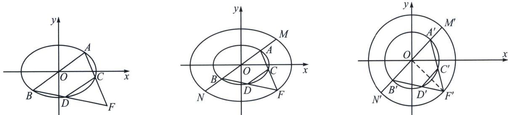

> [!faq]- 《圆锥曲线专题(下册)》例题解析
>
> > [!success]- **【答案】** 详见解析
>
> > [!note]- **【解析】**
> > 解析 (1)由题意得 $\left\{ \begin{array}{l} \frac{\left(\frac{\sqrt{2}}{2}\right)^2}{a^2} + \frac{\left(\frac{\sqrt{3}}{2}\right)^2}{b^2} = 1 \\ \frac{\sqrt{a^2 - b^2}}{a} = \frac{\sqrt{2}}{2} \end{array} \right.$ ，解得 $\left\{ \begin{array}{l} a = \sqrt{2} \\ b = 1 \end{array} \right.$ ，所以椭圆 $E$ 的方程为 $\frac{x^2}{2} + y^2 = 1$ .
> >
> > (2)由题意设 $A(x_{1},y_{1})$ ， $B(-x_{1}, - y_{1})$ ，则 $\frac{x_1^2}{2} +y_1^2 = 1①$
> >
> > 因为 $\overrightarrow{AB} = 2\overrightarrow{CD}$ ，直线 $AC$ 与 $BD$ 交于点 $F$ 。所以 $C$ ， $D$ 分别是 $AF$ 、 $BF$ 的中点，设 $F(x_0,y_0)$ 则 $C\left(\frac{x_1 + x_0}{2},\frac{y_1 + y_0}{2}\right),D\left(\frac{-x_1 + x_0}{2},\frac{-y_1 + y_0}{2}\right)$ ，因为 $C$ ， $D$ 在椭圆 $E:\frac{x^2}{2} +y^2 = 1$ 上，
> >
> > $$
> > \frac {\left(\frac {x _ {1} + x _ {0}}{2}\right) ^ {2}}{2} + \left(\frac {y _ {1} + y _ {0}}{2}\right) ^ {2} = 1 ②, \frac {\left(\frac {- x _ {1} + x _ {0}}{2}\right) ^ {2}}{2} + \left(\frac {- y _ {1} + y _ {0}}{2}\right) ^ {2} = 1 ③
> > $$
> >
> > 由②+③，得 $\frac{\left(\frac{x_{1}+x_{0}}{2}\right)^{2}+\left(\frac{-x_{1}+x_{0}}{2}\right)^{2}}{2}+\left[\left(\frac{y_{1}+y_{0}}{2}\right)^{2}+\left(\frac{-y_{1}+y_{0}}{2}\right)^{2}\right]=2,$
> >
> > 整理得 $\frac{x_1^2}{2} +\frac{x_0^2}{2} +y_1^2 +y_0^2 = 4$ ，将①代入，得 $\frac{x_0^2}{2} +y_0^2 = 3$ ，即 $\frac{x_0^2}{6} +\frac{y_0^2}{3} = 1$ ，所以 $F$ 点的轨迹方程为 $\frac{x^2 + y^2}{6} +\frac{y^2}{3}$ $= 1.$
> >
> > 
> >
> > $$
> > \text {(3)作} \left\{ \begin{array}{l} x = x ^ {\prime} \\ \sqrt {2} y = y ^ {\prime} \end{array} \Rightarrow \left\{ \begin{array}{l} (x ^ {\prime}) ^ {2} + (y ^ {\prime}) ^ {2} = 2 \\ (x ^ {\prime}) ^ {2} + (y ^ {\prime}) ^ {2} = 6 \end{array} , S _ {\triangle F ^ {\prime} M ^ {\prime} N ^ {\prime}} = \sqrt {2} S _ {\triangle F M N} = \frac {1}{2} | M ^ {\prime} N ^ {\prime} | \cdot | O F ^ {\prime} | \sin \angle M ^ {\prime} O F ^ {\prime}, \right. \right.
> > $$
> >
> > 由于 $C^{\prime}D^{\prime}\parallel A^{\prime}B^{\prime}$ ，故 $OF^{\prime}\bot C^{\prime}D^{\prime}$ ， $OF^{\prime}\bot A^{\prime}B^{\prime}$ ， $S_{\triangle F'M'N'} = \frac{1}{2}|M'N'|\cdot |OF'| = 6$ ， $S_{\triangle FMN} = 3\sqrt{2}$
> >
> > 所以 $\triangle MNF$ 的面积 $S_{\triangle FMN}=3\sqrt{2}$ 为定值.
> >
> > 仿射法定理三: (仿射后面积最值)如果将椭圆仿射成圆后, 得到三角形 $S_{\triangle A^{\prime}OB^{\prime}} = \frac{1}{2} R^{2} \sin \angle A^{\prime}OB^{\prime}$ , 面积最大值看 $\angle A^{\prime}OB^{\prime} = 90^{\circ}$ 是否存在, 关键在于看 $\angle A^{\prime}OB^{\prime}$ 的取值范围;
