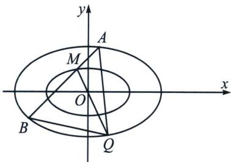
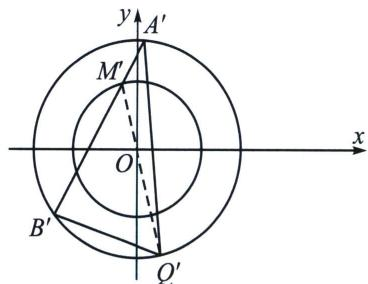

> [!faq]- 《圆锥曲线专题(下册)》例题解析
>
> > [!success]- **【答案】** 详见解析
>
> > [!note]- **【解析】**
> > 解析 (1)设 $PF$ 的中点为 $G$ , 依题意, 以 $PF$ 为直径的圆内切于圆 $O: x^{2} + y^{2} = 16$ ,
> >
> > 所以 $|GO| = 4 - \frac{|PF|}{2}$ ，即 $|PF| = 8 - 2|GO|$ ，设 $F_{2}(2\sqrt{3},0)$ ，因为 $2|OG| = |PF_{2}|$ ，所以 $|PF| + |PF_{2}| = 8 > 4\sqrt{3} = |FF_{2}|$ ，所以点 $P$ 的轨迹是以 $F$ ， $F_{2}$ 为焦点，8为长轴长的椭圆，则 $c = 2\sqrt{3}$ ， $a = 4$ ，可得 $b = \sqrt{a^2 - c^2} = 2$ ，
> >
> > 所以 P 的轨迹 E 的方程为 $\frac{x^{2}}{16} + \frac{y^{2}}{4} = 1$ .
> >
> > 
> >
> > 
> >
> > (2)(i)设 $M(x_{0},y_{0})$ ，则 $\frac{x_{0}^{2}}{4}+y_{0}^{2}=1$ ，令 $\frac{|MO|}{|OQ|}=\frac{1}{\lambda}$ ，则 $Q(\lambda x_{0},\lambda y_{0})$
> >
> > 所以 $\frac{(\lambda x_0)^2}{16} +\frac{(\lambda y_0)^2}{4} = 1\Rightarrow \lambda^2\left(\frac{x_0^2}{4} +y_0^2\right) = 4$ ，所以 $\lambda = 2$ ，故 $\frac{|MO|}{|OQ|} = \frac{1}{2}$ 为定值；
> >
> > (ii)
> > 解法一：设 $A(x_{1}, y_{1})$ ， $B(x_{2}, y_{2})$ ，直线 AB 的方程为 $y = kx + m$ ，由题设 $m \neq 0$ ，
> >
> > 联立直线 $AB$ 与 $E$ 的方程 $\left\{ \begin{array}{l} y = kx + m \\ \frac{x^2}{16} + \frac{y^2}{4} = 1 \end{array} \right.$ ，消去 $y$ 得： $(4k^2 + 1)x^2 + 8kmx + 4m^2 - 16 = 0$
> >
> > 由 $M$ 在曲线 $E$ 内，所以 $\Delta > 0$ 且 $x_{1} + x_{2} = \frac{-8km}{4k^{2} + 1}$ ， $x_{1}x_{2} = \frac{4m^{2} - 16}{4k^{2} + 1}$ ，
> >
> > $$
> > \vert A B \vert = \sqrt {\left(x _ {1} - x _ {2}\right) ^ {2} + \left(y _ {1} - y _ {2}\right) ^ {2}} = \sqrt {1 + k ^ {2}} \sqrt {\left(x _ {1} + x _ {2}\right) ^ {2} - 4 x _ {1} x _ {2}} = 4 \sqrt {1 + k ^ {2}} \frac {\sqrt {1 6 k ^ {2} + 4 - m ^ {2}}}{1 + 4 k ^ {2}}
> > $$
> >
> > 原点 O 到直线 AB 的距离 $d=\frac{|m|}{\sqrt{1+k^{2}}}$ ; 由 (i) 知 Q 到直线 AB 的距离 $\frac{3|m|}{\sqrt{1+k^{2}}}$ ,
> >
> > $$
> > S _ {\triangle A B Q} = \frac {1}{2} | A B | \cdot 3 d = \frac {1}{2} \times 4 \sqrt {1 + k ^ {2}} \cdot \frac {\sqrt {1 6 k ^ {2} + 4 - m ^ {2}}}{1 + 4 k ^ {2}} \cdot \frac {3 | m |}{\sqrt {1 + k ^ {2}}} = 6 \sqrt {\frac {m ^ {2}}{1 + 4 k ^ {2}} \left(4 - \frac {m ^ {2}}{1 + 4 k ^ {2}}\right)}
> > $$
> >
> > 令 $t = \frac{m^2}{1 + 4k^2}$ ，因为 $M$ 是曲线 $\frac{x^2}{4} +y^2 = 1$ 上的任意一点，联立方程组 $\left\{ \begin{array}{l} \frac{x^2}{4} + y^2 = 1 \\ y = kx + m \end{array} \right.$ ，整理得 $(1 + 4k^{2})x^{2}+$ $8kmx + (m^{2} - 4) = 0$ ，可得 $\Delta = (8km)^{2} - 4(1 + 4k^{2})(m^{2} - 4)\geqslant 0$ ，整理得 $m^2\leqslant 1 + 4k^2$ ，所以 $0 < t\leqslant 1$ 函数 $f(t) = (4 - t)t = 4t - t^2 = -(t - 2)^2 +4$ ，当 $t = 1$ 时，△ABQ面积的最大值为 $6\sqrt{3}$
> >
> > (4)
> > 解法二：作 $\left\{ \begin{array}{l} x = x^{\prime} \\ 2y = y^{\prime} \end{array} \right. \Rightarrow \left\{ \begin{array}{l} (x^{\prime})^{2} + (y^{\prime})^{2} = 4 \\ (x^{\prime})^{2} + (y^{\prime})^{2} = 16 \end{array} \right.$ ， $S_{\triangle Q'A'B'} = 2S_{\triangle QAB} = 3S_{\triangle OA'B'} = \frac{3}{2} R^{2}\sin \angle A'OB' = 24\sin \angle A'OB'$ ，由于 $O$ 到 $A'B'$ 距离 $d \leqslant r = 2$ ，利用圆的几何性质，可知 $\angle A'OB' \geqslant 120^\circ$ ，所以 $S_{\triangle Q'A'B'} = 24\sin \angle A'OB'\leqslant 12\sqrt{3}$ ，故 $\triangle ABQ$ 面积的取值范围为 $(0, 6\sqrt{3}]$ .
