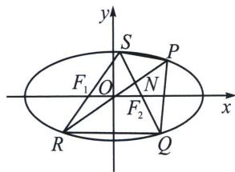
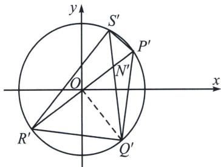

> [!faq]- 《圆锥曲线专题(下册)》例题解析
>
> > [!success]- **【答案】** 详见解析
>
> > [!note]- **【解析】**
> > 解析 (1)解: 设 $A(a, 0)$ , $B(0, b)$ , 因为 $|AB| = 3$ , 所以 $a^2 + b^2 = 9$ ①, 设 $M(x, y)$ , 由 $|AM| = 1$ , 且 $\overrightarrow{AM} = \frac{1}{3}\overrightarrow{AB}$ , 可得 $\overrightarrow{AM} = (x - a, y)$ , $\overrightarrow{AB} = (-a, b)$ , 则 $\left\{ \begin{array}{l} x - a = -\frac{1}{3}a \\ y = \frac{1}{3}b \end{array} \right.$ , 可得 $a = \frac{3}{2}x$ , $b = 3y$ ②, 将②代入①, 可得 $\frac{x^2}{4} + y^2 = 1$ , 所以动点 $M$ 的轨迹 $\Gamma$ 的方程为 $\frac{x^2}{4} + y^2 = 1$ .
> >
> > (2)解：设 $C(x_{1},y_{1})$ ， $D(x_{2},y_{2})$ ，所以 $k_{OC} = \frac{y_1}{x_1}$ ， $k_{OD} = \frac{y_2}{x_2}$ ，则 $\left\{ \begin{array}{l}y = kx + m\\ x^2 +4y^2 -4 = 0 \end{array} \right.$ 整理得 $(1 + 4k^{2})x^{2}+$ $8kmx + 4(m^{2} - 1) = 0$ ，所以 $x_{1} + x_{2} = -\frac{8km}{1 + 4k^{2}}$ ， $x_{1}x_{2} = \frac{4(m^{2} - 1)}{1 + 4k^{2}}$
> >
> > 且 $\Delta = 64k^2 m^2 - 16(1 + 4k^2)(m^2 - 1) > 0$ ，即 $4k^2 - m^2 + 1 > 0$ ，所以 $k_{\mathrm{CC}} \cdot k_{\mathrm{OD}} = \frac{y_1y_2}{x_1x_2} = \frac{k^2x_1x_2 + km(x_1 + x_2) + m^2}{x_1x_2} = k^2$ ，即 $\frac{-8k^2m^2}{1 + 4k^2} + m^2 = 0$ ，因为 $m \neq 0, m \neq \pm 1$ ，故 $k^2 = \frac{1}{4}$ ，所以 $k = \pm \frac{1}{2}$ .
> >
> > (3)
> > 解法一: 设点 $Q$ 到直线 $PR$ 的距离为 $d$ , 因为 $\overrightarrow{QN} = 2 \overrightarrow{NS}$ , 所以点 $Q$ 到直线 $PR$ 的距离是点 $S$ 到直线 $PR$ 的距离的 2 倍; 故四边形 $PQRS$ 的面积 $S = S_{\triangle PQR} + S_{\triangle PSR} = \frac{1}{2} \cdot |PR| \cdot d + \frac{1}{2} \cdot |PR| \cdot \frac{d}{2} = \frac{3}{4} \cdot |PR| \cdot d$ ;
> >
> > 当直线 $PR \perp x$ 轴时， $|PR| = 2$ ，故点 $Q$ 到直线 $PR$ 的距离 $d$ 的最大值为 2，此时 $S_{\max} = \frac{3}{4} \times 2 \times 2 = 3$ ；
> >
> > 
> >
> > 
> >
> > 当直线 PR 不与 x 轴垂直时，设直线 PR: y = tx，联立方程组 $\left\{\begin{aligned}y &= tx \\ \frac{x^{2}}{4} + y^{2} &= 1\end{aligned}\right.$ ，解得 $x = \pm \frac{2}{\sqrt{1 + 4t^{2}}}$ ，所以 $|PR| = \sqrt{1 + t^{2}} \cdot \frac{4}{\sqrt{1 + 4t^{2}}} = \frac{4\sqrt{1 + t^{2}}}{\sqrt{1 + 4t^{2}}}$ ，设过点 Q 与直线 PR 平行的直线 l 的方程为 $y = tx + b$ ，
> >
> > 联立方程组 $\left\{\begin{aligned}y&=tx+b\\ \frac{x^{2}}{4}&+y^{2}=1\end{aligned}\right.$ ，整理得 $(1+4t^{2})x^{2}+8tbx+4b^{2}-4=0$ ，
> >
> > 则 $\Delta' = (8tb)^2 - 4(1 + 4t^2)(4b^2 - 4) \geqslant 0$ ，可得 $b^2 \leqslant (1 + 4t^2)$ ，故 $d = \frac{|b - 0|}{\sqrt{t^2 + 1}} \leqslant \frac{\sqrt{4t^2 + 1}}{\sqrt{t^2 + 1}}$
> >
> > 故 $S = \frac{3}{4} \cdot |PR| \cdot d \leqslant \frac{3}{4} \cdot \frac{4\sqrt{t^2 + 1}}{\sqrt{4t^2 + 1}} \cdot \frac{\sqrt{4t^2 + 1}}{\sqrt{t^2 + 1}} = 3$ ，当 $t = 0$ 且 $b = 1$ 时，上述等号成立，
> >
> > (5)
> > 解法二：作 $\left\{ \begin{array}{l} x = x' \\ 2y = y' \end{array} \right. \Rightarrow (x')^2 + (y')^2 = 4, S_{P'Q'R'S'} = 2S_{PQRS} = \frac{3}{2} S_{\triangle Q'P'R'} = \frac{3}{2} R^2 \sin \angle P'OQ' = 6 \sin \angle P'OQ'$ $\leqslant 6, S_{PQRS} \leqslant 3$ ，当且仅当 $OQ' \perp P'R'$ 时取等；
> >
> > 综上所述，四边形 PQRS 面积的最大值为 3.
