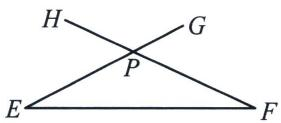
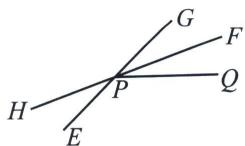
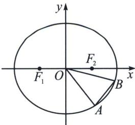

> [!faq]- 《圆锥曲线专题(下册)》例题解析
>
> > [!success]- **【答案】** 详见解析
>
> > [!note]- **【解析】**
> > 解析 (1)由题意可知 $e = \frac{c}{a} = \frac{1}{2}$ , $a = 2c$ , $A$ 为椭圆的上顶点或下顶点时, $\triangle AF_{1}F_{2}$ 的面积最大, 即有 $\frac{1}{2} \times 2c \times b = \sqrt{3}$ , 即 $bc = \sqrt{3}$ , 又 $b^{2} = a^{2} - c^{2} = 3c^{2}$ , 得 $b = \sqrt{3}c$ , 所以 $\sqrt{3}c^{2} = \sqrt{3}$ , $c = 1$ , $a = 2$ , $b = \sqrt{3}$ ,
> >
> > 从而椭圆 C 的标准方程为 $\frac{x^{2}}{4} + \frac{y^{2}}{3} = 1$ .
> >
> > (2)因为两直线的夹角 $\theta$ 的取值范围为 $\left[0, \frac{\pi}{2}\right]$ , 当 $\theta \in \left[0, \frac{\pi}{2}\right)$ 时,
> >
> > 情况1：如图所示，假设直线 $EG$ ，FH的斜率分别为 $k_{1}$ ， $k_{2}$ ，则 $k_{1} = \tan \angle PEF$ ， $k_{2} = -\tan \angle PFE$ 而 $\theta = \angle GPF = \angle PEF + \angle PFE,$
> >
> > $$
> > \tan \theta = \tan \angle G P F = \tan (\angle P E F + \angle P F E) = \frac {\tan \angle P E F + \tan \angle P F E}{1 - \tan \angle P E F \cdot \tan \angle P F E} = \frac {k _ {1} - k _ {2}}{1 + k _ {1} k _ {2}}.
> > $$
> >
> > 
> >
> > 情况 2：如图所示，
> >
> > 
> >
> > 假设直线 $EG$ ， $FH$ 的斜率分别为 $k_{1}$ ， $k_{2}$ ，则 $k_{1} = \tan \angle GPQ$ ， $k_{2} = \tan \angle FPQ$ 。而 $\theta = \angle GPF = \angle GPQ - \angle FPQ$ ，所以 $\tan \theta = \tan \angle GPF = \tan (\angle GPQ - \angle FPQ) = \frac{\tan \angle GPQ - \tan \angle FPQ}{1 + \tan \angle GPQ \cdot \tan \angle FPQ} = \frac{k_{1} - k_{2}}{1 + k_{1}k_{2}}$ .
> >
> > 当 $\theta = \frac{\pi}{2}$ ，两直线垂直， $k_{1}k_{2} = -1$ 。综上， $\theta$ 与 $k_{1}, k_{2}$ 之间的关系式为：
> >
> > 当 $\theta \in \left[0, \frac{\pi}{2}\right)$ 时， $\tan \theta = \left|\frac{k_1 - k_2}{1 + k_1k_2}\right|$ ；当 $\theta = \frac{\pi}{2}, k_1k_2 = -1.$
> >
> > (3)根据题意画出图像为:
> >
> > 
> >
> > 设直线 $OA$ 的方程为 $y = kx$ ，直线 $AB$ 的方程为 $y = -\frac{1}{k} x + m$ ，对椭圆作仿射变换 $\left\{ \begin{array}{l} x' = \frac{x}{2} \\ y' = \frac{y}{\sqrt{3}} \end{array} \right.$ ，则椭圆 $C$ 的方程变为圆的方程： $x'^2 + y'^2 = 1$ ，点 $A, B$ 对应变为 $A'$ ， $B'$ ，则 $|OA'| = |OB'| = 1$ ，直线 $OA'$ 的方程为 $y' = \frac{2}{\sqrt{3}} kx'$ ，直线 $A'B'$ 的方程为 $\sqrt{3} y' = -\frac{1}{k} \cdot 2x' + m$ ，即 $y' = -\frac{2}{\sqrt{3}k} x' + \frac{1}{\sqrt{3}} m$ ，设 $\angle OA'B' = \theta$ ，则 $\tan \theta = \left|\frac{k_{OA'} - k_{A'B'}}{1 + k_{OA'} k_{A'B'}}\right| = \left|\frac{\frac{2}{\sqrt{3}}k + \frac{2}{\sqrt{3}k}}{1 - \frac{4}{3}}\right| = 2\sqrt{3}\left|k + \frac{1}{k}\right| \geqslant 4\sqrt{3}$ ，当且仅当 $k = \pm 1$ 时取等，
> >
> > $S_{\triangle OA'B'} = \frac{1}{2} |OA'| |OB'| \sin(\pi - 2\theta) = \frac{1}{2} \sin 2\theta = \frac{\tan\theta}{1 + \tan^2\theta}$ , 令 $f(x) = \frac{x}{1 + x^2}$ , $x \in [4\sqrt{3}, +\infty)$ , $f'(x) = \frac{1 - x^2}{(1 + x^2)^2} < 0$ , 知 $f(x)$ 在 $[4\sqrt{3}, +\infty)$ 上单调递减, 所以 $f(x) \leqslant f(4\sqrt{3}) = \frac{4\sqrt{3}}{49}$ . 即 $S_{\triangle OA'B'} \leqslant \frac{4\sqrt{3}}{49}$ , 所以 $S_{\triangle OAB} = 2\sqrt{3} S_{\triangle O'B'} \leqslant \frac{24}{49}$ , 故 $\triangle OAB$ 的面积的最大值为 $\frac{24}{49}$ .
