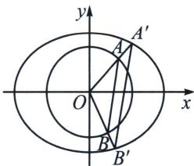

<!-- question-source:start -->
例10 (2025·山东滨州·二模T19)在平面直角坐标系 $xOy$ 中, 设 $\lambda > 0$ , $\mu > 0$ , 规定: 点 $M(\lambda x, \mu y)$ 叫做点 $N(x, y)$ 的 $(\lambda, \mu)$ 仿射对应点. 已知点 $P$ 的轨迹 $C_1$ 的方程为 $x^2 + y^2 = 1$ , 点 $P$ 的 $(\sqrt{3}, \sqrt{2})$ 仿射对应点的轨迹为 $C_2$ .

(1)求 $C_2$ 的轨迹方程;

(2)设 A, B 是曲线 $C_{1}$ 上的两点，A, B 的 $(\sqrt{3}, \sqrt{2})$ 仿射对应点分别为 $A'$ , $B'$ . $\triangle OAB$ 和 $\triangle OA'B'$ 的面积分别记为 $S_{1}$ , $S_{2}$ . 求 $\frac{S_{2}}{S_{1}}$ ;

(3)设 $P(x_{1},y_{1})$ ， $Q(x_{2},y_{2})$ 是曲线 $C_2$ 上两点，若 $\triangle OPQ$ 的面积为 $\frac{\sqrt{6}}{2}$ ，求证： $x_{1}^{2} + x_{2}^{2}$ 为定值.

(1)设 $P(x_0, y_0)$ 为 $C_1$ 上任意一点，点 $P$ 的 $(\sqrt{3}, \sqrt{2})$ 的仿射对应点为 $Q(x, y)$ ，则 $\left\{ \begin{array}{l} \sqrt{3} x_0 = x \\ \sqrt{2} y_0 = y \end{array} \right.$ ，所以 $\left\{ \begin{array}{l} x_0 = \frac{x}{\sqrt{3}} \\ y_0 = \frac{y}{\sqrt{2}} \end{array} \right.$ ，又因为 $P(x_0, y_0)$ 在 $x^2 + y^2 = 1$ 上，从而得 $\frac{x^2}{3} + \frac{y^2}{2} = 1$ ，所以点 $Q$ 的轨迹方程为 $\frac{x^2}{3} + \frac{y^2}{2} = 1$ ；
(2)设 $A(x_1, y_1), B(x_2, y_2)$ ，则 $A'(\sqrt{3} x_1, \sqrt{2} y_1), B'(\sqrt{3} x_2, \sqrt{2} y_2)$ ，因为 $\overrightarrow{OA} = (x_1, y_1), \overrightarrow{OB} = (x_2, y_2)$ ，所以 $S_{\triangle OAB} = \frac{1}{2} |\overrightarrow{OA}| \cdot |\overrightarrow{OB}| \cdot \sin \overrightarrow{OA}, \overrightarrow{OB} = \frac{1}{2}\sqrt{|\overrightarrow{OA}|^2 \cdot |\overrightarrow{OB}|^2 \cdot (1 - \cos^2 \overrightarrow{OA}, \overrightarrow{OB})} = \frac{1}{2}\sqrt{|\overrightarrow{OA}|^2 \cdot |\overrightarrow{OB}|^2 \cdot (1 - \cos^2 \overrightarrow{OA}, \overrightarrow{OB})}$ .

$= \frac{1}{2}\sqrt{(x_1^2 + y_1^2)(x_2^2 + y_2^2) - (x_1x_2 + y_1y_2)^2} = \frac{1}{2}\sqrt{(x_1y_2 - x_2y_1)^2} = \frac{1}{2}|x_1y_2 - x_2y_1|$ ，同理 $S_{\triangle OA'B'} = \frac{1}{2}\left|\sqrt{3} x_1\cdot \sqrt{2} y_2 - \sqrt{3} x_2\cdot \sqrt{2} y_1\right| = \frac{\sqrt{6}}{2}\left|x_1y_2 - x_2y_1\right|$ ，所以 $\frac{S_2}{S_1} = \frac{S_{\triangle OA'B'}}{S_{\triangle OAB}} = \sqrt{6};$

(3)设 $P'(x_{1}', y_{1}')$ ， $Q'(x_{2}', y_{2}')$ 的 $(\sqrt{3}, \sqrt{2})$ 仿射对应点分别为 $P(x_{1}, y_{1})$ ， $Q(x_{2}, y_{2})$ ，

由
(2)可知：由 $\triangle OPQ$ 的面积为 $\frac{\sqrt{6}}{2}$ 得 $\triangle OP'Q'$ 的面积为 $\frac{1}{2}$ ，设 $\overrightarrow{OP'}$ ， $\overrightarrow{OQ'}=\theta$ ，

从而 $\triangle OP'Q'$ 的面积为 $\frac{1}{2} \cdot |\overrightarrow{OP'}| \cdot |\overrightarrow{OQ'}| \cdot \sin \theta = \frac{1}{2}$ ，所以 $\sin \theta = 1$ ，

又 $\theta \in [0, \pi]$ ，所以 $\theta = \frac{\pi}{2}$ ，又因为 $P'(x_1', y_1')$ ， $Q'(x_2', y_2')$ 均在 $x^2 + y^2 = 1$ 上，所以 $x'^2_1 + y'^2_1 = 1$ ， $x'^2_2 + y'^2_2 = 1$ ，又 $x_1' x_2' + y_1' y_2' = 0$ ，所以 $x'^2_1 x'^2_2 = y'^2_1 y'^2_2$ ，所以 $x'^2_1 x'^2_2 = (1 - x'^2_1)(1 - x'^2_2)$ ，所以 $x'^2_1 + x'^2_2 = 1$ ，又 $\left\{ \begin{array}{l} x_1 = \sqrt{3} x_1' \\ x_2 = \sqrt{3} x_2' \end{array} \right.$ ，所以 $x_1^2 + x_2^2 = (\sqrt{3} x_1')^2 + (\sqrt{3} x_2')^2 = 3(x'^2_1 + x'^2_2) = 3.$

仿射法定理六：若椭圆方程 $\frac{x^2}{a^2} +\frac{y^2}{b^2} = 1$ 上三点 $A,B,M$ ，满足 $① k_{OA}\cdot k_{OB} = -\frac{b^2}{a^2};$ $② S_{\triangle AOB} = \frac{ab}{2};$

③ $\overrightarrow{OM}=\sin\alpha\overrightarrow{OA}+\cos\alpha\overrightarrow{OB}\left(\alpha\in\left(0,\frac{\pi}{2}\right)\right)$ ; 三者等价.

证明：我们仅仅根据③证明①，设 $A(x_{1},y_{1})$ ， $B(x_{2},y_{2})$ ，则 $\frac{x_1^2}{a^2} +\frac{y_1^2}{b^2} = 1$ ， $\frac{x_2^2}{a^2} +\frac{y_2^2}{b^2} = 1.$

又设 $M(x, y)$ ，满足 $\overrightarrow{OM} = \sin \alpha \overrightarrow{OA} + \cos \alpha \overrightarrow{OB}$ ，故 $\left\{ \begin{array}{l} x = x_{1} \sin \alpha + x_{2} \cos \alpha, \\ y = y_{1} \sin \alpha + y_{2} \cos \alpha. \end{array} \right.$ 因为 $M$ 在椭圆上，所以 $\frac{(x_{1} \sin \alpha + x_{2} \cos \alpha)^{2}}{a^{2}} + \frac{(y_{1} \sin \alpha + y_{2} \cos \alpha)^{2}}{b^{2}} = 1$ 。整理得 $\left( \frac{x_{1}^{2}}{a^{2}} + \frac{y_{1}^{2}}{b^{2}} \right) (\sin^{2} \alpha + \cos^{2} \alpha) + 2 \left( \frac{x_{1} x_{2}}{a^{2}} + \frac{y_{1} y_{2}}{b^{2}} \right) \sin \alpha \cos \alpha = 1$ .

所以 $\frac{x_{1}x_{2}}{a^{2}}+\frac{y_{1}y_{2}}{b^{2}}=0.$ 所以 $k_{OA}k_{OB}=\frac{y_{1}y_{2}}{x_{1}x_{2}}=-\frac{b^{2}}{a^{2}}.$
<!-- question-source:end -->

![[高中/总复习/专题/2026版高中《mst老唐说题》圆锥曲线专题（数学）/下册/第13章_新定义下的斜率调整与仿射/第二节_仿射法与面积转化/三_斜率乘积__frac_b__2___a__2___能仿射成直角的面积定值问题/例题/answers/Q00048891A1.md]]
