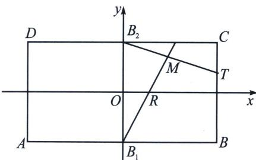
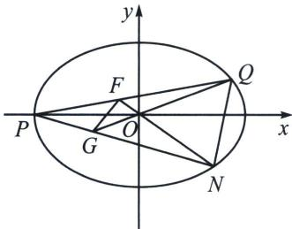
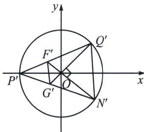

<!-- question-source:start -->
例10 (2024·昆明模拟)如图, 矩形 $ABCD$ 中, $|AB|=4$ , $|BC|=2$ , $A_1$ 、 $B_1$ 、 $A_2$ 、 $B_2$ 分别是矩形四条边的中点, 设 $\overrightarrow{OR}=\lambda\overrightarrow{OA_2}$ , $\overrightarrow{A_2T}=(1-\lambda)\overrightarrow{A_2C}(0<\lambda<1)$ , 设直线 $B_1R$ 与 $B_2T$ 的交点 $M$ 在曲线 $E$ 上.

(1)求曲线 E 的方程;

(2) 直线 l 与曲线 E 交于 Q, N 两点，点 Q 在第一象限，点 N 在第四象限，且满足直线 OQ 与直线 ON 的斜率之积为 $-\frac{1}{4}$ ，若点 P 为曲线 E 的左顶点，且满足 $\overrightarrow{OP} = \lambda \overrightarrow{OQ} + \mu \overrightarrow{ON} (\lambda < 0, \mu < 0)$ ，直线 PQ 与 ON 交于 F，直线 PN 与 OQ 交于 G.

①证明： $\lambda^{2}+\mu^{2}$ 为定值；

②是否存在常数 $m$ ，使得四边形 $QNGF$ 的面积是 $\triangle QON$ 面积的 $m$ 倍？若存在求出 $m$ ，若不存在说明理由.

(1) 易知 $A_{1}(-2,0)$ , $A_{2}(2,0)$ , $C(2,1)$ , $B_{1}(0,-1)$ , $B_{2}(0,1)$ , 设 $M(x,y)$ , 因为 $\overrightarrow{OR}=t\overrightarrow{OA_{2}}$ , 所以 $R(2t,0)$ , 因为 $\overrightarrow{A_{2}T}=(1-t)\overrightarrow{A_{2}C}$ , 所以 $T(2,1-t)$ , 此时直线 $B_{1}R$ 的方程为 $y+1=\frac{1}{2t}x$ , 直线 $B_{2}T$ 的方程为 $y-1=-\frac{t}{2}x$ , 联立 $\left\{\begin{aligned} y+1 &= \frac{1}{2t}x \\ y-1 &= -\frac{t}{2}x \end{aligned}\right.$ , 消去 $t$ 并整理得 $y^{2}-1=-\frac{1}{4}x^{2}$ , 则曲线 $E$ 的方程为 $\frac{x^{2}}{4}+y^{2}=1$ ;

(2)①证明: 易知直线 $l$ 不垂直于 $y$ 轴, 设直线 $l$ 的方程为 $x = my + n$ , $Q(x_{1}, y_{1})$ , $N(x_{2}, y_{2})$ ,

易知 $P(-2,0)$ ，因为 Q，M 均在曲线 E 上，所以 $x_{1}^{2}+4y_{1}^{2}=4$ ， $x_{2}^{2}+4y_{2}^{2}=4$ ，

因为 $\overrightarrow{OP} = \lambda \overrightarrow{OQ} +\mu \overrightarrow{ON} (\lambda <  0,\mu <  0)$ ，所以 $\left\{ \begin{array}{l} - 2 - \lambda x_1 + \mu x_2\\ 0 = \lambda y_1 + \mu y_2 \end{array} \right.$

整理得 $\lambda^2 (x_1^2 +4y_1^2) + \mu^2 (x_2^2 +4y_2^2) + 2\lambda \mu (x_1x_2 + 4y_1y_2) = 4$ ，因为直线 $OQ$ 与直线 $ON$ 的斜率之积为 $-\frac{1}{4}$ 所以 $\frac{y_1}{x_1}\cdot \frac{y_2}{x_2} = -\frac{1}{4}$ ，即 $x_{1}x_{2} + 4y_{1}y_{2} = 0$ ，所以 $4\lambda^2 +4\mu^2 = 4$ ，即 $\lambda^2 +\mu^2 = 1$ ，故 $\lambda^2 +\mu^2$ 为定值；

②如图，作 $\left\{ \begin{array}{l} x' = x \\ y' = 2y \end{array} \right. \Rightarrow \left\{ \begin{array}{l} x = x' \\ y = \frac{1}{2} y' \end{array} \right. \Rightarrow x'^2 + y'^2 = 4$ ，坐标拉伸后，原来 $P, Q, N, G, F$ 分别对应新坐标系的 $P'$ 、 $Q'$ 、 $N'$ 、 $G'$ 、 $F'$ ， $k_{OQ'} k_{ON'} = 2k_{OQ} \cdot 2k_{ON} = -1$ ，所以 $S_{ON'Q'} = 2$ ，则 $S_{ONQ} = 1$

则 $\angle Q'P'N' = 45^{\circ}$ , $\angle P'Q'O + \angle P'N'O = 45^{\circ}$ , 令 $\angle P'Q'O = \theta$ , $|OF'| = \tan \theta$ , $|OG'| = \tan (45^{\circ} - \theta)$ , $S_{F'G'N'Q'} = \frac{1}{2} |F'N'| \cdot |G'Q'| = \frac{1}{2}(2 + 2\tan \theta)(2 + 2\tan (45^{\circ} - \theta)) = 4$ . 所以 $S_{FGNQ} = 2$ , 则 $\frac{S_2}{S_1} = 2$ . 故存在常数 $m$ , 使得四边形 $QNGF$ 的面积是 $\triangle QON$ 面积的 $m$ 倍, $m = 2$ .
<!-- question-source:end -->

![[高中/总复习/专题/2026版高中《mst老唐说题》圆锥曲线专题（数学）/下册/第13章_新定义下的斜率调整与仿射/第二节_仿射法与面积转化/三_斜率乘积__frac_b__2___a__2___能仿射成直角的面积定值问题/例题/answers/Q00048970A1.md]]
