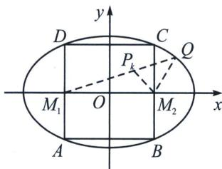

> [!faq]- 《圆锥曲线专题(下册)》例题解析
>
> > [!success]- **【答案】** 详见解析
>
> > [!note]- **【分析】**
> > 本题未单列分析。
>
> > [!note]- **【解析】**
> > 解析
> > 解法二：不妨设 $A(x_0, y_0), A_1(x_1, y_1)$ ，易知矩形ABCD和矩形 $A_1B_1C_1D_1$ 的面积相等，
> > 所以 $4x_{0}y_{0} = 4x_{1}y_{1}$ ，即 $x_0^2 y_0^2 = x_1^2 y_1^2$ ，因为 $\frac{x^2}{a^2} +\frac{y^2}{b^2} = 1$ ，所以 $y^{2} = b^{2}\left(1 - \frac{x^{2}}{a^{2}}\right)$ ，则 $y_{1}^{2} = b^{2}\left(1 - \frac{x_{1}^{2}}{a^{2}}\right),y_{0}^{2} = b^{2}$ $\left(1 - \frac{x_0^2}{a^2}\right)$ ，可得 $b^{2}x_{0}^{2}\left(1 - \frac{x_{0}^{2}}{a^{2}}\right) = b^{2}x_{1}^{2}\left(1 - \frac{x_{1}^{2}}{a^{2}}\right)$ ，整理得 $x_0^2 +x_1^2 = a^2$ ，同理可得 $y_0^2 +y_1^2 = b^2$
> > 则 $|OA|^{2}+|OA_{1}|^{2}=x_{0}^{2}+y_{0}^{2}+x_{1}^{2}+y_{1}^{2}=a^{2}+b^{2}$ ，故 $|OA|^{2}+|OA_{1}|^{2}$ 为定值，定值为 $a^{2}+b^{2}$ ;
> > 
