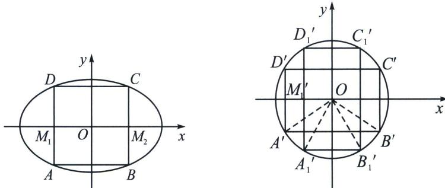

<!-- question-source:start -->
例⑪（2024·阜阳模拟）如图，各边与坐标轴平行或垂直的矩形ABCD内接于椭圆 $E: \frac{x^2}{a^2} + \frac{y^2}{b^2} = 1 (a > b > 0)$ ，其中点 $A, B$ 分别在第三、四象限，边 $AD, BC$ 与 $x$ 轴的交点为 $M_1, M_2$ .

(1) 若 $AB = BC = 1$ ，且 $M_{1}, M_{2}$ 为椭圆 $E$ 的焦点，求椭圆 $E$ 的离心率；

(2) 若 $A_{1}B_{1}C_{1}D_{1}$ 是椭圆 $E$ 的另一内接矩形, 且点 $A_{1}$ 也在第三象限, 若矩形 $ABCD$ 和矩形 $A_{1}B_{1}C_{1}D_{1}$ 的面积相等, 证明: $\left|OA\right|^{2} + \left|OA_{1}\right|^{2}$ 是定值, 并求出该定值;

(3)若 ABCD 是边长为 1 的正方形，边 AB，CD 与 y 轴的交点为 $M_{3}$ ， $M_{4}$ ，设 $P_{i}(P_{i}(i=1,2,\cdots,100))$

是正方形ABCD内部的100个点，记 $d_{k} = \sum_{i = 1}^{100}|M_{k}P_{i}|$ ，其中 $k = 1,2,3,4$ ，证明： $d_{1},d_{2},d_{3},d_{4}$ 中至少有两个小于81.
<!-- question-source:end -->

![[高中/总复习/专题/2026版高中《mst老唐说题》圆锥曲线专题（数学）/下册/第13章_新定义下的斜率调整与仿射/第二节_仿射法与面积转化/三_斜率积仿射直角面积定值/例题/answers/Q00053234A1.md]]
