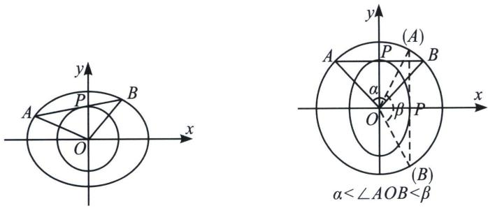

## 二、切点圆面积最值

若椭圆内含有圆与直线相切，如图直线 $AB$ 与圆相切于 $P$ ，交椭圆 $\frac{x^2}{a^2} +\frac{y^2}{b^2} = 1$ 于点 $A$ ， $B$ 求 $S_{\triangle OAB}$ 的最大值，

首先进行仿射变换： $\frac{x^{2}}{a^{2}}+\frac{y^{2}}{b^{2}}=1$ ，令 $\left\{\begin{aligned}x^{\prime}&=x\\ y^{\prime}&=\frac{a}{b}y\end{aligned}\right.\Rightarrow\left\{\begin{aligned}x^{\prime2}&+y^{\prime2}=a^{2}\\ x^{\prime2}&+\frac{b^{2}y^{\prime2}}{a^{2}}=r^{2}\end{aligned}\right.$ ，拉伸后可知， $S_{\triangle AOB}=\frac{b}{a}S_{\triangle A^{\prime}OB^{\prime}}$ ，故当 $S_{\triangle A^{\prime}OB^{\prime}}=\frac{1}{2}a^{2}\sin\angle A^{\prime}OB^{\prime}$ 最大时， $\angle A^{\prime}OB^{\prime}=90^{\circ}$ ，关键在于看 $\angle A^{\prime}OB^{\prime}$ 的取值范围；

根据几何性质， $A^{\prime}B^{\prime}$ 平行于 x 轴时， $\angle A^{\prime}OB^{\prime}=\alpha$ 最小， $A^{\prime}B^{\prime}$ 平行于轴 y 时， $\angle A^{\prime}OB^{\prime}=\beta$ 最大.

![[高中/总复习/专题/2026版高中《mst老唐说题》圆锥曲线专题（数学）/下册/第13章_新定义下的斜率调整与仿射/第二节_仿射法与面积转化/二_切点圆面积最值/例题/Q00048887.md]]
![[高中/总复习/专题/2026版高中《mst老唐说题》圆锥曲线专题（数学）/下册/第13章_新定义下的斜率调整与仿射/第二节_仿射法与面积转化/二_切点圆面积最值/例题/Q00048888.md]]
![[高中/总复习/专题/2026版高中《mst老唐说题》圆锥曲线专题（数学）/下册/第13章_新定义下的斜率调整与仿射/第二节_仿射法与面积转化/二_切点圆面积最值/例题/Q00048889.md]]
![[高中/总复习/专题/2026版高中《mst老唐说题》圆锥曲线专题（数学）/下册/第13章_新定义下的斜率调整与仿射/第二节_仿射法与面积转化/二_切点圆面积最值/例题/Q00048890.md]]
