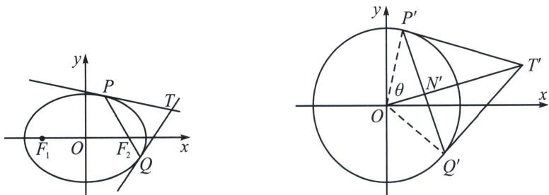

<!-- question-source:start -->
例6 (湖南省名校联合体 2025 届高三考前仿真模拟数 T19) 已知椭圆 $C: \frac{x^{2}}{a^{2}} + \frac{y^{2}}{b^{2}} = 1 (a > b > 0)$ 的长轴长为 $2 \sqrt{3}$ , 左、右焦点分别为 $F_{1}, F_{2}$ , 直线 $l: y = px + q$ 与 $C$ 交于 $P, Q$ 两点, 且满足 $\overrightarrow{OP} \cdot \overrightarrow{OQ} = 0 (O$ 为坐标原点), 当 $l$ 变化时, $\triangle PF_{1}F_{2}$ 面积的最大值为 $\frac{3}{2}$ .

(1) 求 C 的方程;

(2) 证明： $q^{2}=p^{2}+1$ ;

(3)过点 O 和线段 PQ 的中点作一条直线与 C 交于 R, S 两点，求四边形 PRQS 面积的取值范围.

(1)设 $C$ 的半焦距为 $c(c > 0)$ . 依题意得 $a = \sqrt{3}$ , $\frac{1}{2} \times 2c \times b = bc = \frac{3}{2}$ , 所以 $b\sqrt{3 - b^2} = \frac{3}{2}$ , 解得 $b^2 = \frac{3}{2}$ , 所以 $C$ 的方程为 $\frac{x^2}{3} + \frac{2y^2}{3} = 1$ .

(2)解法一：设 $P(x_{1},y_{1})$ ， $Q(x_{2},y_{2})$ ，由 $\left\{ \begin{array}{l}x^{2} + 2y^{2} = 3\\ y = px + q \end{array} \right.$ ，消去 $y$ 得 $(2p^{2} + 1)x^{2} + 4pqx + 2q^{2} - 3 = 0,$

则 $\Delta = 16p^{2}q^{2} - 4(2p^{2} + 1)(2q^{2} - 3) = 4(6p^{2} - 2q^{2} + 3) > 0$ ， $x_{1} + x_{2} = -\frac{4pq}{2p^{2} + 1}$ ， $x_{1}x_{2} = \frac{2q^{2} - 3}{2p^{2} + 1}$ 因为 $\overrightarrow{OP}\cdot \overrightarrow{OQ} = 0$ ，所以 $x_{1}x_{2} + y_{1}y_{2} = x_{1}x_{2} + (px_{1} + q)(px_{2} + q) = (p^{2} + 1)x_{1}x_{2} + pq(x_{1} + x_{2}) + q^{2} = (p^{2} + 1)\cdot$ $\frac{2q^2 - 3}{2p^2 + 1} -\frac{4p^2q^2}{2p^2 + 1} +q^2 = 0$ ，化简得 $q^{2} = p^{2} + 1$ ，此时 $\Delta >0$ 成立，证毕.

(3)解法一: 设 $PQ$ 的中点为 $M$ , 因为直线 $RS$ 经过点 $O$ 和点 $M$ , 所以不妨设 $\overrightarrow{OR} = t(\overrightarrow{OP} + \overrightarrow{OQ}) = 2t\overrightarrow{OM}$ $t > 0$ , 则 $S_{PRQS} = 2S_{OPRQ} = 4tS_{\triangle OPQ}$ . $S_{\triangle OPQ} = \frac{1}{2}|q||x_1 - x_2| = \frac{1}{2}|q|\sqrt{(x_1 + x_2)^2 - 4x_1x_2} = |q| \cdot \frac{\sqrt{4p^2 + 1}}{2p^2 + 1}$ . 由 $\overrightarrow{OR} = t(\overrightarrow{OP} + \overrightarrow{OQ})$ , 得 $R$ 点的坐标为 $(t(x_1 + x_2), t(y_1 + y_2))$ ,

又 $y_{1} + y_{2} = px_{1} + q + px_{2} + q = p(x_{1} + x_{2}) + 2q = \frac{2q}{2p^{2} + 1}$ 所以 $\left\{ \begin{array}{l}t(x_1 + x_2) = -\frac{4pq}{2p^2 + 1} t,\\ \iota (y_1 + y_2) = \frac{2q}{2p^2 + 1} t, \end{array} \right.$ 代入 $C$ 的方程得

$\left(-\frac{4pq}{2p^2 + 1} t\right)^2 + 2\left(\frac{2q}{2p^2 + 1} t\right)^2 = 3$ ，化简得 $\frac{8q^2t^2}{2p^2 + 1} = 3$ ，则 $t = \sqrt{\frac{3(2p^2 + 1)}{8q^2}}$ 。

所以 $S_{\mathrm{PRQS}} = 4\sqrt{\frac{3(2p^2 + 1)}{8q^2}}\cdot |q|\cdot \frac{\sqrt{4p^2 + 1}}{2p^2 + 1} = \sqrt{6}\cdot \sqrt{\frac{4p^2 + 1}{2p^2 + 1}} = \sqrt{6}\cdot \sqrt{2 - \frac{1}{2p^2 + 1}}\in [\sqrt{6},2\sqrt{3})$

即四边形 PRQS 面积的取值范围为 $\left[\sqrt{6}, 2\sqrt{3}\right)$ .
<!-- question-source:end -->

![[高中/总复习/专题/2026版高中《mst老唐说题》圆锥曲线专题（数学）/下册/第13章_新定义下的斜率调整与仿射/第二节_仿射法与面积转化/二_切点圆面积最值/例题/answers/Q00048887A1.md]]
