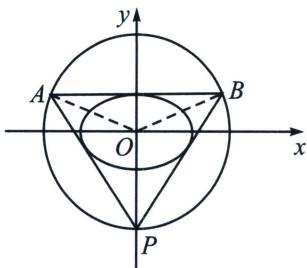
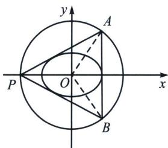
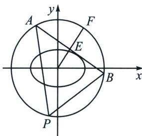

<!-- question-source:start -->
例7 (2024·江苏模拟)在平面直角坐标系 $xOy$ 中, 已知椭圆 $\Gamma: \frac{x^2}{a^2} + \frac{y^2}{b^2} = 1 (a > b > 0)$ 的离心率为 $\frac{\sqrt{6}}{3}$ , 直线 $l$ 与 $\Gamma$ 相切, 与圆 $O: x^2 + y^2 = 3a^2$ 相交于 $A, B$ 两点. 当 $l$ 垂直于 $x$ 轴时, $|AB| = 2\sqrt{6}$ .

(1)求 $\Gamma$ 的方程；

(2)对于给定的点集 $M, N$ , 若 $M$ 中的每个点在 $N$ 中都存在距离最小的点, 且所有最小距离的最大值存在, 则记此最大值为 $d(M, N)$ .

(i) 若 M, N 分别为线段 AB 与圆 O, P 为圆 O 上一点，当 $\triangle PAB$ 的面积最大时，求 $d(M, N)$ ;

(ii) 若 $d(M, N)$ , $d(N, M)$ 均存在, 记两者中的较大者为 $H(M, N)$ . 已知 $H(X, Y)$ , $H(Y, Z)$ , $H(X, Z)$ 均存在, 证明: $H(X, Z) + H(Y, Z) \geqslant H(X, Y)$ .

(1) 当 $l$ 垂直于 $x$ 轴时, $\vert AB\vert = 2\sqrt{3a^2 - a^2} = 2\sqrt{2} a = 2\sqrt{6}$ , 解得 $a = \sqrt{3}$ ,

离心率 $e = \frac{c}{a} = \frac{\sqrt{a^2 - b^2}}{a} = \frac{\sqrt{3 - b^2}}{\sqrt{3}} = \frac{\sqrt{6}}{3}$ ，解得 $b^2 = 1$ ，所以 $\Gamma$ 的方程为： $\frac{x^2}{3} + y^2 = 1$ .

(i) 当 $P$ 作圆的切线, 其切线平行于 $AB$ 时, $S_{\triangle PAB}$ 是以此 $AB$ 为底边的面积最大值, 设 $\angle AOB = 2\theta$ , 如上左右两图, 则 $\frac{1}{3} \leqslant \cos \theta \leqslant \frac{\sqrt{3}}{3}$ , $S_{\triangle PAB} = \frac{1}{2} \times 2 \times 3 \sin \theta \times (3 \cos \theta + 3) = 9 \sin \theta (\cos \theta + 1) = \frac{9}{2} \sin 2 \theta + 9 \sin \theta = f(\theta)$ , $f'(\theta) = 9 \cos 2 \theta + 9 \cos \theta = 18 \cos^2 \theta + 9 \cos \theta - 9 = 0$ , 即当 $\cos \theta = \frac{1}{2}$ 时, $S_{\triangle PAB \max} = \frac{27\sqrt{3}}{4}$ , $d_{O-AB} = 3 \cos \theta = \frac{3}{2}$ ,

对于线段 AB 上任意点 E，连接 OE 并延长与圆 O 交于点 F，则 F 是圆上与 E 最近的点，当 E 为线段 AB 的中点时，EF 取得最大值 $\frac{3}{2}$ ，所以 $d(M, N)=\frac{3}{2}$ .

(ii) 因为 $H(X, Y)$ , $H(Y, Z)$ , $H(X, Z)$ 均存在, 设点 $X_1$ , $X_2 \in X$ , $Y_1$ , $Y_2 \in Y$ , $Z_1$ , $Z_2 \in \mathbf{Z}$ , 且 $H(X, Z) = |X_1Z_1|$ , $H(Y, Z) = |Y_1Z_2|$ , $H(X, Y) = |X_2Y_2|$ , 设 $Y_2$ 是集合 $Y$ 中到 $X_2$ 的最近点, 根据对称性, 不妨设 $H(X, Y) = d(X, Y) = |X_2Y_2|$ , 令点 $X_2$ 到集合 $Z$ 的最近点为 $Z_3$ , 点 $Z_3$ 到集合 $Y$ 的最近点为 $Y_3$ , 因为 $|X_1Z_1|$ 是集合 $X$ 中所有点到集合 $Z$ 最近点距离的最大值, 则 $|X_1Z_1| \geqslant |X_2Z_3|$ , 因为 $|Y_1Z_2|$ 是集合 $Y$ 中所有点到集合 $Z$ 最近点距离的最大值, 则 $|Y_1Z_2| \geqslant |Y_3Z_3|$ , 因此 $H(X, Z) + H(Y, Z) = |X_1Z_1| + |Y_1Z_2| \geqslant |X_2Z_3| + |Y_3Z_3|$ , 而在坐标平面中, $|X_2Z_3| + |Y_3Z_3| \geqslant |X_2Y_3|$ , 又点 $Y_2$ 是集合 $Y$ 中到点 $X_2$ 的最近点, 则 $|X_2Y_3| \geqslant |X_2Y_2|$ , 所以 $H(X, Z) + H(Y, Z) \geqslant H(X, Y)$ .
<!-- question-source:end -->

![[高中/总复习/专题/2026版高中《mst老唐说题》圆锥曲线专题（数学）/下册/第13章_新定义下的斜率调整与仿射/第二节_仿射法与面积转化/二_切点圆面积最值/例题/answers/Q00048889A1.md]]
