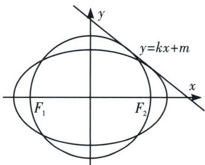
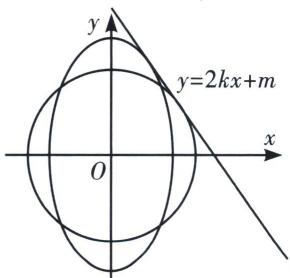
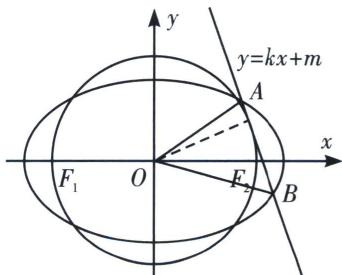
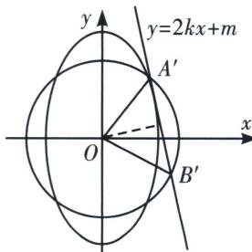

<!-- question-source:start -->
例8（2018·江苏卷）如图，在平面直角坐标系 $xOy$ 中，椭圆 $C$ 过点 $\left(\sqrt{3}, \frac{1}{2}\right)$ ，焦点 $F_{1}(-\sqrt{3}, 0)$ ， $F_{2}(\sqrt{3}, 0)$ ，圆的直径为 $F_{1}F_{2}$ .

(1)求椭圆 C 及圆 O 的方程;

(2)设直线 l 与圆 O 相切于第一象限内的点 P.

①若直线 l 与椭圆 C 有且只有一个公共点，求点 P 的坐标；

②直线 l 与椭圆 C 交于 A、B 两点. 若 $\triangle OAB$ 的面积为 $\frac{2\sqrt{6}}{7}$ ，求直线 l 的方程.

<!-- question-source:end -->

![[高中/总复习/专题/2026版高中《mst老唐说题》圆锥曲线专题（数学）/下册/第13章_新定义下的斜率调整与仿射/第二节_仿射法与面积转化/二_切点圆面积最值/例题/answers/Q00053231A1.md]]
