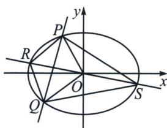
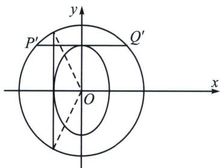

> [!faq]- 《圆锥曲线专题(下册)》例题解析
>
> > [!success]- **【答案】** 详见解析
>
> > [!note]- **【解析】**
> > 解析 (1)设 $C$ 的半焦距为 $c(c > 0)$ . 依题意得 $a = \sqrt{3}$ , $\frac{1}{2} \times 2c \times b = bc = \frac{3}{2}$ , 所以 $b\sqrt{3 - b^2} = \frac{3}{2}$ , 解得 $b^2 = \frac{3}{2}$ , 所以 $C$ 的方程为 $\frac{x^2}{3} + \frac{2y^2}{3} = 1$ .
> >
> > (2)
> > 解法一：设 $P(x_{1},y_{1})$ ， $Q(x_{2},y_{2})$ ，由 $\left\{ \begin{array}{l}x^{2} + 2y^{2} = 3\\ y = px + q \end{array} \right.$ ，消去 $y$ 得 $(2p^{2} + 1)x^{2} + 4pqx + 2q^{2} - 3 = 0,$
> >
> > 则 $\Delta = 16p^{2}q^{2} - 4(2p^{2} + 1)(2q^{2} - 3) = 4(6p^{2} - 2q^{2} + 3) > 0$ ， $x_{1} + x_{2} = -\frac{4pq}{2p^{2} + 1}$ ， $x_{1}x_{2} = \frac{2q^{2} - 3}{2p^{2} + 1}$ 因为 $\overrightarrow{OP}\cdot \overrightarrow{OQ} = 0$ ，所以 $x_{1}x_{2} + y_{1}y_{2} = x_{1}x_{2} + (px_{1} + q)(px_{2} + q) = (p^{2} + 1)x_{1}x_{2} + pq(x_{1} + x_{2}) + q^{2} = (p^{2} + 1)\cdot$ $\frac{2q^2 - 3}{2p^2 + 1} -\frac{4p^2q^2}{2p^2 + 1} +q^2 = 0$ ，化简得 $q^{2} = p^{2} + 1$ ，此时 $\Delta >0$ 成立，证毕.
> >
> > 解法二： $\frac{x^{2}}{3}+\frac{2y^{2}}{3}=\left(-\frac{p}{q}x+\frac{y}{q}\right)^{2}$ ，同除以 $x^{2}$ 得： $\left(\frac{1}{q^{2}}-\frac{2}{3}\right)\left(\frac{y}{x}\right)^{2}-\frac{2p}{q^{2}}\frac{y}{x}+\frac{p^{2}}{q^{2}}-\frac{1}{3}=0$ ，所以 $k_{OP}k_{OQ}=$ $\frac{\frac{p^{2}}{q^{2}}-\frac{1}{3}}{\frac{1}{q^{2}}-\frac{2}{3}}=-1$ ，所以 $q^{2}=p^{2}+1,\quad d=\frac{|q|}{\sqrt{p^{2}+1}}=1$ ，所以PQ与原点为圆心，1为半径得圆相切；
> >
> > 
> >
> > 
> >
> > (3)
> > 解法一: 设 $PQ$ 的中点为 $M$ , 因为直线 $RS$ 经过点 $O$ 和点 $M$ , 所以不妨设 $\overrightarrow{OR} = t(\overrightarrow{OP} + \overrightarrow{OQ}) = 2t\overrightarrow{OM}$ $t > 0$ , 则 $S_{PRQS} = 2S_{OPRQ} = 4tS_{\triangle OPQ}$ . $S_{\triangle OPQ} = \frac{1}{2}|q||x_1 - x_2| = \frac{1}{2}|q|\sqrt{(x_1 + x_2)^2 - 4x_1x_2} = |q| \cdot \frac{\sqrt{4p^2 + 1}}{2p^2 + 1}$ . 由 $\overrightarrow{OR} = t(\overrightarrow{OP} + \overrightarrow{OQ})$ , 得 $R$ 点的坐标为 $(t(x_1 + x_2), t(y_1 + y_2))$ ,
> >
> > 又 $y_{1} + y_{2} = px_{1} + q + px_{2} + q = p(x_{1} + x_{2}) + 2q = \frac{2q}{2p^{2} + 1}$ 所以 $\left\{ \begin{array}{l}t(x_1 + x_2) = -\frac{4pq}{2p^2 + 1} t,\\ \iota (y_1 + y_2) = \frac{2q}{2p^2 + 1} t, \end{array} \right.$ 代入 $C$ 的方程得
> >
> > 
> >
> > $\left(-\frac{4pq}{2p^2 + 1} t\right)^2 + 2\left(\frac{2q}{2p^2 + 1} t\right)^2 = 3$ ，化简得 $\frac{8q^2t^2}{2p^2 + 1} = 3$ ，则 $t = \sqrt{\frac{3(2p^2 + 1)}{8q^2}}$ 。
> >
> > 所以 $S_{\mathrm{PRQS}} = 4\sqrt{\frac{3(2p^2 + 1)}{8q^2}}\cdot |q|\cdot \frac{\sqrt{4p^2 + 1}}{2p^2 + 1} = \sqrt{6}\cdot \sqrt{\frac{4p^2 + 1}{2p^2 + 1}} = \sqrt{6}\cdot \sqrt{2 - \frac{1}{2p^2 + 1}}\in [\sqrt{6},2\sqrt{3})$
> >
> > 即四边形 PRQS 面积的取值范围为 $\left[\sqrt{6}, 2\sqrt{3}\right)$ .
> >
> > 解法二：（仿射）： $\frac{x^{2}}{3}+\frac{2y^{2}}{3}=1$ ，令 $\left\{\begin{aligned}&x=x^{\prime}\\ &\sqrt{2}y=y^{\prime}\end{aligned}\right.\Rightarrow\left\{\begin{aligned}(x^{\prime})^{2}+(y^{\prime})^{2}=3\\ (x^{\prime})^{2}+\frac{(y^{\prime})^{2}}{2}=1\end{aligned}\right.$
> >
> > 仿射后可知， $S_{\triangle P'Q'R'S'} = \sqrt{2} S_{\triangle PQRS} = \frac{1}{2} |R'S'| \cdot |P'Q'| = \sqrt{3} |P'Q'|$ ，根据几何性质可知，当 $P'Q'$ 平行于 $x$ 轴时， $\angle P'OQ'_{\min} < 90^\circ$ ， $\tan \frac{\angle P'OQ'}{2} = \frac{\sqrt{2}}{2}$ ，此时 $|P'Q'|_{\min} = 2$ ，当 $P'Q'$ 平行于 $y$ 轴时， $\angle P'OQ'_{\max} > 90^\circ$ ， $\tan \frac{\angle P'OQ'}{2} = \sqrt{2}$ ， $|P'Q'|_{\max} = 2\sqrt{2}$ ，所以 $S_{\triangle P'Q'R'S'} = \sqrt{3} |P'Q'| \in [2\sqrt{3}, 2\sqrt{6}]$ ，所以 $S_{\triangle PQRS} \in [\sqrt{6}, 2\sqrt{3}]$ ，由于 $p$ 存在，即斜率存在，故最大值取不到，所以四边形 $PRQS$ 面积的取值范围为 $[\sqrt{6}, 2\sqrt{3})$
